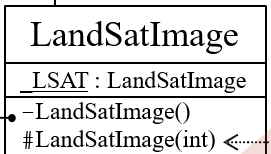
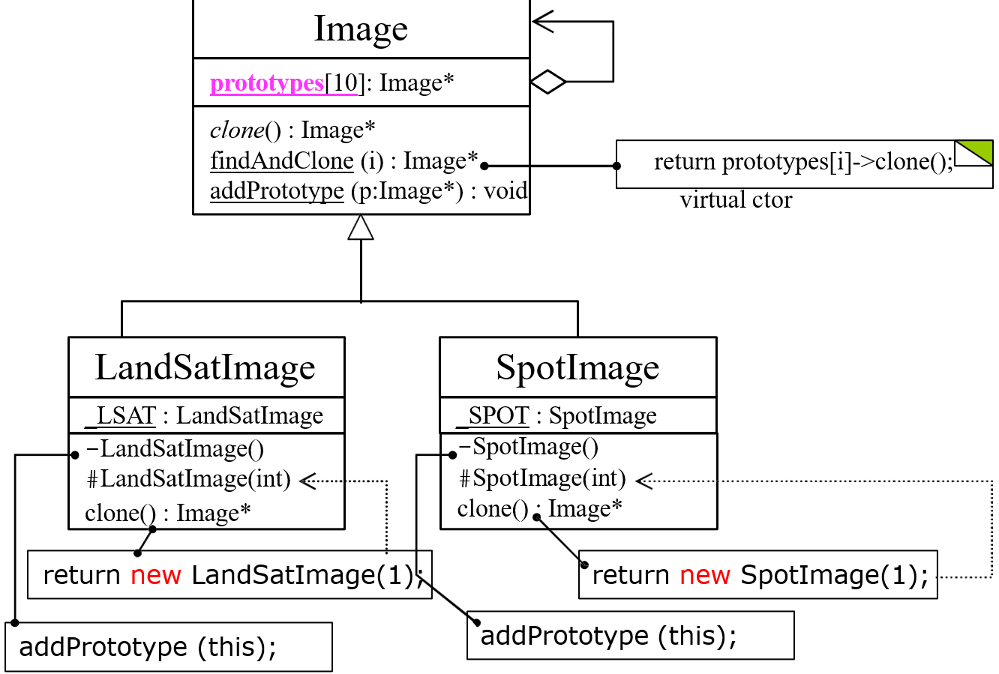
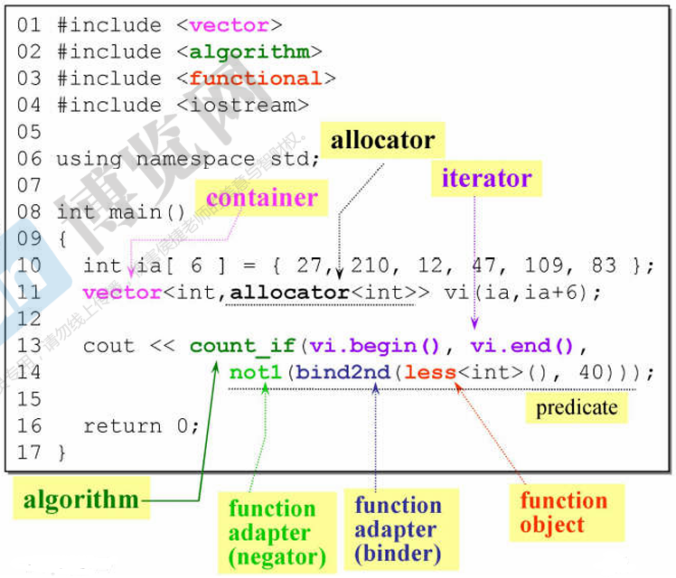
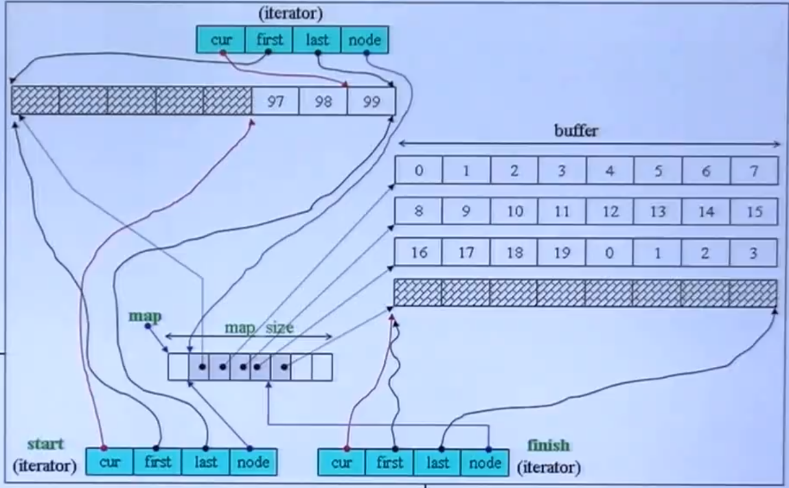
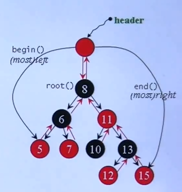
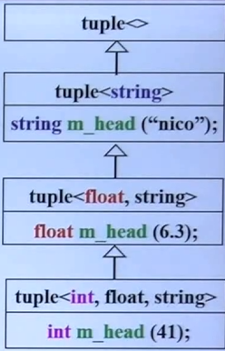

# C++ Part1 面向对象编程合集

## 1 头文件与类的声明

### 1.1 c vs cpp关于数据和函数


c语言中，data和函数都是分别定义，根据类型创建的。这样创建出的变量，是全局的

cpp中，将数据data和函数都包含在一起（class），创建出一个对象，即为面向对象；数据和函数（类的方法）都是局部的，不是全局的

class的两个经典分类：

- 无指针成员的类（complex）——复数
- 有指针成员的类（string）——字符串

### 1.2 头文件与类

#### 1.2.1 头文件

引用自己写的头文件，用双引号

头文件的标准写法：


```cpp
complex.h:
#ifndef _COMPLEX_  // 如果没有被定义过就定义 （防卫式声明）
#define _COMPLEX_

#endif
```

- **首先是防卫式声明，如果没定义这个名词，那么就定义一下。ifndef+define。**（这样如果程序是第一次引用它，则定义，后续则不需要重复定义，不需要重复进入下面的过程）
- `1`要写的类的声明，`2`是要写类的具体定义，写`1` `2`的时候发现有一些东西需要提前声明，写在`0`处

#### 1.2.2 class的声明

> 在C++中 struct和class唯一的区别就在于**默认的访问权限不同**
>
> - *struct* 默认权限为公共
> - *class* 默认权限为私有

```cpp
class complex  //class head
{              //class body  /*有些函数直接在此定义，另一些在 body 之外定义*/
public:
 complex (double r = 0, double i = 0)
    : re (r), im (i) 
 { }
 complex& operator += (const complex&);
 double real () const { return re; }
 double imag () const { return im; }
private:
 double re, im;

 friend complex& __doapl (complex*, const complex&); 
};
{
 complex c1(2,1);
 complex c2;
 ...
}
```

#### 1.2.3 模板初识


```cpp
{
    complex<double> c1(2.5, 1.5);
    complex<int> c2(2, 6);
    ...
}
```

- 因为实部和虚部的类型不确定，可能是 `double` `float` `int`，定义一个模板类型叫做 `T`
- 将`T`作为一个类型参数来传入，在调用的时候就可以指定类型了
- 通过在定义类的前面加入一行代码 `template<typename T>` 来实现

## 2 构造函数

### 2.1 inline 函数


定义类的时候，*可以直接在body中定义函数（inline函数，在body中定义完成）*，也可以只是在body中声明函数

- inline内联函数：如果定义的函数是内联函数，那么会运行比较快，尽可能定义为内联函数
- 在body外，*通过`inline`关键字来指定该函数为inline函数*。

> 注意的是，上面所有的inline函数，都只是我们指定的，希望它为inline，具体是不是，要看编译器来决定

### 2.2 访问级别


- 数据应该被定义为private
- 函数要被外界使用，定义为public；若只是内部处理，定义为private

### 2.3 ctor 构造函数

#### 2.3.1 ctor 的写法

方式一：（推荐）

```cpp
complex(T r = 0, T i = 0) //函数名称与class的名称一致
    : re(r), im(i)        //中间这一行就是初始化
{ }
```

方式二：（不推荐）

```cpp
complex(double r = 0, double i = 0)  
{
    re = r; im = i;       //用赋值来进行初始化
}
```

通过构造函数来创建对象。会自动调用构造函数进行创建。

- 构造函数名称需要与类的名称一样
- 函数的参数可以有默认参数
- 构造函数没有返回类型

#### 2.3.2 ctor/函数 重载


构造函数可以有很多个，可以重载；但是上面的`1` `2`两个构造函数冲突了

```cpp
complex c2();   // "()" 可以不要，一样的
```

上面的调用方式对两个构造函数都适用，冲突

------

```cpp
double real () const { return re; }
void real (double r) {  re = r;  }  //不能有const
```

- 同名的函数可以有多个，编译器会编成不同的名称，实际调用哪个会根据哪个适用

#### 2.3.3 ctor 放在 private 区


- 通常构造函数不要放在private中，这样外界没法调用，也就无法创建对象
- 在设计模式 `Singleton`（单体）中，将构造函数放在了private中；这个class只有一份，外界想要调用的时候，只能使用定义的 `getInstance()` 函数来取得这一份；外界无法创建新的对象。

### 2.4 const 常量成员函数


==**对于不会改变数据内容的函数，一定要加上const**==

```
{
    const complex c1(2, 1);
    cout << c1.real();
    cout << c1.imag();
}
```

对于上面调用方式，我们**创建一个常量**复数然后**调用函数**输出实部虚部，如果上面real和imag函数定义的时候，没有加const，那么这里函数默认的意思是可能会改变数据，与我们的常量复数就矛盾了，编译器会报错；因此，对于不会改变数据内容的函数，一定一定要加const

## 3 参数传递与返回值——引用

### 3.1 参数传递


- 值传递 pass by value，传递value是把整个参数全传过去，尽量不要直接value传递 例 `double r`

- 引用传递 pass by reference，传引用相当于传指针，快，形式也漂亮 例 `complex&`

- 如果只是为了提升速度，不向改变数据，那么传**const引用**；这样传进去的东西，**不能被修改**

  例 `const complex&`

### 3.2 返回值传递


返回值的传递，尽量返回引用

> **在函数中创建的变量 (local 变量)，要返回**——这种情况是**不能返回引用的**；因为函数结束后函数中创建的变量就消失了，无法引用

------


> 传递者无需知道接受者是以reference形式接受——所以用reference形式很便捷

## 4 友元 friend

### 4.1 友元


友元：friend，修饰在函数定义之前，**表示这个函数可以直接拿该类对象的private数据**

```cpp
inline complex&
__doapl(complex* ths, const complex& r)
{
    ths->re += r.re;  //直接拿private的数据，不需要函数
    ths->im += r.im;
    return *ths;
}
```

- 如上面所示，声明为friend之后，函数可以直接取到re和im，如果不被声明为friend，**只能通过调用real和imag函数来得到，效率较低**

### 4.2 相同 class 的 object 互为 friends


```cpp
{
    complex c1(2, 1);
    complex c2;
    c2.func(c1);
}
```

相同class的不同对象互为友元，即可以直接取另一個 object 的 private data

## 5 操作符重载与临时对象

### 5.1 操作符重载

在c++里我们可以定义加法等操作符，比如我们可以定义两个石头的加法

#### 5.1.1 成员函数实现 / this

成员函数： `complex :: function ....` 前面带有class的名称（在class里先声明了的）

```cpp
inline complex&
complex::operator += (const complex& r) {
    return __doapl(this, r);   //do assignment plus
}
```


所有的成员函数都带有一个隐藏的参数thisthis（是一个指针），`this`指向调用这个函数的调用者

- 定义函数的时候，**在参数中不能写出来`this`**，直接用即可

- **函数里可写可不写**，但当传入参数与成员变量名**相同**时要写

  ```cpp
  public:
  	double real () const { return this->re; }  //这里的this->可省略 
  ```

------

```cpp
c3 += c2 += c1;    // c2 加了 c1 后如果返回 void 就无法进行 c3 的操作了
```

将操作符写为void函数也可以，**但为了可以兼容`c3+=c2+=c1`的形式，写成返回引用更好。**

#### 5.1.2 非成员函数实现


非成员函数**没有`this`**

应对三种使用方法，写出三种方式

- 非成员函数是global函数——为了后面两种使用方法

- 这些函数不能返回引用，必须值传递

  > **在函数中创建的新变量 (local 变量)，要返回**

#### 5.1.3 output函数 « 的重载

cout不认识新定义的这种复数，因此也需要对`<<`进行操作符重载

> 只能全局函数，不能成员函数——导致使用时方向相反

```cpp
#include <iostream.h>
ostream&
operator<<(ostream& os, const complex& x)
{
    return os << '(' << real(x) << ',' << imag(x) << ')';  //自定义输出
}
```

- `ostream&` 是 `cout` 的 classname

> 参数传递：os 在函数中会变化，所以不能加 `const`

> 返回值传递：为了避免 `cout << c1 << conj(c1);` 连续输出，不用 `void`
>
> `cout << c1` 返回值需要与 `cout` 类型一致

### 5.2 临时对象


`classname ()` 创建一个classname类型的临时对象——不需要名称，生命只有一行

## 6 带指针的类：三大函数


- 析构函数：`~String();`

- 拷贝构造函数 copy ctor ： `String (const String& str);` —— `string s3(s1)`

- 拷贝赋值函数 copy op= ： `String& operator=(const String& str);` —— `s3=s2`

  > 编译器默认的拷贝构造赋值（一个bit一个bit的复制），编译器默认的只是拷贝了指针（浅拷贝），而不是指针指向的数据
  >
  > 
  >
  > alias（别名）和 memory leak（内存泄漏）都是十分危险的
  >
  > 因此，如果类中有指针，一定自己写这两个函数

### 6.1 ctor 和 dtor (构造和析构函数)

#### 6.1.1 ctor 构造函数

这里的 `new` 是申请的字符串的空间

```cpp
inline
String::String(const char* cstr = 0)
{
    if (cstr) {       // 指定了初值—— String s2("hello");
        m_data = new char[strlen(cstr) + 1];  // 字符串长度 + /0
        strcpy(m_data, cstr);
    }
    else {            // 未指定初值—— String s1();
        m_data = new char[1];
        *m_data = '\0';
    }
}
```

这里的 `new` 是申请的指针的空间，`String()`里面还有一个 `new`

```cpp
String* p = new String("hello");  
delete p;
```

#### 6.1.2 dtor 析构函数

```cpp
inline  
String::~String()
{
    delete[] m_data;
}
```

每个 `new` 都对应一个 `delete` —— 一定要释放

类对象死亡的时候（离开作用域），析构函数会被自动调用

例：这里结束会调用三次 dtor

```cpp
{
    String s1(),
    String s2("hello");
    String* p = new String("hello");
    delete p;
}
```

### 6.2 copy ctor 拷贝构造函数

```cpp
inline
String::String(const String& str)
{
    m_data = new char[strlen(str.m_data) + 1]; // “str.m_data” 兄弟之间互为友元 
    strcpy(m_data, str.m_data); // 深拷贝
}
String s1("hello ");
String s2(s1);
```

### 6.3 copy op= 拷贝赋值函数

1. 先杀死调用者
2. 重新申请指定大小的空间
3. 复制字符串内容到调用者

```cpp
inline
String& String::operator=(const String & str)
{
    if (this == &str)  // 检测自我赋值 self assignment
        return *this;

    delete[] m_data;                               // 第一步
    m_data = new char[strlen(str.m_data) + 1];     // 第二步
    strcpy(m_data, str.m_data);                    // 第三步
    return *this;
}
```

> 一定要在开始就检测自我赋值，因为`a=a`时第一步 `delete` 了后，会使第三步出现问题

## 7 堆，栈，内存管理

### 7.1 堆和栈

**Stack** **栈**，是存在于某作用域 (scope) 的一块内存空间。

例如当你调用函数，函数本身即会形成一个 `stack` 用来放置它所接收的参数，以及返回地址；在函数本体 (function body) 内声明的任何变量其所使用的内存块都取自上述 `stack`

**Heap** **堆**，或称为 *system heap* ，是指由操作系统提供的一块 global 内存空间，程序可动态分配 (dynamic allocated) 从中获得若干区块 (blocks)

可以用 ≠w≠w 来动态取得

> 在 stack 中的是自动生成的空间，作用域结束空间会自动释放
>
> 在 heap 中的是自己申请的空间，需要自己释放

```cpp
{
   complex c1(1,2);              
   /*c1空间来自stack*/
   complex* p = new complex(3);  
   /*complex(3) 是个临时对象
   其所用的空间是以new从heap动态分配而得，并由p指向*/
}
```

### 7.2 object 生命期

- *stack objects* 的生命期

  `c1` 便是所谓 stack object，其生命在作用域 (scope) 结束之际结束这种作用域内的 object，又称为 *auto object*，因为它会被“自动”清理（结束自动调用析构函数）

  ```cpp
  {
  	complex c1(1,2);
  }
  ```

- *static local objects* 的生命期

  若在前面加上 `static` 后，其会存在到整个程序结束

  ```cpp
  {
      static complex c2(1,2);
  }
  ```

- *global objects* 的生命期

  写在任何作用域之外的对象，其生命在整个程序结束之后才结束，你也可以把它视为一种 static object，其作用域是整个程序

  ```cpp
  ...
  complex c3(1,2);
    
  int main()
  {
      ...
  }
  ```

- *heap objects* 的生命期

  `p` 所指的便是 heap object，其生命在它被 `delete` 之际结束

  ```cpp
  {
      complex* p = new complex;
      ...
      delete p;
  }
    
  ```

### 7.3 new 和delete

#### 7.3.1 new

**new**：先分配 *memory* , 再调用 *ctor*


1. 分配内存：先用一个特殊函数，按 class 的定义分配了两个 `double` 的大小
2. 转型（忽视）
3. 调用构造函数，赋值`(1,2)`

#### 7.3.2 delete

**delete**：先调用 *dtor*, 再释放 *memory*


1. 调用析构函数——释放的是 `m_date` 指向的字符串 `Hello` 的空间（即构造函数中 `new` 申请的空间）
2. 释放内存：用一个特殊函数释放了 `ps` 指向的空间（即`String* ps = new String("Hello");` 中 `new` 申请的空间）

### 7.4 内存动态分配

#### 7.4.1 在VC下内存动态分配

在VC下（不同编译器的内存动态分配可能不同）


- 调试模式：

  `(4*3)` 是3个指针的大小

  `(32+4)` 是调试模式所需空间（橘色部分）

  `(4*2)` 是上下两个 *cookie* ——表示内存块的开始与结束

  `4` 是数组才有的长度记录

  由于分配内存块需要是16的倍数，所以需要 *pad* 来填充到`64`

- 执行模式：

  去掉调试模式的空间即可

> 因为内存块是16的倍数，因此最后四位bit一定都是0，*cookie* 就借用最后的一位`1`表示占用内存，`0`表示释放内存
>
> 如上图`41h`中`1`即表示占用内存

#### 7.4.2 array new/delete


==`array new` 一定要搭配 `array delete`==

==`new`后有`[ ]`—> `delete`后加`[ ]`==

普通的delete只调用一次析构函数——剩下两个指针的指向的空间没有调用析构函数，内存泄漏

这种情况发生在有指针的类，但最好都这样写

## 8 静态 模板 namespace

### 8.1 static

对于**非静态**的函数和数据：

非静态的成员函数通过`this`指针来处理不同的数据（一份函数—>多个对象）


对于**静态**的函数和数据：

==静态函数没有`this`==，不能处理一般的数据，只能处理静态的数据

例1：

```cpp
class Account
{
public:
	static double m_rate;  //静态变量的声明
	static void set_rate(const double& x) { m_rate = x; } //静态函数
};
double Account::m_rate = 0; //静态变量的定义 一定要有

int main()
{
    //调用静态函数法1——by class name
	Account::set_rate(5.0);
    //调用静态函数法2——by object
	Account a;
	a.set_rate(7.0); //静态函数与a无关/无this
}
```

例2：设计模式 `Singleton`（单体）


- 构造函数放在private中，外界无法调用
- 设计了`getInstance`静态函数，来生成并返回唯一的一份

### 8.2 template

#### 8.2.1 class template 类模板


- `T`来代替某种类型
- 使用时`classname<type1> xxx`，编译器会把`T`全部替换为`type1`

#### 8.2.2 function template 函数模板


比较函数——任何类型都可以进行比较；`T`来代替某种类型

应用时，不需要写某种类型——编译器自己会推导

### 8.3 namespace

对东西进行一个包装（不一定要一次性全写在一起，可分开包装在一起）

```cpp
namespace name
{
...    
}
```

1. 用法一：using directive

   ```cpp
   #include <iostream>
   using namespace std; //直接把包装全打开
   int main()
   {
   	cin << ...;
   	cout << ...;
   	return 0;
   }
   ```

2. 用法二：using declaration

   ```cpp
   #include <iostream>
   using std::cout; //只打开一条
   int main()
   {
   	std::cin << ...; //没打开要写全名
   	cout << ...;
   	return 0;
   }
   ```

3. 用法三：都写全名

   ```cpp
   #include <iostream>
   int main()
   {
   	std::cin << ; 
   	std::cout << ...;
   	return 0;
   }
   ```

## 9 复合 委托

### 9.1 Composition 复合

类似于c中结构里有结构——class里有class


`deque` 是一个已经存在的功能很多的类（两头进出的队列）；利用`deque`的功能来实现`queue`的多种操作

> 该例只是复合的一种情况——设计模式 **Adapter**

#### 9.1.1 复合下的构造和析构


- 构造是==由内而外==

  Container 的构造函数，编译器会自动先调用 Component 的 default 构造函数，再执行自己

  > 注意如果要调用 Component 的其他构造函数需要自己写出来
  >
  > `Container::Container(…): Component() { … };`

- 析构是==由外而内==

  Container 的析构函数会先执行自己，之后编译器调用 Component 的析构函数

### 9.2 Delegation 委托

委托就是 Composition by reference；即通过指针把任务委托给另一个类


复合中，内部和外部是一起出现的；而委托是不同步的

> 这是一个著名的设计模式——**pimpl** (pointer to implementation) 或者叫 “编译防火墙”
>
> - 右边怎么变动都不会影响左边
>
> - reference counting 多个指针共享一个 “Hello”；但当a要改变内容时， 系统会单独复制一份出来给a来改，b和c依然在共享
>
>   

## 10 继承与虚函数

### 10.1 Inheritance 继承


语法：`:public base_class_name`

```cpp
public` 只是一种继承的方式，还有`protect`，`private
```

> 子类会拥有自己的以及父类的数据

#### 10.1.1 继承下的构造和析构

与复合下的构造和析构相似


- 构造是==由内而外==

  Container 的构造函数，编译器会自动先调用 Component 的 default 构造函数，再执行自己

  > 注意如果要调用 Component 的其他构造函数需要自己写出来
  >
  > `Derived::Derived(…): Base() { … };`

- 析构是==由外而内==

  Container 的析构函数会先执行自己，之后编译器调用 Component 的析构函数

  > `Derived::~Derived(…){ … /* ~Base() */ };`

  > 注意：Base class 的 dtor 必需是 *virtual*
  >
  > 否则下例会导致结束时只会调用 Base 的 dtor
  >
  > ```cpp
  > int main() {
  >     Base* ptr = new Derived();
  >     delete ptr; // 只会调用 Base 类的析构函数
  >     return 0;
  > }
  > ```

### 10.2 虚函数


- *pure virtual* 函数：

  derived class 一定要重新定义 (override 覆写) 它；其没有定义只有声明

  语法：`virtual xxxxxx =0;`

- *virtual* 函数：

  derived class 可以重新定义 (override, 覆写) 它，且它已有默认定义

  语法：`virtual xxxxxx;`

- *non-virtual* 函数：

  不希望 derived class 重新定义 (override, 覆写) 它

### 10.3 继承 with virtual

> 例子：在 Windows 平台下用某个软件打开文件——分为好几步，但基本所有软件大多数操作都是一致的，只有一个操作如读取方式是不一样的


1. 现有一个框架 Application framework 其写好了所有必要的函数，其中 `Serialize()` 就是一个 *pure virtual* 函数
2. 使用这个框架写自己软件的打开文件，就继承这个框架，其中就需要自己 *override* 覆写 `Serialize()` 这个函数
3. 在执行中，执行 `myDoc.OnFileOpen();` 中到 `Serialize()` 时，是通过 `this` 来指引到自己写的 `Serialize()` 中去的

> 把关键动作延缓到子类再做，这是一个经典的设计模式——**Template Method**

### 10.4 缩略图

- 复合：
- 委托：
- 继承：
- 类中的元素： 变量名称 : 变量类型（与代码刚好相反
  - 变量下面加下划线 表示 `static`
  - 前面加一个 `-` 表示 `private`
  - 前面加一个 `#` 表示 `protected`
  - 前面加一个 `+` 表示 `public`（一般可以省略）

### 10.5 继承+复合

这种关系下的构造和析构与之前的类似

- 第一种：

  

  - 构造==由内到外== **先 Base 再 Component**

    Derived 的构造函数首先调用 Base 的 default 构造函数，然后调用 Component 的 default 构造函数，然后才执行自己

    `Derived::Derived(…): Base(),Component() { … };`

  - 析构==由外而内== **先 Component 再 Base**

    Derived 的析构函数首先执行自己，然后调用 Component 的析构函数，然后调用 Base 的析构函数

    `Derived::~Derived(…){… /*~Component() ~Base()*/};`

- 第二种：

  

  同理构造==由内到外==，析构==由外而内==

### 10.6 继承+委托

#### 10.6.1 例一 Observer

> 设计模式—— **Observer**
>
> 例如一串数据，可以用饼图来观察，也可以用条形图来观察，这种种的观察方式都是继承于 Observer


通过 `vector<Observer> m_views;` 来进行委托

当数据改变的时候，Observer 也需要更新，即 `notify` 函数，来将目前所有的观察者更新

#### 10.6.2 例二 Composite

> 设计模式—— **Composite**
>
> 例如文件系统，文件夹里可以有文件夹（与自己相同的类），也可以有文件，其中文件就是最基本的 *Primitive*，而文件夹就是复合物 *Composite*


要达成目的，就可以再设计一个父类 *Component* ，文件和文件夹就继承于同一父类；

其中 *Composite* 要用委托到父类的方式 `Component*` 设计容器和操作——使其 *Primitive* 和 *Composite* 都可以适用

```cpp
//父类 Component
class Component
{
private:
    int value;
public:
    Component(int val)	{value = val;}  
    virtual void add( Component* ) {} //虚函数
};

//复合物 Composite
class Composite 
    : public Component
{
	vector <Component*> c;  
public:
	Composite(int val) : Component(val) {}

	void add(Component* elem)
	{
		c.push_back(elem);
	}
	…
}

//基本类 Primitive
class Primitive
    : public Component
{
public:
	Primitive(int val): Component(val) {}
};
```

> component中add是虚函数（且是空函数），不能是纯虚函数——*Primitive* 不会 override add函数（最基本的单位，不能 add 了），而 *Composite* 需要 override add函数

#### 10.6.3 例三 Prototype

> 设计模式—— **Prototype**
>
> 框架（父类）要创建未来才会出现的子类——要求子类要创建一个自己当作原型 *Prototype* 让框架（父类）来找到并创建 FindAndClone

> 补充：当一个子类继承自父类时，它可以被视为是父类的一种类型，因此可以使用父类的指针或引用来引用子类的对象；
>
> 这种用父类的指针或引用来处理子类对象的方式称为——**向上转型 ** \*Upcasting*



1. 父类中，有一个存放原型的数组，有纯虚函数 `Image *clone()`，还有两个静态函数 `Image FindAndClone(imageType);` `void addPrototype(Image *image){...}`

2. 子类中，创建一个静态的自己 `_LAST` ，把它放到父类的一个空间中，这样父类就可以找到新创建的子类

   > ==private 的构造函数== `LandSatImage()` 中是 `addPrototype(this); //这里的 this 就是 _LAST` 将自己的原型放到了父类中去

3. 子类中，准备一个 `clone()`函数，父类通过调用找到的相应类型的 clone 函数来创建子类的副本

   > 这里的 clone 函数就不能用之前的那个构造函数来创建副本了——其会放到父类中去，所以创建一个新的构造函数 `LandSatImage(int)` 用传进一个无用参数（随便传个int型数据就好）来进行区分

# **C++ Part2 兼谈对象模型合集**

## 1 转换

### 1.1 转换函数

将当前对象的类型转换成其他类型

- 以 `operator` 开头，函数名称为需要转成的类型，无参数
- 前面不需要写返回类型，编译器会自动根据函数名称进行补充

- 转换函数中，分子分母都没改变，所以通常加 `const`

```cpp
// class Fraction里的一个成员函数
operator double() const
{
    return (double) (m_numerator / m_denominator);
}
Fraction f(3,5);
double d = 4 + f; //编译器自动调用转换函数将f转换为0.6
```

### 1.2 non-explicit-one-argument ctor

将其他类型的对象转换为当前类型

one-argument 表示只要一个实参就够了

```cpp
// non-explicit-one-argument ctor
Fraction(int num, int den = 1) 
    : m_numerator(num), m_denominator(den) {}
Fraction f(3,5);
Fraction d = f + 4; //编译器调用ctor将4转化为Fraction
```

### 1.3 explicit

当上面两个都有转换功能的函数在一起，编译器调用时都可以用，报错

```cpp
class Fraction
{
public:
	Fraction(int num, int den = 1) 
		: m_numerator(num), m_denominator(den) {}
	operator double() const
	{
		return (double)m_numerator / m_denominator;
	}
	Fraction operator+(const Fraction& f) const
	{
		return Fraction(...);
	}
private:
	int m_numerator; // 分子
	int m_denominator; // 分母
};
...
    
Fraction f(3,5);
Fraction d = f + 4; // [Error] ambiguous
```

*one-argument ctor* 加上 `explicit`，表示这个 ctor 只能在构造的时候使用，编译器不能拿来进行类型转换了

```cpp
...
explicit Fraction(int num, int den = 1) 
    : m_numerator(num), m_denominator(den) {}
...
    
Fraction f(3,5);
Fraction d = f + 4; // [Error] 4不能从‘double’转化为‘Fraction’
```

> 关键字 `explicit` 主要就在这里运用

## 2 xxx-like classes

### 2.1 pointer-like classes

#### 2.1.1 智能指针

- 设计得像指针class，能有更多的功能，包着一个普通指针
- 指针允许的动作，这个类也要有，其中 `*`，`->` 一般都要重载

```cpp
template <typename T>
class shared_ptr
{
public:
	T& operator*() const { return *px; }
	T* operator->() const { return px; }
	shared_ptr(T* p) : ptr(p) {}
private:
	T* px;
	long* pn;
};
```

> 在使用时，`*shared_ptr1` 就返回 `*px`；
>
> 但是 `shared_ptr1->` 得到的东西会继续用 `->` 作用上去，**相当于这个->符号用了两次**
>
> 

#### 2.1.2 迭代器

以标准库中的*链表迭代器*为例，这种智能指针还需要处理 `++` `--` 等符号

```
node` 是迭代器包着的一个真正的指针，其指向 `_list_node
```


- 下图 `*ite` 的意图是取 `data`——即一个 *Foo 类型的 object*
- 下图 `ite->method` 的意图是调用 *Foo 中的函数 method*


### 2.2 function-like classes

设计一个class，行为像一个函数

函数行为即 —— `xxx()` 有一个小括号，所以函数中要有对 ()() 进行重载

```cpp
template <class pair>
struct select1st ... // 这里是继承奇特的Base classes，先不管
{
	const typename pair::first_type& // 返回值类型，先不管
	operator()(const pair& x) const
	{
		return x.first;
	}
};

...
//像一个函数一样在用这个类
select1st<my_pair> selector;
first_type first_element = selector(example_pair);

//还可以这样写，第一个()在创建临时对象
first_type first_element = select1st<my_pair>()(example_pair);

...
```

## 3 模板

### 3.1 类模板/函数模板

补充：只有模板的尖括号中<>，关键字 `typename` 和 `class` 是一样的

### 3.2 成员模板

它即是模板的一部分，自己又是模板，则称为成员模板

其经常用于构造函数

1. *ctor1* 这是默认构造函数的实现；它初始化 `first` 和 `second` 分别为 T1T1 和 T2T2 类型的默认构造函数生成的默认值
2. *ctor2* 这是带参数的构造函数的实现；它接受两个参数 `a` 和 `b`，并将它们分别用来初始化 `first` 和 `second` 成员变量
3. *ctor3* 这是一个==模板构造函数==，接受一个不同类型的 pairpair 对象作为参数；它允许从一个不同类型的 `pair` 对象构造当前类型的 `pair` 对象，在构造过程中，它将源 `pair` 对象的 `first` 和 `second` 成员变量分别赋值给当前对象的成员变量，使其具有一定的灵活性和通用性

```cpp
template <class T1, class T2>
struct pair
{
	T1 first;
	T2 second;
	pair() : first(T1()), second(T2()) {} //ctor1
	pair(const T1& a, const T2& b) : 	  //ctor2
		first(a), second(b) {}

	template <class U1, class U2>		  //ctor3
	pair(const pair<U1, U2>& p) : 
		first(p.first), second(p.second) {}
};
```

- 例一，可以使用 <鲫鱼，麻雀> 对象来构造一个 <鱼类，鸟类> 的pair

  

- 例二，父类指针是可以指向子类的，叫做 *up-cast*；智能指针也必须可以，所以其构造函数需要为==模板构造函数==

  

### 3.3 模板模板参数

即模板中的一个模板参数也为模板，下图黄色高亮部分


> - `XCLs<string, list> mylist` 中即表示：容器 *list* 是 *string* 类型的—— 创建一个 *string* 的链表；`Container<T> c;` 即表示 `list<srting> c;`
> - 但是这样 `Container<T> c;` 语法过不了，容器 *list* 后面还有参数，需要用中间框和下面框下一行的代码 —— c++11的内容

> 注：下面不是模板模板参数
>
> 
>
> ```cpp
> class Sequence = deque<T>` 是有一个初始值，当没指定时就初始为 `deque<T>
> ```
>
> 在要指定时，如最后一行中的 `list<int>` 是确切的，不是模板

## 4 specialization 特化

### 4.1 全特化 full specialization

模板是*泛化*，特化是泛化的反面，可以针对不同的类型，来设计不同的东西

- 其语法为`template<>` `struct xxx<type>`

```cpp
template<>
struct hash<char>
{
...
    size_t operator()(char& x) const {return x;}
};

template<>
struct hash<int>
{
...
	size_t operator()(int& x) const { return x; }
};
```

- 这里编译器就会用 `int` 的那段代码；注意：`hash<int>()` 是创建临时变量

```cpp
cout << hash<int>()(1000)
```

### 4.2 偏特化 partial specialization

#### 4.2.1 个数上的偏

例如：第一个模板参数我想针对 `bool` 特别设计


注意绑定模板参数不能跳着绑定，需要从左到右

#### 4.2.2 范围上的偏

例如：想要当模板参数是指针时特别设计


```cpp
C<string> obj1; //编译器会调用上面的
C<string*> obj2; //编译器会调用下面的
```

## 5 三个C++11新特性

### 5.1 variadic templates

模板参数可变化，其语法为 `...` (加在哪看情况)

```cpp
// 当参数pack里没有东西了就调用这个基本函数结束输出
void print() {
}

// 用于打印多个参数的可变参数模板函数
template <typename T, typename... Args>
void print(const T& first, const Args&... args) {
    std::cout << first << " ";
    print(args...);  // 使用剩余参数进行递归调用
}

int main() {
    print(1, "Hello", 3.14, "World");
    return 0;
}
```

还可以使用 `sizeof...(args)` 来得到参数pack里的数量

### 5.2 auto

编译器通过赋值的返回值类型，自动匹配返回类型


注：下面这样是不行的，第一行编译器找不到返回值类型

```cpp
auto ite; // error
ite = find(c.begin(), c.end(), target);
```

### 5.3 ranged-base for

`for` 循环的新语法，`for(声明变量 : 容器)`，编译器会从容器中依次拿出数据赋值给声明变量中

```cpp
for (decl : coll)
{
    statement
}

//例
for (int i : {1, 3, 4, 6, 8}) // {xx,xx,xx} 也是c++11的新特性
{
    cout << i << endl;
}
```

注意：改变原容器中的值需要 *pass by reference*

```cpp
vector<double> vec;
...

for (auto elem : vec) //值传递
{
    cout << elem << endl;
}
for (auto& elem : vec) //引用传递
{
    elem *= 3;
}
```

## 6 多态 虚机制

### 6.1 虚机制

当类中有虚函数时（无论多少个），其就会多一个指针—— *vptr* 虚指针，其会指向一个 *vtbl* 虚函数表，而 *vtbl* 中有指针一一对应指向所有的虚函数

有三个类依次继承，其中A有两个虚函数 `vfunc1()` `vfunc2()`，B改写了A的 `vfunc1()`，C又改写了B的 `vfunc1()`，子类在继承中对于虚函数会通过指针的方式进行——因为可能其会被改写

继承中，子类要继承父类所有的数据和其函数调用权，但虚函数可能会被改写，所以调用虚函数是==动态绑定==的，通过指针 `p` 找到 `vptr`，找到`vtbl`，再找到调用的第n个虚函数函数——`( *(p->vptr[n]) )(p)`


编译器在满足以下三个条件时就会做==动态绑定==：

1. 通过指针调用
2. 指针是向上转型 *up-cast* ——`Base* basePtr = new Derived;`
3. 调用的是虚函数

编译器就会编译成 `( *(p->vptr[n]) )(p)` 这样来调用

> 例如：用一个 Shape（父类）的指针，调用 Circle（子类）的 *draw* 函数（每个形状的 *draw* 都不一样，继承自 Shape）
>
> ==**多态**==：同样是 Shape 的指针，在链表中却指向了不同的类型
>
> ```cpp
> list<Shape*> Mylist
> ```
>
> 
>
> 多态优点：代码组织结构清晰，可读性强，利于前期和后期的扩展以及维护

### 6.2 动态绑定


`a.vfunc1()` 是通过对象来调用，是 *static binding* 静态绑定

在汇编代码中，是通过 *call* 函数的固定地址来进行调用的


`pa` 是指针，是向上转型，是用其调用虚函数—— *dynamic binding* 动态绑定

在汇编代码中，调用函数的时候，蓝框的操作用 *c语言* 的形式即是 —— `( *(p->vptr[n]) )(p)`

下面同理

## 7 reference、const、new/delete

### 7.1 reference

`x` 是整数，占4字节；`p` 是指针占4字节（32位）；rr 代表xx，那么rr也是整数，占4字节

```cpp
int x = 0;
int* p = &x; // 地址和指针是互通的
int& r = x; // 引用是代表x
```

> **引用与指针不同，只能代表一个变量，不能改变**

> 引用底部的实现也是指针，但是注意 object 和它的 reference 的大小是相同的，地址也是相同的（是编译器制造的假象）
>
> ```cpp
> sizeof(r) == sizeof(x)
> &x == &r
> ```

reference 通常不用于声明变量，用于参数类型和返回类型的描述


以下 `imag(const double& im)` 和 `imag(const double im)` 的签名signature 在C++中是视为相同的——二者不能同时存在

```cpp
double imag(const double& im) /*const*/ {....}
double imag(const double im){....} //Ambiguity
```

> 注意：*const* 是函数签名的一部分，所以加上后是可以共存的

### 7.2 const

`const` 加在函数后面 —— 常量成员函数（成员函数才有）：表示这个成员函数保证不改变 class 的 data

|                                                       | const object | non-const object |
| ----------------------------------------------------- | ------------ | :--------------- |
| const member function（保证不改变 data members）      | ✔️            | ✔️                |
| non-const member function（不保证 data members 不变） | ❌            | ✔️                |

> ==**COW**==：*Copy On Write*
>
> 多个指针共享一个 “Hello”；但当a要改变内容时， 系统会单独复制一份出来给a来改，即 COW
>
> 

在常量成员函数中，数据不能被改变所以不需要COW；而非常量成员函数中数据就有可能被改变，需要COW

```cpp
charT
operator[] (size_type pos)const
{
	.... /* 不必考虑COW */   
}

reference
operator[] (size_type pos)
{
    .... /* 必须考虑COW */
}
```

> 函数签名不包括返回类型但包括`const`，所以上面两个函数是共存的

**当两个版本同时存在时，\*const object\* 只能调用 \*const\* 版本，\*non-const object\* 只能调用 \*non-const\* 版本**

### 7.3 new delete

#### 7.3.1 全局重载

- 可以全局重载 `operator new`、`operator delete`、`operator new[]`、`operator delete[]`
- 这几个函数是在 new 的时候，编译器的分解步骤中的函数，是给编译器调用的

注意这个影响非常大！

```cpp
inline void* operator new(size_t size){....}
inline void* operator new[](size_t size){....}
inline void operator delete(void* ptr){....}
inline void operator delete[](void* ptr){....}
```

#### 7.3.2 class中成员重载

- 可以重载 class 中成员函数 `operator new`、`operator delete`、`operator new[]`、`operator delete[]`
- 重载之后，new 这个类时，编译器会使用重载之后的

```cpp
class Foo
{
public：
    void* operator new(size_t size){....}
    void operator delete(void* ptr, size_t size){....} // size_t可有可无
    
    void* operator new[](size_t size){....}
    void operator delete[](void* ptr, size_t size){....} // size_t可有可无
    ....
}
// 这里优先调用 members，若无就调用 globals
Foo* pf = new Foo;
delete pf;

// 这里强制调用 globals
Foo* pf = ::new Foo;
::delete pf;
```

#### 7.3.3 placement new delete

可以重载 class 成员函数 *placement new* `operator new()`，可以写出多个版本，前提是每一个版本的声明有独特的传入参数列，且其中第一个参数必须是 *size_t*，其余参数出现于 `new(.....)` 小括号内（即 *placement arguments*）

```cpp
Foo* pf = new(300, 'c') Foo; // 其中第一个参数size_t不用写
// 对应的operator new
void* operator new (size_t size, long extra, char init){....}
```

我们也可以重载对应的 class 成员函数 `operator delete()`，但其不会被delete调用，只当 new 调用的构造函数抛出异常 exception 的时候，才会调用来归还**未能完全创建成功**的 object 占用的内存

# C++ STL+泛式编程合集

## 1 STL概述

STL —— Standard Template Library，标准模板库

C++ Standard LIbrary，C++标准库中包含STL（即STL+一些小东西）

### 1.1 头文件名称

- C++标准库的 header files 不带 `.h`，例如：`#include<vector>`
- 新式 C header files 不带 `.h`，例如：`#include<cstdio>`
- 老式 C header files 带 `.h` 仍然可用，例如：`#include<stdio.h>`

> 新式 header 内的组件封装于 *namespace std*
>
> 老式 header 内的组件**不**封装于 *namespace std*

### 1.2 STL基础介绍

STL六大部件：容器(Containers)、分配器(Allocators)、算法(Algorithms)、迭代器(Iterators)、仿函数(Functors)、适配器(Adapters)

- *容器*：放数据
- *分配器*：是来支持容器将数据放到内存里
- *算法*：是一个个函数来处理存放在容器里的数据
- *迭代器*：就是来支持算法操作容器的
- *仿函数*：作用类似函数，例如相加相减等等
- *适配器*：有三种，分别将容器，迭代器，仿函数来进行一个转换


实例：



1. 首先是创建一个 container（*vector*）
2. allocator 来帮助 container 来分配内存（一般会忽略不写）
3. 用一个 Algorithm 来操作数据（*count_if* 是数出满足条件的个数）
4. iterator 就是一个泛化的指针，来告诉 Algorithm 要处理哪里的数据
5. 用一个 functor 来判断数据（*less* 其有两个参数传入，第一个 < 第二个就为真）
6. 先用一个 function adapter（*bind2nd*）绑定了第二个参数为 40；再用一个 function adapter（*not1*）来对整个判断结果进行否定

判断条件 predicate 为：`not1(bind2nd(less<int>(), 40))` —— 表示 >= 40 数为真

> 前闭后开：[ )，基本所有容器都有 `begin()` `end()`，但 *begin* 是指向的容器的第一个元素，而 *end* 是指向的容器最后一个元素的**下一个**
>
> 例子：遍历容器
>
> ```cpp
> ...
> Container<T> c;
> Container<T>::iterator i = c.begin();
> for (; i != c.end(); ++i)
> {
>     ...
> }
> 
> 
> //但在C++11中可以用新语法简写
> ...
> Container<T> c;
> for (auto elem : c)
> {
>     ...
> }
> ```

### 1.3 typename

在模板参数的关键字使用中与 `class` 是一样的

在类型前面加上 `typename`：

```cpp
template <typename T>
class MyTemplateClass {
public:
    typedef typename T::NestedType NestedType;
};

template <typename T>
void MyTemplateFunction() {
    typename T::SomeType variable;
    // ...
}
```

在这个例子中，`typename` 用于告诉编译器 `T::NestedType` 和 `T::SomeType` 是类型名称而不是成员变量

`typename` 是一个用于明确指定符号是一个类型的关键字，以帮助编译器正确解析代码并避免歧义，如果不使用 `typename`，编译器可能会认为符号是一个值而不是类型，导致编译错误。

## 2 OOP vs. GP

- **OOP** —— Object-Oriented programming 面向对象编程

  将数据和操作关联到一起

  例如容器 List，其自带了一个 `sort()`，因为链表的存储空间不是连续的，Iterator 不能实现加减操作，所以不能使用全局的 `::sort()`

- **GP** —— Generic Programming 泛式编程

  将数据和操作分开

  - 容器和算法的团队就可以各自闭门造车，其间通过 Iterator 联通即可
  - 算法通过 Iterator 确定操作范围，并通过 Iterator 取用容器的元素
  - 所有的算法，其内的最终涉及元素的操作都是比大小

## 3 容器

### 3.1 容器结构分类

分类：序列式容器 *Sequence Container*，关联式容器 *Associative Container*

- 序列式容器：按照放入的次序进行排列

  

  - Array 数组，固定大小
  - Vector 向量，会自动扩充大小
  - Deque 双向队列，双向都可以扩充
  - List 链表，双向链表
  - Forward-List 链表，单向链表

- 关联式容器：有 *key* 和 *value*，适合快速的查找

  STL中实现使用红黑树（高度平衡二叉树）和哈希表

  

  - Set，*key* 就是 *value*，元素不可重复

  - Map，*key* 和 *value* 是分开的，元素不可重复

  - Multi~，元素是可以重复的

  - Unordered~，HashTable Separate Chaining

    

> 其中 *Array*，*Forward-List*，*Unordered~* 都是C++11的

### 3.2 序列式容器

#### 3.2.1 array

##### 测试


```cpp
#include <array>
#include <iostream>
#include <ctime> 
#include <cstdlib> //qsort, bsearch, NULL

void test_array() {
    cout << "\n test_array().......... \n";

    // 创建一个包含long型元素的array容器，ASIZE为数组的大小
    array<long, ASIZE> c;

    // 记录开始时间
    clock_t timeStart = clock();

    // 填充数组 c 中的元素，使用 rand() 生成随机数
    for (long i = 0; i < ASIZE; ++i) {
        c[i] = rand();
    }
    // 输出填充数组所花费的毫秒数
    cout << "milli-seconds : " << (clock() - timeStart) << endl;

    // 输出数组的大小、第一个元素、最后一个元素、起始地址
    cout << "array.size()= " << c.size() << endl;
    cout << "array.front()= " << c.front() << endl;
    cout << "array.back()= " << c.back() << endl;
    cout << "array.data()= " << c.data() << endl;

    // 获取目标值
    long target = get_a_target_long();

    // 记录开始时间
    timeStart = clock();
    // 使用标准库的 qsort 函数（快排）对数组 c 进行排序
    ::qsort(c.data(), ASIZE, sizeof(long), compareLongs);

    // 使用标准库的 bsearch 函数（二分查找）在排序后的数组中搜索目标值
    long* pItem = (long*)::bsearch(&target, c.data(), ASIZE, sizeof(long), compareLongs);
    // 输出排序和搜索所花费的毫秒数
    cout << "qsort()+bsearch(), milli-seconds : " << (clock() - timeStart) << endl;

    // 如果找到目标值，输出该值；否则输出未找到消息
    if (pItem != NULL)
        cout << "found, " << *pItem << endl;
    else
        cout << "not found! " << endl;
}
```

运行结果：


随机数据填充容器：47ms；排序和搜索：187ms

------

##### 深度探索

**C++TR1**下（比较简单）：

```cpp
template <typename _Tp, std::size_t _Nm>
struct array
{
	typedef _Tp value_type;
	typedef _Tp* pointer;
	typedef value_type* iterator; // 迭代器为_Tp*


	value_type _M_instance[_Nm ? _Nm : 1]; // 如果_Nm为0，就分配一个空间

	iterator begin() { return iterator(&_M_instance[0]); }
	iterator end() { return iterator(&_M_instance[_Nm]); }
	...
};
```

**GCC4.9**下（复杂且无益处）：


```cpp
// GCC4.9通过多个typedef以下面的逻辑创建的array里的data
typedef int T[100]; // T即类型int[100] 
T c; // 与int c[100]一样
```

#### 3.2.2 vector

##### 测试


```cpp
#include <vector>
#include <stdexcept>
#include <string>
#include <cstdlib> //abort()
#include <cstdio>  //snprintf()
#include <iostream>
#include <ctime> 
#include <algorithm> 	//sort()

// 测试函数，接受一个引用类型的长整型参数
void test_vector(long& value)
{
    cout << "\ntest_vector().......... \n";
     
    vector<string> c;  	// 创建一个字符串类型的向量
    char buf[10];
    
    clock_t timeStart = clock();	// 记录开始时间							
    for(long i=0; i< value; ++i)	// 循环插入随机生成的字符串
    {
        try {
            snprintf(buf, 10, "%d", rand());	// 将随机整数转换为字符串
            c.push_back(string(buf));     	// 将字符串添加到向量中
        } // 这里是处理异常，如内存不够
        catch(exception& p) {
            cout << "i=" << i << " " << p.what() << endl;	
            // 输出出现异常的信息以及对应的索引值
            // 曾經最高 i=58389486 then std::bad_alloc
            abort();	// 异常处理后中止程序
        }
    }
    cout << "milli-seconds : " << (clock()-timeStart) << endl;	// 输出填充向量花费时间
    cout << "vector.max_size()= " << c.max_size() << endl;	// 输出向量的最大容量
    cout << "vector.size()= " << c.size() << endl;	// 输出向量的实际大小
    cout << "vector.front()= " << c.front() << endl;	// 输出向量的首元素
    cout << "vector.back()= " << c.back() << endl;	// 输出向量的末尾元素
    cout << "vector.data()= " << c.data() << endl;	// 输出向量地址
    cout << "vector.capacity()= " << c.capacity() << endl << endl;	// 输出向量的容量

    // 直接find来查找————次序查找
    string target = get_a_target_string();	// 获取一个目标字符串
    {
        timeStart = clock();	// 记录开始时间
        auto pItem = find(c.begin(), c.end(), target);	// 在向量中查找目标字符串
        cout << "std::find(), milli-seconds : " << (clock()-timeStart) << endl;  
        
        if (pItem != c.end())
            cout << "found, " << *pItem << endl << endl;	// 输出找到的目标字符串
        else
            cout << "not found! " << endl << endl;	// 输出未找到目标字符串
    }

    // 先排序再二分法查找
    {
        timeStart = clock();	// 记录开始时间
        sort(c.begin(), c.end());	// 对向量中的字符串进行排序
        cout << "sort(), milli-seconds : " << (clock()-timeStart) << endl; 
        
        timeStart = clock();	    
        string* pItem = (string*)::bsearch(&target, (c.data()), 
                                           c.size(), sizeof(string), compareStrings); 
        cout << "bsearch(), milli-seconds : " << (clock()-timeStart) << endl; 
       
        if (pItem != NULL)
            cout << "found, " << *pItem << endl << endl;	// 输出在排序后向量中找到的目标字符串
        else
            cout << "not found! " << endl << endl;	// 输出在排序后向量中未找到目标字符串
    }
    
    c.clear();	// 清空向量中的数据
    test_moveable(vector<MyString>(),vector<MyStrNoMove>(), value);	// 调用另一个函数进行测试
}
```

这是 array 在后面插入元素，其中若空间 *capacity* 不够，其会进行**两倍扩充**——即空间不够时会将原来的空间 `*2`

```cpp
c.push_back(string(buf));
```

运行结果：


随机数据填充容器：3063ms；直接搜索：0ms（运气很好）；排序后二分查找：2765ms

------

##### 深度探索

**GCC2.9**下：

一共3个指针：`start`，`finish`，`end_of_storage`

所以 `sizeof(vector<int>)` 是`12`


```cpp
template <class T, class Alloc = alloc>
class vector
{
public:
	typedef T value_type;
	typedef value_type* iterator; // 迭代器就是T*
	typedef value_type& reference;
	typedef size_t size_type;
protected:
	iterator start;
	iterator finish;
	iterator end_of_storage;
public:
	iterator begin() { return start; }
	iterator end() { return finish; }
	size_type size() const { return size_type(end() - begin()); }
	size_type capacity() const { return size_type(end_of_storage - begin()); }
	bool empty() const { return begin() == end(); }
	reference operator[](size_type n) { return *(begin() + n); }
    // 所有连续储存的容器都有[]的重载
	reference front() { return *begin(); }
	reference back() { return *(end() - 1); }
}
```

vector 每次成长会大量调用元素的拷贝构造函数和析构函数，是一个大成本

```cpp
void push_back(const T& x)
{
    if (finish != end_of_storage) // 还有备用空间
    {
        construct(finish, x); // 全局函数
        ++finish;
    }
    else // 无备用空间
        insert_aux(end(), x);
}

template <class T, class Alloc>
void vector<T, Alloc>::insert_aux(iterator position, const T& x){
if (finish != end_of_storage){ // insert_aux还会被其他函数调用所以还有检查
    // 在‘备用空间起始处’构建一个元素以vector最后一个元素为初值
    // insert_aux也可能被insert调用，元素插入位置不定
    construct(finish, *(finish - 1));
    ++finish;
    T x_copy = x;
    copy_backward(position, finish - 2, finish - 1);
    *position = x_copy;
}
else{
    const size_type old_size = size();
    const size_type len = old_size != 0 ? 2 * old_size : 1;
    // 原大小为0，则分配1；否则，分配原大小的2倍
    
    iterator new_start = data_allocator::allocate(len);
    iterator new_finish = new_start;
    try{
        // 拷贝安插点前的原内容
        new_finish = uninitialized_copy(start, position, new_start);
        construct(new_finish, x);
        ++new_finish;
        // 拷贝安插点后的原内容
        new_finish = uninitialized_copy(position, finish, new_finish);
    }
    catch (...){
        destroy(new_start, new_finish);
        data_allocator::deallocate(new_start, len);
        throw;
    }
    // 解构并释放原vector
    destroy(begin(), end());
    deallocate();
    // 调整迭代器，指向新vector
    start = new_start;
    finish = new_finish;
    end_of_storage = new_start + len;
}
```

**GCC4.9**下变得复杂：


> 且迭代器也变得乱七八糟，舍近求远，何必如此！！
>
> 

#### 3.2.3 list

##### 测试


```cpp
// 同理
void test_list(long& value)
{ 
    ...
        
    list<string> c;  // 创建一个字符串列表  	
    char buf[10];  // 字符串缓冲区
	
    ...
		
    string target = get_a_target_string();  // 获取目标字符串		
    timeStart = clock();		
    auto pItem = find(c.begin(), c.end(), target);  // 在列表中查找目标字符串						
    cout << "std::find()，milli-seconds : " << (clock()-timeStart) << endl;  // 输出查找时间		
	
    ...
    	
    timeStart = clock();		
    c.sort();  // 对列表进行排序						
    cout << "c.sort(), milli-seconds : " << (clock()-timeStart) << endl;  // 输出排序时间		    	

    c.clear();  // 清空	 
}
```

> 注意：` c.sort();` 是容器自带的排序函数，如果容器自带肯定是要比全局的排序函数好的
>
> *list* 同样也是用 `c.push_back(string(buf));` 往里添加元素的

运行结果：


随机数据填充容器：3265ms；直接搜索：16ms；排序：2312ms

------

##### 深度探索

**GCC2.9**中


```cpp
// list class
template <class T, class Alloc = alloc>
class list
{
protected:
	typedef __list_node<T> list_node;
public:	
	typedef list_node* link_type;
	typedef __list_iterator<T, T&, T*> iterator; // 迭代器，每一个容器都会 typedef
	// 只传一个参数就行了 不理想
protected:
	link_type node; // 一个 __list_node<T> 的指针
...
};

// 节点 class
template <class T>
struct __list_node
{
	typedef void* void_pointer; // 每次用还要转换类型 不理想
	void_pointer prev;
	void_pointer next;
	T data;
};
```

> 除了 array，vector 这样是连续存储的容器，其他容器的 iterator 都是智能指针，其有大量的操作符重载 —— 模拟指针

基本上所有的 iterator 都有下面*5*个 *typedef* 和一大堆操作符重载

```cpp
// iterator class
template <class T, class Ref, class Ptr>
struct __list_iterator
{
	typedef __list_iterator<T, T&, T*> self;
	typedef bidirectional_iterator_tag iterator_category; // (1)双向迭代器	
	typedef T value_type; // (2)迭代器所指对象的类型
	typedef Ptr pointer; // (3)迭代器所指对象的指针类型
	typedef Ref reference; // (4)迭代器所指对象的引用类型
	typedef __list_node<T>* link_type;
	typedef ptrdiff_t difference_type; // (5)两个迭代器之间的距离类型

	link_type node; // iterator本体，一个指向__list_node<T>的指针

	reference operator*() const { return (*node).data; }
	pointer operator->() const { return &(operator*()); }
	self& operator++() // ++i
    {
        node = (link_type)((*node).next); // 移到下一个节点
        return *this; 
    }
	self operator++(int) // i++ 为了区分加上了一个参数其实无用
    {
        self tmp = *this; 
        ++*this; 
        return tmp; 
    }
	...
};
```

注意：`self operator++(int){...}` 的 `self tmp = *this;` 中，由于先调用了 `=` 唤起了 *copy ctor* 用以创建 tmp 并以 `*this` 为初值，所以不会唤起 opera→r⋅opera→r⋅ —— `*this` 已经被解释为 ctor 的参数

下面的 `++*this;` 同理

> 与 int 类似：iterator 可以连续前++，但不能连续后++
>
> 
>
> 所以前++是返回引用，后++返回值

因为要符合前闭后开原则，所以在 list 尾端加上了一个空白节点


**GCC4.9**中做出了改进：

- 迭代器模板参数从三个 –> 只有一个
- 节点 class 中的前后指针类型从 `void*` –> `_LIst_node_base*`


在GCC4.9中 `sizeof(list<int>)` 是 **8**

在GCC2.9中 `sizeof(list<int>)` 是 **4**

#### 3.2.4 forward_list

##### 测试


```cpp
// 同理
void test_forward_list(long& value)
{
    ...
     
    forward_list<string> c;  // 创建一个前向列表  	
    char buf[10];  // 字符串缓冲区
			
    ...
    
    
    string target = get_a_target_string();  // 获取目标字符串	
    timeStart = clock();	
    auto pItem = find(c.begin(), c.end(), target);  // 在前向列表中查找目标字符串	
    cout << "std::find()，milli-seconds : " << (clock()-timeStart) << endl;  // 输出查找时间		
	
    ...
    	
    timeStart = clock();		
    c.sort();  // 进行排序					
    cout << "c.sort()， milli-seconds : " << (clock()-timeStart) << endl;  // 输出排序时间		
	
    c.clear();  // 清空	 
}
```

> 注意：*forward_list* 只有 `c.push_front();` 且没有 `forward_list.back()` `forward_list.size()`

运行结果：


随机数据填充容器：3204ms；直接搜索：15ms；排序：2656ms

##### 深度探索

与 *list* 相似，略


#### 3.2.6 deque

##### 测试


类似vector，两边都能扩充，实际上是分段连续的

其是通过 *map*（是一个vector，但在扩充时会 copy 到中间）里的指针指向各个 *buffer*，*buffer* 里再存数据，每个 *buffer* 的大小一致，每次扩充都是扩充一个指针指向一个新的 *buffer*


```cpp
void test_deque(long& value)
{
    ...
     
    deque<string> c;  // 创建一个双端队列  	
    char buf[10];  // 字符串缓冲区
	
    ...
    
    string target = get_a_target_string();  // 获取目标字符串	
    timeStart = clock();	
    auto pItem = find(c.begin(), c.end(), target);  // 在队列中查找目标字符串	
    cout << "std::find()，milli-seconds : " << (clock()-timeStart) << endl;  // 输出查找时间		
	
    ...
    	
    timeStart = clock();		
    sort(c.begin(), c.end());  // 对队列进行排序					
    cout << "sort()，milli-seconds : " << (clock()-timeStart) << endl;  // 输出排序时间		
	
    c.clear();  // 清空队列
}
```

运行结果：


随机数据填充容器：2704ms；直接搜索：15ms；排序：3110ms

> 下面的 *stack* 和 *queue* 内部都是一个 *deque*，所以技术上这两个可以看作容器适配器 *Container Adapter*

------

##### 深度探索

**GCC2.9**下

```cpp
template <class T, class Alloc = alloc, size_t BufSiz = 0>
class deque
{
public:
	typedef T value_type;
	typedef __deque_iterator<T, T&, T*, BufSiz> iterator;
	typedef size_t size_type;
	typedef T* pointer;
protected:
	typedef pointer* map_pointer; // T** 指向指针的指针
protected:
	iterator start;
	iterator finish;
	map_pointer map;
	size_type map_size;
    // 两个迭代器:16*2，一个指针:4，一个size_t:4，一共40字节
public:
	iterator begin() { return start; }
	iterator end() { return finish; }
    size_type size() const { return finish - start; }
    ...
};
```

> 注意：第三个模板参数 `size_t BufSiz = 0` 有一个函数：
>
> 如果不为0，则 buffer size 就是传入的数据
>
> 如果为0，表示预设值，那么
>
> 如果 `sz = sizeof(value_type)` < 512，传回 `512/sz` 如果 `sz = sizeof(value_type)` >= 512，传回 `1`

迭代器四个指针，`cur` 指向当前元素，`first` 指向当前 buffer 的第一个元素，`last` 指向当前 buffer 的最后一个元素的下一个，`node` 指向当前 buffer 在 map（控制中心）的指针


```cpp
// deque迭代器
template <class T, class Ref, class Ptr, size_t BufSiz>
struct __deque_iterator
{
	typedef random_access_iterator_tag iterator_category; // (1)
	typedef T value_type; // (2)
	typedef Ptr pointer; // (3)
	typedef Ref reference; // (4)
	typedef size_t size_type;
	typedef ptrdiff_t difference_type; // (5)
	typedef T** map_pointer;
	typedef __deque_iterator self;

	T* cur;
	T* first;
	T* last;
	map_pointer node; // 指向指针的指针
    // 四个指针，一共16字节
	...
};
```

deque 中的 *insert* 函数：

```cpp
iterator insert(iterator position, const T& x)
{
    if (position.cur == start.cur) // 插入点在deque最前端      
    {							// 交给push_front
        push_front(x);
        return start;
    }
    else if (position.cur == finish.cur) // 插入点在deque最尾端
    {								  // 交给push_front
        push_back(x);
        iterator tmp = finish;
        --tmp;
        return tmp;
    }
    else // 在中间插入
    {
        return insert_aux(position, x);
    }   
}

iterator insert_aux(iterator pos, const T& x)
{
    difference_type index = pos - start; // 安插点前元素个数
    value_type x_copy = x;
    if (index < size() / 2) // 安插点前的元素少————搬前面的
    {
        push_front(front());
        ...
        copy(front2, pos1, front1); // 搬元素
    }
    else // 安插点后的元素少————搬后面的
    {
        push_back(back());
        ...
        copy_backward(pos, back2, back1);
    }
    *pos = x_copy; // 安插点设新值
    return pos;
}
```

deque 模拟连续空间（deque iterator 的功能）：



- `-`：两个位置之间的距离——前闭后开的元素个数

  

  两个位置之间的距离 = buffer_size * 两个位置之间 buffer 的数量 + 末尾位置到 buffer 前端的长度 + 起始位置到 buffer 末尾的长度

- `++`/`--`：注：下面带参数的是后++（i++）

  

- `+=`/`+`：

  ```cpp
  self& operator+=(difference_type n)
  {
      difference_type offset = n + (cur - first);  
      if (offset >= 0 && offset < difference_type(buffer_size()))  
          // 若+了之后在缓冲区大小范围内
          cur += n;  // 直接移动迭代器 n 步
      else
      {
          difference_type node_offset = offset > 0 ? offset / difference_type(buffer_size()) 
              : -difference_type((-offset - 1) / buffer_size()) - 1;
          // 计算偏移的节点数，offset > 0判断是为了之后的-=/-
          // 这里(-offset - 1)后除buffer_size()再-1是为了offset==buffer_size()的情况
          set_node(node + node_offset);  // 调整节点，使迭代器指向正确的节点
          cur = first + (offset - node_offset * difference_type(buffer_size()));  // 调整迭代器位置
      }
      return *this;
  }
    
  self operator+(difference_type n) const
  {
      self tmp = *this;  // 复制当前迭代器
      return tmp += n;   // 返回向前移动 n 步后的迭代器副本
  }
  ```

- `-=`/`-`：

  ```cpp
  // -就等于+负的
  self& operator-=(difference_type n) { return *this += -n; }
  self operator-(difference_type n) const
  {
      self tmp = *this;
      return tmp -= n;
  }
  ```

- `[]`：

  ```cpp
  reference operator[](difference_type n) const 
  { return *(*this + n); }
  ```

**GCC4.9**下：其实没必要这样


G2.91 允许指派 buffer_size

G4.53 不允许了

#### 3.2.7 stack，queque

##### 测试

stack：


queue：


> *stack*，*queue* 是通过 `push()` 和 `pop()` 来放取元素的，且无*iterator* 的操作

------

##### 深度探索

*stack* 和 *queue* 内部默认用 *deque* 来实现，所以有时候不会将这两个认为容器而是一个适配器

- 底层函数可以使用 *list* 和 *deque*（deque默认更快）
- queue 不能用 vector，stack 可以用 *vector*
- set，map 都不能用

用时编译器可以通过的，但在具体使用函数时，若遇到底层容器没有这个函数时，就会报错

```cpp
// queue
template<class T, class Sequence = deque<T>>
class queue
{
	...
protected:
	Sequence c; // 底层容器
public:
    // 都是通过底层容器来实现
	bool empty() const { return c.empty(); }
	size_type size() const { return c.size(); }
	reference front() { return c.front(); }
	const_reference front() const { return c.front(); }
	reference back() { return c.back(); }
	const_reference back() const { return c.back(); }
	void push(const value_type& x) { c.push_back(x); }
	void pop() { c.pop_front(); }
};

// stack
template<class T, class Sequence = deque<T>>
class stack
{
	...
protected:
	Sequence c; // 底层容器
public:
    // 都是通过底层容器来实现
	bool empty() const { return c.empty(); }
	size_type size() const { return c.size(); }
	reference top() { return c.back(); }
	const_reference top() const { return c.back(); }
	void push(const value_type& x) { c.push_back(x); }
	void pop() { c.pop_back(); }
};
```

==stack，queue 都不允许遍历，也不提供 iterator==

### 3.3 关联式容器

#### 3.3.0 RB-Tree

**红黑树**（Red-Black Tree）是一种自平衡的二叉搜索树 BST（AVL 是另一种）

> rb-tree 提供遍历操作和 iterators，按*中序遍历*遍历，便可以得到排序状态

> 不能用 iterator 去改变元素的 key（其有严谨的排列规则）

> rb-tree 提供两种 insertion 操作：`insert_unique()` 和 `insert_equal()`，前者表示 key 独一无二，后者表示 key 可重复

**GCC2.9**下：



```cpp
template<class Key, // key的类型
		 class Value, // Value里包含key和date
		 class KeyOfValue, // 从Value中取出key的仿函数
		 class Compare, // 比较key大小的仿函数
		 class Alloc = alloc>
class rb_tree
{
protected:
	typedef __rb_tree_node<Value> rb_tree_node;
	...
public:
	typedef rb_tree_node* link_type;
	...
protected:
	size_type node_count; // rb-tree节点数量，大小4
	link_type header; // 头指针，大小4
	Compare Key_compare; // key比大小的仿函数，大小1
    // sizeof: 9 ——> 12(填充到4的倍数)
    ...
};
```

**GCC4.9**下：


*_M_color* 是 “枚举”（Enumeration）

#### 3.3.1 set / multiset

##### 测试


```cpp
void test_multiset(long& value)
{
    cout << "\ntest_multiset().......... \n";
     
    multiset<string> c;  // 创建一个multiset  	
    char buf[10];		
    clock_t timeStart = clock();  // 记录起始时间							
    for(long i=0; i< value; ++i)  // 添加元素到multiset中
    {
        try {
            snprintf(buf, 10, "%d", rand());  // 将随机数转换为字符串格式
            c.insert(string(buf));  // 将字符串插入multiset中     				
        }
        catch(exception& p) {  // 捕获可能的异常
            cout << "i=" << i << " " << p.what() << endl;  // 输出异常信息
            abort();  // 终止程序
        }
    }
    cout << "毫秒数 : " << (clock()-timeStart) << endl;  // 输出时间差，计算插入时间	
    cout << "multiset.size()= " << c.size() << endl;  // 输出multiset大小	
    cout << "multiset.max_size()= " << c.max_size() << endl;  // 输出multiset的最大容量
    
    string target = get_a_target_string();	
    {
        timeStart = clock();
        auto pItem = find(c.begin(), c.end(), target);  // 在multiset中使用 std::find(...) 查找目标字符串
        cout << "std::find()，毫秒数 : " << (clock()-timeStart) << endl;		
        ...
    }
 	
    {
        timeStart = clock();		
        auto pItem = c.find(target);  // 在multiset中使用 c.find(...) 查找目标字符串
        cout << "c.find()，毫秒数 : " << (clock()-timeStart) << endl;		 
        ...
    }	
	 
    c.clear();  // 清空multiset
}
```

> 安插元素是使用 `insert()`，其位置由红黑树决定

> 容器自己有 `c.find()`，其会比全局的 `::find()` 快

运行结果：


随机数据填充容器：6609ms（其在填充的时候就进行排序了）；直接搜索 `::find()`：203ms；`c.find()`：0ms

------

##### 深度探索

以 rb-tree 为底层结构，因此有——元素自动排序，key 与 value 和一

> set / multiset 提供遍历操作和 iterators，按*中序遍历*遍历，便可以得到排序状态

> 禁止用 iterator 去改变元素的值（其有严谨的排列规则）

> set的key 独一无二，其 `insert()` 操作用的 rb-tree 的：`insert_unique()`
>
> multiset 的 key 可以重复，其 `insert()` 操作用的 rb-tree 的：`insert_equal()`

**GCC2.9**下：

```cpp
// set
template <class Key, class Compare = less<Key>, class Alloc = alloc>
class set
{
public:
	typedef Key key_type;
	typedef Key value_type;
	typedef Compare key_compare;
	typedef Compare value_compare;
private:
	typedef rb_tree<key_type, value_type, identity<value_type>, 
    			    key_compare, Alloc> rep_type;
	rep_type t; // 采用红黑树作为底层机制
public:
	typedef typename rep_type::const_iterator iterator;
	// 注意：这里是const_iterator，所以不能用iterator改元素
    ...
};
```

#### 3.3.2 map / multimap

##### 测试


```cpp
void test_multimap(long& value)
{
    ...
    multimap<long, string> c;  // 创建一个multimap，key 为 long 类型，value 为 string 类型  	
    char buf[10];
    clock_t timeStart = clock();  // 记录起始时间							
    for(long i=0; i< value; ++i)  // 添加元素到multimap中
    {
        try {
            snprintf(buf, 10, "%d", rand());  // 将随机数转换为字符串格式并复制到缓冲区
            // multimap 不可使用 [] 做 insertion 
            c.insert(pair<long, string>(i, buf));  // 将元素插入multimap中   						
        }
        catch(exception& p) {  // 捕获可能的异常
            cout << "i=" << i << " " << p.what() << endl;  // 输出异常信息
            abort();  // 终止程序
        }
    }
    cout << "毫秒数 : " << (clock()-timeStart) << endl;  // 输出时间差，计算插入时间	
    cout << "multimap.size()= " << c.size() << endl;  // 输出multimap大小
    cout << "multimap.max_size()= " << c.max_size() << endl;  // 输出multimap的最大容量
    
    long target = get_a_target_long();		
    timeStart = clock();		
    auto pItem = c.find(target);  // 在multimap中查找目标 key								
    cout << "c.find()，毫秒数 : " << (clock()-timeStart) << endl;	 
    
    if (pItem != c.end())
        cout << "找到，value=" << (*pItem).second << endl;  // 如果找到，输出找到的值
    else
        cout << "未找到！" << endl;  // 如果未找到，输出未找到的信息	
    
    c.clear();  // 清空multimap		  					
}
```

> `c.insert(pair<long, string>(i, buf));` 中 *key* 是从1~1000000，*value* 是随机取的，将其组合为 *pair* 插入

运行结果：


随机数据填充容器：4812ms（其在填充的时候就进行排序了）；`c.find()`：0ms

------

##### 深度探索

以 rb-tree 为底层结构，因此有——元素自动排序

> map/ multimap 提供遍历操作和 iterators，按*中序遍历*遍历，便可以得到排序状态

> 不能用 iterator 去改变元素的key（其有严谨的排列规则），但可以用 iterator 去改变元素的 data
>
> 因此 map / multimap 将 user 指定的 *key_type* 设定成 `const`

> map的key 独一无二，其 `insert()` 操作用的 rb-tree 的：`insert_unique()`
>
> multimap 的 key 可以重复，其 `insert()` 操作用的 rb-tree 的：`insert_equal()`

**GCC2.9**下：

```cpp
template <class Key, // key的类型
		 class T, // data的类型
		 class Compare = less<Key>, 
		 class Alloc = alloc>
class map
{
public:
	typedef Key key_type;
	typedef T data_type;
	typedef T mapped_type;
	typedef pair<const Key, T> value_type;
    // 注意：这里是const Key ———— 防止改key
	typedef Compare key_compare;
private:
	typedef rb_tree<key_type, value_type, select1st<value_type>, key_compare, Alloc> rep_type;
	rep_type t; // 采用红黑树作为底层机制
public:
	typedef typename rep_type::iterator iterator;
	...
};
```

> map 的插入元素有特殊写法：`c[i] = string(buf)`，其中 `i` 就是 key；multimap没有
>
> map 的 `[]` 功能：
>
> **访问元素：** 如果指定的键存在于映射中，`map[key]` 将返回与该键关联的 data；如果键不存在，`map[key]` 将自动创建一个新的键值对，key 为指定的 key，data 为默认 data，并返回这个默认 data

#### 3.3.3 HashTable


- 元素的位置 = key % bucket大小

- bucket vector 的大小为质数

- 当元素个数大于 bucket 的总数时，bucket vector 扩充并重新打散放在新计算的 bucket 中（*rehashing* 很花时间）—— bucket 一定比元素多

  > 在扩充时，按 vector 扩充为2倍大小，但会选择靠进这个数的一个质数做新的大小

**GCC2.9**下：

```cpp
template <class Value, // Value里包含key和date
		  class Key, // key的类型
		  class HashFcn, // hash函数
		  class ExtractKey, // 从Value中取出key的方法
		  class EqualKey, // 判断key相等的函数
		  class Alloc>
class hashtable
{
public:
	typedef HashFcn hasher; 
	typedef EqualKey key_equal; // 判断key相等的函数
	typedef size_t size_type;
private:
    // 3个函数对象，大小一共3（应该是0，因为一些因素）
	hasher hash;
	key_equal equals;
	ExtractKey get_key;

	typedef __hashtable_node<Value> node;

	vector<node*, Alloc> buckets; // vector里3个指针，大小12
	size_type num_elements; // 大小4
    // 一共19 ——> 20（调整为4的倍数）
public:
	size_type bucket_count() const { return buckets.size(); }
};
```

Hash函数：

偏特化写不同类型的 hash 函数，下图都是数值类型，直接返回就可以


下图对 c 风格的字符串做了处理（也可以自己设计），来生成 hash code


> 注意：老版本STL没有提供现成的 *string* 类型的 hash 函数

#### 3.3.4 unordered容器

##### 测试


```cpp
void test_unordered_multiset(long& value)
{
    cout << "\ntest_unordered_multiset().......... \n";
     
    unordered_multiset<string> c;  // 创建一个 unordered_multiset  	
    char buf[10];
    clock_t timeStart = clock();  // 记录起始时间							
    for(long i=0; i< value; ++i)  // 添加元素到 unordered_multiset 中
    {
        try {
            snprintf(buf, 10, "%d", rand());  // 将随机数转换为字符串格式
            c.insert(string(buf));  // 将字符串插入 unordered_multiset 中   			  		
        }
        catch(exception& p) {  // 捕获可能的异常
            cout << "i=" << i << " " << p.what() << endl;  // 输出异常信息
            abort();  // 终止程序
        }
    }
    cout << "毫秒数 : " << (clock()-timeStart) << endl;  // 输出时间差，计算插入时间	
    cout << "unordered_multiset.size()= " << c.size() << endl;  // 输出 unordered_multiset 大小
    cout << "unordered_multiset.max_size()= " << c.max_size() << endl;  // 输出 unordered_multiset 的最大容量
    cout << "unordered_multiset.bucket_count()= " << c.bucket_count() << endl;  // 输出 unordered_multiset 的桶数量
    cout << "unordered_multiset.load_factor()= " << c.load_factor() << endl;  // 输出 unordered_multiset 的负载因子
    cout << "unordered_multiset.max_load_factor()= " << c.max_load_factor() << endl;  // 输出 unordered_multiset 的最大负载因子
    cout << "unordered_multiset.max_bucket_count()= " << c.max_bucket_count() << endl;  // 输出 unordered_multiset 的最大桶数量
    for (unsigned i=0; i< 20; ++i) {
        cout << "bucket #" << i << " has " << c.bucket_size(i) << " elements.\n";  // 输出前20个桶中的元素数量
    }					
				
    string target = get_a_target_string();	
    {
        timeStart = clock();
        auto pItem = find(c.begin(), c.end(), target);  // 在 unordered_multiset 中使用 std::find(...) 查找目标字符串
        cout << "std::find()，毫秒数 : " << (clock()-timeStart) << endl;	
        if (pItem != c.end())
            cout << "found, " << *pItem << endl;  // 如果找到，输出找到的元素
        else
            cout << "not found! " << endl;  // 如果未找到，输出未找到的信息	
    }
 
    {
        timeStart = clock();		
        auto pItem = c.find(target);  // 在 unordered_multiset 中使用 c.find(...) 查找目标字符串
        cout << "c.find()，毫秒数 : " << (clock()-timeStart) << endl;	 
        if (pItem != c.end())
            cout << "found, " << *pItem << endl;  // 如果找到，输出找到的元素
        else
            cout << "not found! " << endl;  // 如果未找到，输出未找到的信息	
    }		
	 
    c.clear();  // 清空unordered_multiset
}					
```

运行结果：


随机数据填充容器：4406ms；直接搜索 `::find()`：109ms；`c.find()`：0ms；前二十个 *bucket* 中只有一个有24个元素

##### 深度探索


## 4 分配器

### 4.1 测试

分配器都是与容器共同使用的，一般分配器参数用默认值即可

```cpp
list<string, allocator<string>> c1;
```

不建议直接用分配器分配空间，因为其需要在释放内存时也要指明大小

```cpp
int* p; 	
p = allocator<int>().allocate(512, (int*)0); // 临时变量调用函数
allocator<int>().deallocate(p,512); // 释放时需要指明之前申请的大小
```

### 4.2 源码解析

**VC6**下：*allocator* 中有 `allocate`，`deallocate` 其分别用函数 `::operator new` 和 `::operator delete` 来调用 c 中的 *malloc* 和 *free*

```cpp
pointer allocate(size_type _N, const void*){...} // 后面一个参数只是用来指明类型的
void deallocate(void _FARQ *_P, size_type){...}
```

这里经过包装还是调用的 malloc 和 free，其执行效率变慢；且如果申请的空间比较小，会有较大比例的额外开销（cookie，调试模式所需空间等等）

**GCC2.9** 下：其容器都是调用的名叫 *alloc* 的分配器


其从0到15有一共16个链表，分别代表8字节到16*8字节，例如 #0 的位置用 malloc 要一大块内存，然后做切割，切成一块一块的8字节空间**不带cookie**，用单向链表穿起来；当要申请6字节的大小的空间时，其就会到 #0 中占用一块 —— 节省空间

> 在 GCC4.9 中各个容器又用回了 allocator，而上面的 alloc 变成了`__poll_alloc`

## 5 迭代器

### 5.1 迭代器的设计准则

==Iterator 必须提供5种 associated type==（说明自己的特性的）来供算法来识别，以便算法正确地使用 Iterator

```cpp
template <class T, class Ref, class Ptr>
struct __list_iterator
{
    ...
	typedef bidirectional_iterator_tag iterator_category; // (1)迭代器类别：双向迭代器	
	typedef T value_type; // (2)迭代器所指对象的类型
	typedef Ptr pointer; // (3)迭代器所指对象的指针类型
	typedef Ref reference; // (4)迭代器所指对象的引用类型
	typedef ptrdiff_t difference_type; // (5)两个迭代器之间的距离类型
    // iter1-iter2 时，要保证数据类型以存储任何两个迭代器对象间的距离
    ...

}
// 迭代器回答

// | Λ
// | |
// | | 
// V |

// 算法直接提问
template <typename I>
inline void algorithm(I first, I last)
{
    ...
    I::iterator_category
    I::pointer
    I::reference
    I::value_type
    I::difference_type
    ...
}
```

但当 Iterator 并不是 class 时，例如指针本身，就不能 `typedef` 了 —— 这时就要设计一个 *Iterator Traits*

**Traits**：用于定义类型特征的信息，从而在编译时根据类型的不同进行不同的操作或处理 —— 类似一个萃取机（针对不同类型做不同操作：偏特化）


```cpp
// I是class iterator进
template <class I>
struct Iterator_traits
{
	typedef typename I::iterator_category iterator_category;
	typedef typename I::value_type value_type;
	typedef typename I::difference_type difference_type;
	typedef typename I::pointer pointer;
	typedef typename I::reference reference;
    // typename用于告诉编译器，接下来的标识符是一个类型名，而不是一个变量名或其他名称
    // I::iterator_category 是一个类型名
    // iterator_category是这个迭代器类型内部的一个嵌套类型（typedef ...）
};

// I是指向T的指针进
template <class T>
struct Iterator_traits<T*>
{
	typedef random_access_iterator_tag iterator_category;
	typedef T value_type;
	typedef ptrdiff_t difference_type;
	typedef T* pointer;
	typedef T& reference;
};

// I是指向T的常量指针进
template <class T>
struct Iterator_traits<const T*>
{
	typedef random_access_iterator_tag iterator_category;
	typedef T value_type; // 注意是T而不是const T
    // 按理说是const T，但声明一个不能被赋值的变量无用
    // 所以value_type不应加上const
	typedef ptrdiff_t difference_type;
	typedef const T* pointer;
	typedef const T& reference;
};
```

> 除了 Iterator Traits，还有很多其他 Traits

### 5.2 迭代器的分类

迭代器的分类对算法的效率有很大的影响

1. 输入迭代器 *input_iterator_tag*：istream迭代器
2. 输出迭代器 *output_iterator_tag*：ostream迭代器
3. 单向迭代器 *forward_iterator_tag*：forward_list，hash类容器
4. 双向迭代器 *bidirectional_iterator_tag*： list、红黑树容器
5. 随机存取迭代器 *random_access_iterator_tag*：array、vector、deque


> 用有继承关系的class实现：
>
> 1. 方便迭代器类型作为参数进行传递，如果是整数的是不方便的
> 2. 有些算法的实现没有实现所有类型的迭代器类别，就要用继承关系去找父迭代器类别

```cpp
struct input_iterator_tag {};
struct output_iterator_tag {};
struct forward_iterator_tag : public input_iterator_tag {};
struct bidirectional_iterator_tag : public forward_iterator_tag {};
struct random_access_iterator_tag : public bidirectional_iterator_tag {};
```

算法 *distance* 将会按照迭代器的类别进行不同的操作以提升效率

- 如果迭代器可以跳，直接 `last - first` 即可
- 如果迭代器不能跳，就只能一步一步走来计数

两者的效率差别很大


> 但如果迭代器类别是 `farward_iterator_tag` 或者 `bidirectional_iterator_tag`，该算法没有针对这种类型迭代器实现，就可以用**继承关系**来使用父类的实现（继承关系——*“is a”* 子类是一种父类，当然可以用父类的实现）

算法 *copy* 将经过很多判断筛选来找到最高效率的实现

其中用到了 *Iterator Traits* 和 *Type Traits* 来进行筛选

> *has trivial op=()* 是指的有不重要的拷贝赋值函数（例如复数用的自带的拷贝赋值函数）


> 注意：由于 *output_iterator_tag*（例如 *ostream_iterator*）是 **write-only**，无法用 `*` 来读取内容，所以在设计时就需要再写个专属版本

在源码中，算法都是模板函数，接受所有的 iterator，但一些算法只能用特定的 iterator，所以其会在模板参数的名称上进行暗示：


## 6 算法

算法的标准样式：需要传进去两个指针


### 6.1 算法源码

#### 6.1.1 accumulate

两个版本：

1. 元素**累加**到 *init* 上

   ```cpp
   template <class InputIterator, class T>
   T accumulate(InputIterator first, InputIterator last, T init)
   {
   	for (; first != last; ++first)
   		init = init + *first; // 累加到init
   	return init;
   }
   ```

2. 元素**累运算**到 *init* 上

   ```cpp
   template <class InputIterator, class T, class BinaryOperation>
   T accumulate(InputIterator first, InputIterator last, T init, BinaryOperation binary_op)
   {
   	for (; first != last; ++first)
   		init = binary_op(init, *first); // 累运算到init上
   	return init;
   }
   ```

   这里可以用任意的二元操作（可以是函数，也可以是仿函数）

测试：

```cpp
#include <iostream>     // std::cout
#include <functional>   // std::minus
#include <numeric>      // std::accumulate

// 函数
int myfunc (int x, int y) {return x+2*y;}

// 仿函数
struct myclass {
	int operator()(int x, int y) {return x+3*y;}
} myobj;

void test_accumulate()
{
  cout << "\ntest_accumulate().......... \n";	
  int init = 100;
  int nums[] = {10,20,30};

  cout << "using default accumulate: ";
  cout << accumulate(nums,nums+3,init);  //160
  cout << '\n';

  cout << "using functional's minus: ";
  cout << accumulate(nums, nums+3, init, minus<int>()); //40
  cout << '\n';

  cout << "using custom function: ";
  cout << accumulate(nums, nums+3, init, myfunc);	//220
  cout << '\n';

  cout << "using custom object: ";
  cout << accumulate(nums, nums+3, init, myobj);	//280
  cout << '\n';
}															 
```

#### 6.1.2 for_each

让范围里的所有元素都依次做同一件事情

Function 可以是函数也可以是仿函数

```cpp
template <class InputIterator, class Function>
Function for_each(InputIterator first, InputIterator last, Function f)
{
	for (; first != last; ++first) {
		f(*first);
	}
	return f;
}
```

> 与C++11中的 *range-based for statement* 差不多

#### 6.1.3 replace…

- `replace`：范围内的所有等于 *old_value* 的，都被 *new_value* 取代

  ```cpp
  template <class ForwardIterator, class T>
  void replace(ForwardIterator first, ForwardIterator last,
  	const T& old_value, const T& new_value)
  {
  	for (; first != last; ++first)
  	{
  		if (*first == old_value) *first = new_value;	
  	}
  }
  ```

- `replace_if`：范围内所有满足 `pred()` 为 *true* 的元素都被 *new_value* 取代

  ```cpp
  template <class ForwardIterator,class Predicate, class T>
  void replace_if(ForwardIterator first, ForwardIterator last,
  	Predicate pred, const T& new_value)
  {
  	for (; first != last; ++first)
  	{
  		if (pred(*first)) *first = new_value;
  	}
  }
  ```

- `replace_copy`：范围内的元素全部 copy 到新地方，其中所有等于 *old_value* 的，都被替代为 *new_value*

  ```cpp
  template <class InputIterator, class OutputIterator, class T>
  OutputIterator replace_copy(InputIterator first, InputIterator last,
  	OutputIterator result, const T& old_value, const T& new_value)
  {
  	for (; first != last; ++first, ++result)
  	{
  		*result = (*first == old_value) ? new_value : *first;
  	}
  	return result;
  }
  ```

#### 6.1.4 count…

- `count`：在范围中计数值等于 *value* 的个数

  ```cpp
  template <class InputIterator, class T>
  typename iterator_traits<InputIterator>::difference_type // 返回类型
  count (InputIterator first, InputIterator last, const T& value)
  {
  	typename iterator_traits<InputIterator>::difference_type n = 0;
  	for (; first != last; ++first)
  	{
  		if (*first == value) ++n;
  	}
  	return n;
  }
  ```

- `count_if`：在范围中计数满足条件 `pred()` 的个数

  ```cpp
  template <class InputIterator, class Predicate>
  typename iterator_traits<InputIterator>::difference_type // 返回类型
  count_if (InputIterator first, InputIterator last, Predicate pred)
  {
  	typename iterator_traits<InputIterator>::difference_type n = 0;
  	for (; first != last; ++first)
  	{
  		if (pred(*first)) ++n;
  	}
  	return n;
  }
  ```

> - 容器**不带**成员函数 `count()`：array，vector，forward_list，deque
> - 容器**自带**成员函数 `count()`：set / multiset，map / multimap，unordered_set / unordered_multiset，unordered_map / unorderd_multimap —— 所有关联式容器

#### 6.1 5 find…

- `find`：在范围内找到值等于 value 的元素

  ```cpp
  template <class InputIterator, class T>
  InputIterator find(InputIterator first, InputIterator last, const T& value)
  {
  	while (first != last && *first != value) ++first;
  	return first;
  }
  ```

- `find_if`：在范围内找到满足 `pred()` 的元素

  ```cpp
  template <class InputIterator, class Predicate>
  InputIterator find_if(InputIterator first, InputIterator last, Predicate pred)
  {
  	while (first != last && !pred(*first)) ++first;
  	return first;
  }
  ```

> 都是循序查找，效率低

> - 容器**不带**成员函数 `find()`：array，vector，forward_list，deque
> - 容器**自带**成员函数 `find()`：set / multiset，map / multimap，unordered_set / unordered_multiset，unordered_map / unorderd_multimap —— 所有关联式容器

#### 6.1.6 sort

源码复杂

测试：

```cpp
// 函数
bool myfunc (int i,int j) { return (i<j); }

//仿函数
struct myclass {
  bool operator() (int i,int j) { return (i<j);}
} myobj;

// 定义向量
int myints[] = {32,71,12,45,26,80,53,33};
vector<int> myvec(myints, myints+8);          // 32 71 12 45 26 80 53 33

// 用默认的比较(operator <)
sort(myvec.begin(), myvec.begin()+4);         //(12 32 45 71)26 80 53 33

// 用自己的函数作比较
sort(myvec.begin()+4, myvec.end(), myfunc); 	// 12 32 45 71(26 33 53 80)

// 用自己的仿函数作比较
sort(myvec.begin(), myvec.end(), myobj);      //(12 26 32 33 45 53 71 80)


// 用反向迭代器 reverse iterator 和默认的比较(operator <)
sort(myvec.rbegin(), myvec.rend());           // 80 71 53 45 33 32 26 12

// 用显式默认比较(operator <)
sort(myvec.begin(), myvec.end(), less<int>()); // 12 26 32 33 45 53 71 80   

// 使用另一个比较标准(operator >)
sort(myvec.begin(), myvec.end(), greater<int>()); // 80 71 53 45 33 32 26 12     
```

> - 容器**不带**成员函数 `sort()`：array，vector，deque，所有关联式容器（本身就排好序了）
> - 容器**自带**成员函数 `sort()`：list，forward_list（只能用自带）

> *reverse iterator*：
>
> 
>
> 其中用的是 *reverse_iterator* —— **iterator adapter**

#### 6.1.7 binary_search

二分查找是否存在目标元素（并不给予位置），使用前必须先排序；其主要使用 `lower_bound()` 来找到能放入 *val* 的最低位置，再判断该元素是否存在

```cpp
template <class ForwardIterator, class T>
bool binary_search(ForwardIterator first, ForwardIterator last, const T& value)
{
	first = lower_bound(first, last, value);
	return (first != last && !(value < *first));
    // first == last 就是序列中所有元素都小于value
    // first == last 时，*first是没有值的，所以需要先检查
    // value < *first 就是序列中没有等于value的
    
}
```

> `lower_bound()`：用于在有序序列中查找==第一个大于等于==该值的元素（包括目标值本身），并返回一个指向该位置的迭代器
>
> - 如果目标值在序列中多次出现，返回第一个出现的位置
> - 如果目标值在序列中不存在，它将返回指向比目标值大的第一个元素位置，或者返回 `last`
>
> `upper_bound()`：用于在有序序列中查找==第一个大于==该值的元素（不包括目标值本身），并返回一个指向该位置的迭代器
>
> - 如果目标值在序列中多次出现，返回第一个大于目标值的位置
> - 如果目标值在序列中不存在，它将返回与 lowerbound()lowerbound() 一样的位置
>
> 
>
> 一样是前闭后开的原则，且他们都用的是二分查找的方法

## 7 仿函数

仿函数专门为算法服务，设计成一个函数/仿函数是为了能传入算法


STL中的每个仿函数都继承了 `binary_function` / `unary_function`—— 融入到STL中

STL规定每个 Adaptable Function（之后可以改造的函数）都应该继承其中一个（因为之后 ==Function Adapter== 将会提问）

```cpp
// 一个操作数的操作，例如“!”
template <class Arg, class Result>
struct unary_function
{
	typedef Arg argument_type;
	typedef Result result_type;
};

// 两个操作数的操作，例如“+”
template <class Arg1, class Arg2, class Result>
struct binary_function
{
	typedef Arg1 first_argument_type;
	typedef Arg2 second_argument_type;
	typedef Result result_type;
};

// 理论大小都是0，实际上可能是1（如果有人继承，那就一定是0）
```

> 防函数是我们自己可能会写的，所以自己写的时候，如果想要融入STL，就要继承上面的两个之一

## 8 适配器

- 适配器 Adapter 只是一个小变化，比如改个接口，函数名称等等
- 其出现在三个地方：仿函数适配器，迭代器适配器，容器适配器
- 可以使用继承 / 复合的两种方式实现，STL中都用复合

> 其思想就是将该记的东西记起来，以便日后使用

### 8.1 容器适配器

*stack*，*queue* 都是属于 deque 的 Adapter

比如 stack 中将 deque 的 `push_back` 改名为 `push`

### 8.2 函数适配器

#### 8.2.1 binder2nd

*binder2nd* —— 绑定第二参数

```cpp
// 数范围内所有小于40的元素个数
cout << count_if(vi.begin(), vi.end(), 
                 bind2nd(less<int>(), 40));
// 辅助函数bind2nd，使用方便
// 编译器自动推动op的类型（函数模板）
template <class Operation, class T>
inline binder2nd<Operation> bind2nd(const Operation& op, const T& x)
{
	typedef typename Operation::second_argument_type arg2_type;
	// 调用ctor生成一个binder2nd临时对象并返回
	return binder2nd<Operation>(op, arg2_type(x)); 
}


// binder2nd适配器：将二元函数对象转换为一元函数对象
template <class Operation>
class binder2nd 
	: public unary_function<typename Operation::first_argument_type,
	                        typename Operation::result_type>
// 可能binder2nd也要被改造，要回答问题
{
protected:
	Operation op; // 内部成员，记录op和第二实参
	typename Operation::second_argument_type value;
public:
	binder2nd(const Operation& x, 
			  const typename Operation::second_argument_type& y)
		: op(x), value(y) {} // ctor，将op和第二实参记录下来
	typename Operation::result_type
		operator()(const typename Operation::first_argument_type& x) const
	{
		return op(x, value); // 实际调用op，第二实参为value
	}
};
```

当然还有：*binder1st* —— 绑定第二参数

新型适配器：`bind`，代替了 `bind1st`，`bind2nd`，`binder1st`，`binder2nd`

#### 8.2.2 not1

*not1* —— 否定

```cpp
// 数范围内所有大于等于40的元素个数
cout << count_if(vi.begin(), vi.end(), 
    			not1(bind2nd(less<int>(), 40)));
```

#### 8.2.3 bind

C++11提供的 *Adapter*，其可以绑定：

1. functions
2. function objects
3. member functions
4. data members

测试函数 / 对象

```cpp
// functions
double my_divide(double x, double y)
{
	return x/y;
}

// function objects 测试与functions同理
// divides<double> my_divide;

struct MyPair
{
    // data members
	double a, b;
    // member functions
	double multiply()
	{
		return a*b;
	}
};
```

> 占位符 *placeholders*：
>
> ```cpp
> using namespace std::placeholders;
> ```
>
> 提供了 `_1`，`_2`，`_3`，·······
>
> 下面的的 `_1` 指的是被绑函数中的第一个参数

- binding *functions / function objects* 测试

  - 单纯将两个整数 `10`，`2` 绑定到 `my_divide`

    ```cpp
    auto fn_five = bind(my_divide, 10, 2);
    cout << fn_five() << endl; // 5.0
    ```

  - 用 `_1` 占据第一参数，第二参数绑定2，即 `x/2`

    ```cpp
    auto fn_half = bind(my_divide, _1, 2);
    cout << fn_half(10) << endl; // 5.0
    ```

  - 用 `_1` 占据第一参数，`_2` 占据第二参数，即 `y/x`

    ```cpp
    auto fn_invert = bind(my_divide, _2, _1);
    cout << fn_invert(10, 2) << endl; // 0.2
    ```

  - 给 `bind` 指定了一个模板参数 `int`，将 `my_divide` 的返回类型变为 `int`，即 `int(x/y)`

    ```cpp
    auto fn_rounding = bind<int>(my_divide, _1, _2);
    cout << fn_rounding(10, 3) << endl; // 3
    ```

- binding *member functions / data members* 测试

  `MyPair ten_two {10, 2};` 用C++11的新语法定义一个实例

  - 绑定 *member functions*，由于成员函数有 `this`，所以 `_1` 就相当于 `this`，即 `x.multiply()`

    ```cpp
    auto bound_memfn = bind(&MyPair::multiply, _1);
    cout << bound_memfn(ten_two) << endl; // 20
    ```

  - 绑定 *data members*，绑定是谁的数据

    把实例 `ten_two` 绑定到 `a`，即 `ten_two.a`

    ```cpp
    auto bound_memdata = bind(&MyPair::a, ten_two);
    cout << bound_memdata() << endl; // 10
    ```

    用占位符绑定，即 `x.a`

    ```cpp
    auto bound_member_data2 = bind(&MyPair::b, _1);
    cout << bound_member_data2(ten_two) << endl;
    ```

### 8.3 迭代器适配器

#### 8.3.1 reverse_iterator


> 注意：对逆向迭代器取值，就是取其所指正向迭代器的前一个位置

```cpp
template <class Iterator>
class reverse_iterator
{
protected:
	Iterator current;
public:
	// 五个associated types与对应的正向迭代器相同

	typedef Iterator iterator_type; // 代表正向迭代器
	typedef reverse_iterator<Iterator> self; // 代表逆向迭代器
public:
	explicit reverse_iterator(iterator_type x) : current(x) {}
	reverse_iterator(const self& x) : current(x.current) {}

	iterator_type base() const { return current; } // 取出正向迭代器
	
    // 对逆向迭代器取值，就是取其所指正向迭代器的前一个位置
	reference operator*() const 
	{ Iterator tmp = current; return *--tmp; }

	pointer operator->() const { return &(operator*()); } // 同上

	// 前进变后退，后退变前进
	self& operator++()
	{ --current; return *this; }
	self& operator--()
	{ ++current; return *this; }
	self operator+(difference_type n)const
	{ return self(current-n); }
	self operator-(difference_type n)const
	{ return self(current+n); }
};
```

#### 8.3.2 inserter

对于 `copy(InputIterator first, InputIterator last, OutputIterator result)`，其会不管 `OutputIterator` 后是否有充裕空间，对 `result` 开始依次**赋值**

但如果使用 `inserter`，就会有如下用 copycopy 实现的插入的效果


```cpp
list<int> foo, bar;
for (int i = 1; i <= 5; i++)
{
    foo.push_back(i);
    bar.push_back(i*10);
}

list<int>::iterator it = foo.begin();
advance(it, 3);

copy(bar.begin(), bar.end(), inserter(foo, it));
```

> 注：其是 *output_iterator_tag*

其实现原理核心就是 —— 对 `=` 的**操作符重载**

```cpp
insert_iterator<Container>&
operator=(const typename Container::value_type& val)
{
	// 关键：转调用insert()
	iter = container->insert(iter, val);
	++iter; // 使其一直随target贴身移动
	return *this;
}
```

### 8.4 X适配器

#### 8.4.1 ostream_iterator

其会将 `copy` 变为一个输出工具，分隔符是 `,`

```cpp
vector<int> vec = { 1,2,3,4,5,6,7,8,9,10 };

ostream_iterator<int> out_it(cout, ",");
copy(vec.begin(), vec.end(), out_it); // 1,2,3,4,5,6,7,8,9,10,
```

其核心依然是**操作符重载**，这样就相当于 `cout<<*first;` `cout<<",";`

```cpp
basic_ostream<charT,traits>* out_stream;
const charT* delim;

...
    
ostream_iterator<T, charT, traits>& operator=(const T& value)
{
	*out_stream << value;
	if(delim!=0) *out_stream << delim; // 分隔符delimiter
	return *this;
}

ostream_iterator<T,charT,traits>& operator*(){return *this;}
ostream_iterator<T,charT,traits>& operator++(){return *this;}

...
```

其中 `out_stream` 存的 `cout`，`delim` 存的 `,`

#### 8.4.2 istream_iterator

例一：

在创建 iitiit 的时候就已经把所有的键盘输入读进去了，之后就是一个一个取出来赋值给 value 的操作

```cpp
double value1, value2;
istream_iterator<double> eos; // end of stream iterator
istream_iterator<double> iit(cin); // 相当于cin>>value
if(iit != eos)
    value1 = *iit; // 相当于return value
iit++; // 迭代器不断++，就是不断地读内容
if(iit != eos)
    value2 = *iit;
```

例二：

从 `cin` 读 data，插入到目的容器

```cpp
istream_iterator<double> eos; // end of stream iterator
istream_iterator<double> iit(cin);

copy(iit, eos, inserter(c,c.begin()));
```

原理依旧是大量的**操作符重载 **—— 就可以改变原函数的作用

```cpp
basic_istream<charT, traits>* in_stream;
T value;

...
    
istream_iterator():in_stream(0){} // eos
istream_iterator(istream_type& s):in_stream(&s){++*this;} // 进++

istream_iterator<T,charT,traits,Distance>& operator++()
{
    if(in_stream && !(*in_stream >> value)) // 开始读了
        in_stream = 0;
    return *this;
}
const T& operator*() const { return value; }

...
```

## 9 STL周围

### 9.1 万用Hash Function

Hash Function的常规写法：其中 `hash_val` 就是万用Hash Function

```cpp
class CustumerHash
{ 
public:
	size_t operator()(const Customer& c) const
	{ return hash_val(c.fname(), c.lname(), c.no()); }
};
```

> 还可以直接用函数实现，或者写一个 `hash` 的特化版本

原理：

通过三个函数重载实现从给入数据中逐一提取来不断改变 `seed`

```cpp
// 第一个函数 首先进入该函数
template <typename... Types>
inline size_t hash_val(const Type&... args)
{
	size_t seed = 0; // 设置初始seed
	hash_val(seed, args...); // 进入第二个函数
	return seed; // seed就是最后的HashCode
}

// 第二个函数 该函数中逐一提取一个参数
template <typename T, typename... Types>
inline void hash_val(size_t& seed, const T& val, const Types&... args)
{
	hash_combine(seed, val); // 逐一取val，改变seed
	hash_val(seed, args...); // 递归调用自己，直到取完进入第三个函数
}

// 第三个函数
template <typename T>
inline void hash_val(size_t& seed, const T& val)
{
	hash_combine(seed, val); // 取最后一个val，改变seed
}

// 改变seed的函数
template <typename T>
inline void hash_combine(size_t& seed, const T& val)
{
    // 乱七八糟的运算，越乱越好
	seed ^= hash<T>()(val) + 0x9e3779b9 + (seed<<6) + (seed>>2);
}
```

> C++11中 *variadic templates*：
>
> 从传入的内容（任意个数，任意元素类型）分为一个和其他，递归再分为一个和其他······

> *0x9e3779b9*：是黄金比例！

### 9.2 Tuple

可以将一些东西组合在一起

#### 9.2.1 用例

- 创建 `tuple`

  ```cpp
  tuple<string, int, int, complex<double>> t; 
    
  tuple<int, float, string> t1(41, 6.3, "nico"); 
    
  auto t2 = make_tuple(22, 44, "stacy");
  ```

- 输出 `tuple`

  ```cpp
  // 输出t1中的第一个
  cout << get<0>(t1) << endl; // 41
  cout << t << endl; // 在VS2022上并没有<<的重载
  ```

- 运算

  ```cpp
  t1 = t2;
    
  if(t1 < t2) // 以特定的方式进行的比较
  {
      ...
  }
  ```

- 绑定解包

  ```cpp
  tuple<int, float, string> t3(77, 1.1, "more light");
  int i;
  float f;
  string s;
    
  tie(i, f, s) = t3; // i == 77, f == 1.1, s == "more light"
  ```

- ```cpp
  // tuple里有多少类型
  tuple_size< tuple<int, float, string> >::value; // 3
    
  // 取tuple里面的类型，前面一堆代表float
  tuple_element<1, TupleType>::type fl = 1.0; // float fl = 1.0;
  ```

#### 9.2.2 原理

依然是使用 *variadic templates*，通过递归继承，不断从 `...` 中提取内容

```cpp
// 空的tuple
template <> class tuple<> {}; // 直到取完

// tuple主体
template <typename Head, typename... Tail>
class tuple<Head, Tail...>
	: private tuple<Tail...> // 递归继承
{
    typedef tuple<Tail...> inherited;
public:
	tuple() {}
	tuple(Head v, Tail... vtail) 
        : m_head(v), inherited(vtail...) {}
	...
protected:
	Head m_head; // 每次取出的元素
};
```

 👈🏻不断的继承就可以实现不同类型的组合了

其余函数：

```cpp
...
{
public:
    ...
	Head head() { return m_head; }
	inherited& tail() { return *this; } // 通过转型获得Tail部分
    ...
};
```

 一般不这么用

### 9.3 type traits

#### 9.3.1 用例

**GCC2.9**中：

默认的 `__type_traits` 进行了一系列**泛化**的设定（*trivial* 是不重要的意思）

```cpp
 struct __true_type {};
struct __false_type {};

template <class type>
struct __type_traits
{
	typedef __true_type this_dummy_member_must_be_first;
	typedef __false_type has_trivial_default_constructor;
	typedef __false_type has_trivial_copy_constructor;
	typedef __false_type has_trivial_assignment_operator;
	typedef __false_type has_trivial_destructor;
	typedef __false_type is_POD_type; // Plain Old Data 类似C的struct
};
```

还会通过**特化**来实现针对不同类型的设定，例

```cpp
template <> struct __type_traits<int>
{
	typedef __true_type has_trivial_default_constructor;
	typedef __true_type has_trivial_copy_constructor;
	typedef __true_type has_trivial_assignment_operator;
	typedef __true_type has_trivial_destructor;
	typedef __true_type is_POD_type;
};
```

**C++11**中： 有了很多个 *type traits*，可以回答更多问题

测试：

```cpp
cout << is_void<T>::value << endl;
cout << is_integral<T>::value << endl;
cout << is_floating_point<T>::value << endl;
cout << is_array<T>::value << endl;
...
```


不论是什么类型都可以**自动检测**它的 *traits*，非常厉害！（里面有虚函数——就能自动检测出它有多态性）

#### 9.3.2 原理

模板的作用

例 `is_integral`

依然是采用的一种问答的方式实现的

```cpp
template <typename _Tp>
struct is_integral
	:public __is_intagral_helper<typename remove_cv<_Tp>::type>::type
{ };
```

首先 `remove_cv`（`const` 和 `volatile`）

```cpp
// 通过偏特化实现remove const
template <typename _Tp>
struct remove_const
{ typedef _Tp type };

template <typename _Tp>
struct remove_const<_Tp const>
{ typedef _Tp type };

// remove volatile 同理
```

再通过 `__is_intagral_helper` 进行问答

```cpp
// 通过偏特化实现
template <typename>
struct __is_integral_helper
	:public false_type { };

template <>
struct __is_integral_helper<bool>
	:public true_type { };

template <>
struct __is_integral_helper<int>
	:public true_type { };

template <>
struct __is_integral_helper<long>
	:public true_type { };

...
```

> 其他深入 class 内部的一些 traits 比如是否有虚函数，是否是一个类，是否是POD等等，其实现可能都与编译器有关

### 9.4 move

*moveable class* 中有：

```cpp
// move ctor
MyString(MyString&& str) noexcept // 用&&与普通版本区别开
    : _data(str._data), _len(str._len)
{
    str._len = 0;
    str._data = NULL; // 避免析构函数释放资源
}

// move assignment
MyString& operator=(MyString&& str) noexcept
{
    if (this != &str)
    {
        _len = str._len;
        _data = str._data;
        str._len = 0;
        str._data = NULL; // 避免析构函数释放资源
    }
    return *this;
}

// dtor
virtual ~MyString()
{
    if(_data) delete _data; // 一定要检查
}
MyString C11(C1); // ctor
MyString C12(move(C1)); // move ctor
```

 

是**浅拷贝**，并且把之前的指向去除了

对于 vector 这样的容器，其用 move 就只是 swap 了三根指针，非常快！

> move 之后原来的东西不能再使用，比如拿数据插入容器，用临时对象，编译器看到就==会自动使用== move 版本的
>
> `MyString C11(C1);` 时，创建了一个实例 C11，编译器就不知道是否能用 move，就需要自己 `MyString C12(move(C1));` 使用 move，但注意之后==一定不能用原来的 `C1`==

> `&&`（右值引用）这是C++11引入的特性，右值引用用于处理临时对象或将资源所有权转移给其他对象，以提高性能和资源管理