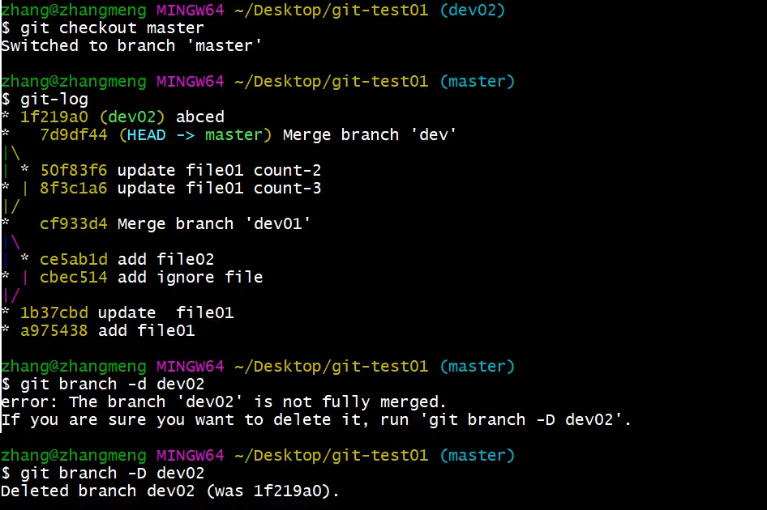
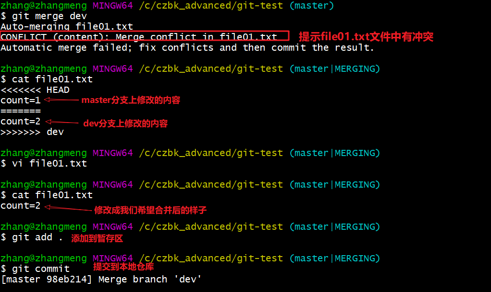
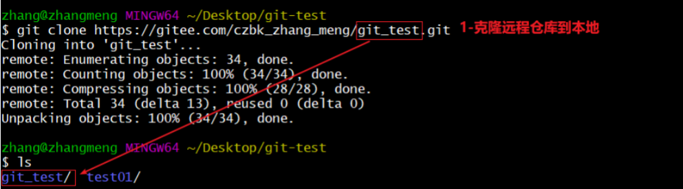

修改自：
https://github.com/Eric-lHHI/Git-learning-notes

# Git - 分布式版本控制工具

## 1. 目标

- 了解Git基本概念
- 能够概述Git工作流程
- 能够使用Git常用命令
- 熟悉Git代码托管服务
- 能够使用IDEA操作Git

## 2. 概述

### 2.1 开发中的实际场景

**场景一：备份**  
小明负责的模块即将完成，就在即将发布（Release）之前，电脑突然蓝屏，硬盘损坏！几个月来的辛勤努力瞬间付诸东流。

**场景二：代码还原**  
这个项目需要一个复杂的功能，老王研究了一个星期，终于找到了思路，但经过修改后，代码已面目全非，无法恢复。哪里可以买到哆啦A梦的时光机？

**场景三：协同开发**  
小刚和小强分别从文件服务器下载了同一个文件：`Analysis.java`。小刚在 `Analysis.java` 文件的第30行声明了一个名为 `count()` 的方法，并保存到了文件服务器上；而小强在第50行声明了 `sum()` 方法，也随后保存到文件服务器上。结果，`count()` 方法仅保留在小刚的记忆里。

**场景四：追溯问题代码的编写人和编写时间**  
老王是另一位项目经理，每次项目进度不顺时，他都不知道该扣哪个程序员的工资！这次有个 Bug，调试了 30 多个小时，才发现是因为相关属性在应用初始化时没有赋值。然而，二胖、王东、刘流和正经牛都不承认是自己犯的错。

### 2.2 版本控制器的方式

**a、集中式版本控制工具**  
集中式版本控制工具的版本库集中存放在中央服务器上，团队成员需要从中央服务器下载代码，因此必须保持联网才能工作（通过局域网或互联网）。个人修改后将代码提交到中央版本库。  
举例：SVN 和 CVS。

**b、分布式版本控制工具**  
分布式版本控制工具没有“中央服务器”，每个人的电脑上都有一个完整的版本库。这样在工作时无需联网，因为版本库就在自己的电脑上。多人协作时，只需要将各自的修改推送给对方，便可看到对方的更新。  
举例：Git。

### 2.3 SVN


### 2.4 Git

Git 是一个分布式版本控制系统，它不依赖于中心服务器。每台计算机上的 Git 仓库都是完整的，彼此之间没有层级之分。尽管我们使用 Git 并可能依赖一个中心服务器来方便地交换修改，但这个服务器的角色与每个人的电脑是一样的。可以将其看作是开发者的一个额外的 "PC"，用于方便团队成员之间的代码交流，它并不影响每个人独立工作的能力。没有这个服务器，大家依然可以正常工作，只是“交换”修改会变得不那么方便。

Git 是一个开源的分布式版本控制系统，能够高效、快速地管理从小型到大型的项目版本。它由 Linus Torvalds 为了更好地管理 Linux 内核的开发而设计和开发。

与许多伟大的发明一样，Git 的诞生背景充满了变革与创新。Linux 内核的开源项目吸引了大量的贡献者。在 1991 到 2002 年间，绝大多数时间都花费在了提交补丁和管理代码归档的繁琐工作上。到了 2002 年，项目组开始使用一个名为 BitKeeper 的专有分布式版本控制系统来帮助管理和维护代码。

然而，到 2005 年，BitKeeper 的开发公司与 Linux 内核开源社区的合作结束，Linux 社区失去了免费使用 BitKeeper 的权限。这迫使 Linux 开源社区，特别是 Linux 的创始人 Linus Torvalds，开发出自己独立的版本控制系统。基于使用 BitKeeper 的经验，他们设定了新系统的一些关键目标：

- 速度
- 简单的设计
- 对非线性开发模式的强力支持（允许成千上万个并行开发的分支）
- 完全分布式
- 有能力高效管理类似 Linux 内核一样的超大规模项目（速度和数据量）


### 2.5 Git工作流程图


命令如下：

1. **clone（克隆）**：将远程仓库的代码克隆到本地仓库中，获取一个完整的代码副本。
2. **checkout（检出）**：从本地仓库中切换到某个分支并进行修改，通常用于切换工作环境。
3. **add（添加）**：在提交前，将修改的代码添加到暂存区，准备提交。
4. **commit（提交）**：将暂存区的代码提交到本地仓库，形成一个新的历史版本。
5. **fetch（抓取）**：从远程仓库获取最新的代码到本地仓库，但不进行合并操作，适用于查看远程更新。
6. **pull（拉取）**：从远程仓库拉取最新的代码到本地仓库，并自动执行合并操作，相当于 `fetch + merge`。
7. **push（推送）**：将本地的修改推送到远程仓库，与团队成员共享代码。

## 3 Git安装与常用命令

本教程中的 Git 命令示例均在 Git Bash 中演示，过程中会使用一些基本的 Linux 命令。为了帮助大家更好地理解，以下是常用命令的预先列举：

- **`ls`** / **`ll`**：查看当前目录中的文件和文件夹。
- **`cat`**：查看文件内容。
- **`touch`**：创建一个新的空文件。
- **`vi`**：使用 vi 编辑器打开文件（为了展示效果使用 vi，学员可以根据自己的需求选择其他编辑器，如记事本、EditPlus、NotePad++ 等）。

### 3.1 Git环境配置

#### 3.1.1 下载与安装

下载地址： [https://git-scm.com/download](https://git-scm.com/download)


下载完成后，得到如下安装文件：


双击下载的安装文件进行安装。安装完成后，在电脑桌面（或其他目录）点击右键，如果看到如下两个菜单，则说明 Git 安装成功。


备注：

- **Git GUI**：Git 提供的图形界面工具。
- **Git Bash**：Git 提供的命令行工具。

安装 Git 后，首先需要设置用户名称和 email 地址。这非常重要，因为每次 Git 提交都会使用这些用户信息。

#### 3.1.2 基本配置

1. 打开 Git Bash。
2. 设置用户信息：
    ```shell
    git config --global user.name "itcast"
    git config --global user.email "hello@itcast.cn"
    ```

查看配置信息：
```shell
git config --global user.name
git config --global user.email
```

#### 3.1.3 为常用指令配置别名（可选）

有些常用指令参数较多，每次都需要输入多个参数，我们可以为这些指令设置别名。

1. 打开用户目录，创建 `.bashrc` 文件。  
   部分 Windows 系统不允许用户创建以点号开头的文件，可以在 Git Bash 中执行以下命令来创建：
   ```shell
   touch ~/.bashrc
   ```
   

2. 在 `.bashrc` 文件中输入以下内容：
   ```shell
   # 用于输出 git 提交日志
   alias git-log='git log --pretty=oneline --all --graph --abbrev-commit'
   # 用于输出当前目录所有文件及基本信息
   alias ll='ls -al'
   # 用于一次性暂存并提交所有修改和删除的文件
   alias commit='git commit -a'
   ```

3. 打开 Git Bash，执行以下命令加载配置：
   ```shell
   source ~/.bashrc
   ```
   

#### 3.1.4 解决GitBash乱码问题

1. 打开GitBash执行下面命令
   ```shell
   git config --global core.quotepath false
   ```

2. `${git_home}/etc/bash.bashrc`文件最后加入下面两行

   ```shell
   export LANG="zh_CN.UTF-8"
   export LC_ALL="zh_CN.UTF-8"
   ```

### 3.2 获取本地仓库

要使用 Git 对我们的代码进行版本控制，首先需要创建一个本地仓库：

1. 在电脑的任意位置创建一个空目录（例如 `test`）作为本地 Git 仓库。
2. 进入该目录，点击右键并选择打开 Git Bash 窗口。
3. 执行命令 `git init` 初始化仓库。
4. 如果创建成功，你可以在文件夹下看到一个隐藏的 `.git` 目录。


### 3.3 基础操作指令

Git 工作目录下的文件修改（增加、删除、更新）会处于不同的状态，这些状态会随着执行 Git 命令而发生变化。


本章节讲解如何使用命令控制这些状态之间的转换：

1. `git add`（工作区 → 暂存区）
2. `git commit`（暂存区 → 本地仓库）

#### 3.3.1 查看修改的状态（`status`）

- **作用**：查看文件的修改状态（暂存区、工作区）。
- **命令形式**：`git status`

#### 3.3.2 添加工作区到暂存区（`add`）

- **作用**：将工作区一个或多个文件的修改添加到暂存区。
- **命令形式**：`git add 单个文件名|通配符`
  - 将所有修改加入暂存区：`git add .`

#### 3.3.3 提交暂存区到本地仓库（`commit`）

- **作用**：将暂存区的内容提交到本地仓库的当前分支。
- **命令形式**：`git commit -m '注释内容'`

#### `commit`

- **命令形式**：`git commit [options]`
  - **options**:
    - `-a` = `--all`  
      自动暂存已修改和删除的文件。（新创建的文件仍需执行 `git add`）

#### 3.3.4 查看提交日志（`log`）

**在 [3.1.3](#3.1.3-为常用指令配置别名（可选）) 中配置的别名 `git-log` 包含了这些参数，后续可以直接使用 `git-log` 指令。**

- **作用**：查看提交记录。
- **命令形式**：`git log [options]`
  - **options**:
    - `--all` 显示所有分支的日志。
    - `--pretty=oneline` 将提交信息显示为一行。
    - `--abbrev-commit` 使输出的 commitID 更简短。
    - `--graph` 以图形化的形式显示提交历史。

#### 3.3.5 版本回退

- **作用**：切换到指定版本。
- **命令形式**：`git reset --hard commitID`
  - `commitID` 可通过 `git-log` 或 `git log` 查看。
- **如何查看已删除的记录？**
  - 使用 `git reflog` 查看已删除的提交记录。

#### 3.3.6 添加文件至忽略列表

有些文件不需要被 Git 管理，通常是自动生成的文件，如日志文件或编译时产生的临时文件。可以在工作目录中创建一个名为 `.gitignore` 的文件（文件名固定），列出要忽略的文件模式。以下是一个 `.gitignore` 文件的示例：

```shell
# 不管理 .a 文件
*.a
# 但仍然管理 lib.a，即使上面忽略了 .a 文件
!lib.a
# 只忽略当前目录下的 TODO 文件，不包括 subdir/TODO
/TODO
# 忽略 'build/' 目录下的所有文件
build/
# 忽略 doc/notes.txt，但不忽略 doc/server/arch.txt
doc/*.txt
# 忽略 doc/ 目录下所有的 .pdf 文件
doc/**/*.pdf
```
#### 练习:基础操作

```shell
#####################仓库初始化######################
# 创建目录（git_test01）并在目录下打开gitbash
略
# 初始化git仓库
git init

#####################创建文件并提交#####################
# 目录下创建文件 file01.txt
略
# 将修改加入暂存区
git add .
# 将修改提交到本地仓库，提交记录内容为：commit 001
git commit -m 'commit 001'
# 查看日志
git log

####################修改文件并提交######################
# 修改file01的内容为：count=1
略
# 将修改加入暂存区
git add .
# # 将修改提交到本地仓库，提交记录内容为：update file01
git commit -m 'update file01'
# 查看日志
git log
# 以精简的方式显示提交记录
git-log

####################将最后一次修改还原##################
# 查看提交记录
git-log
# 找到倒数第2次提交的commitID
略
# 版本回退
git reset commitID --hard
```
### 3.4 分支

几乎所有的版本控制系统都以某种形式支持分支。使用分支可以将工作从开发主线上分离开来，进行重大的 Bug 修复或新功能开发，避免影响开发主线。

#### 3.4.1 查看本地分支

- **命令**：`git branch`

#### 3.4.2 创建本地分支

- **命令**：`git branch 分支名`

#### 3.4.4 切换分支（`checkout`）

- **命令**：`git checkout 分支名`

你也可以直接切换到一个不存在的分支（即创建并切换分支）：

- **命令**：`git checkout -b 分支名`

#### 3.4.6 合并分支（`merge`）

一个分支（合并分支）上的提交可以合并到另一个分支（目标分支）。

- **步骤**：先切换到目标分支：`git checkout 目标分支名`
- **合并命令**：`git merge 合并分支名`

#### 3.4.7 删除分支

**注意：不能删除当前分支，只能删除其他分支**。

- **删除分支时做检查**：`git branch -d 分支名`
- **强制删除分支**：`git branch -D 分支名`

例如：



#### 3.4.8 解决冲突

当两个分支修改了同一个文件的同一部分时，就会发生冲突，需要手动解决。解决冲突的步骤如下：

1. 处理文件中的冲突部分。
2. 将解决完冲突的文件添加到暂存区（`add`）。
3. 提交文件到本地仓库（`commit`）。

冲突内容的示例如下：



#### 3.4.9 开发中分支使用原则与流程

在开发中，常见的分支使用流程如下：

- **master（生产）分支**  
  主分支，通常对应线上应用，是最终的生产版本分支。
  
- **develop（开发）分支**  
  从 master 分支创建的开发分支，作为开发部门的主要开发分支。所有阶段性开发完成后，会合并到 master 分支准备上线。

- **feature/xxxx（功能）分支**  
  从 develop 分支创建的分支，通常用于并行开发，开发完成后合并回 develop 分支。

- **hotfix/xxxx（修复）分支**  
  从 master 分支派生出来，用于紧急修复线上 Bug，修复完成后需要合并回 master、test、develop 分支。

- **其他分支**  
  如 test 分支（用于测试），pre 分支（预上线分支）等。


#### 练习：分支操作

```shell
########################### 创建并切换到 dev01 分支，在 dev01 分支提交
# [master] 创建分支 dev01
git branch dev01
# [master] 切换到 dev01
git checkout dev01
# [dev01] 创建文件 file02.txt
略
# [dev01] 将修改加入暂存区并提交到仓库，提交记录内容为：add file02 on dev
git add .
git commit -m 'add file02 on dev'
# [dev01] 以精简的方式显示提交记录
git-log

########################### 切换到 master 分支，将 dev01 合并到 master 分支
# [dev01] 切换到 master 分支
git checkout master
# [master] 合并 dev01 到 master 分支
git merge dev01
# [master] 以精简的方式显示提交记录
git-log
# [master] 查看文件变化（目录下也出现了 file02.txt）
略

########################## 删除 dev01 分支
# [master] 删除 dev01 分支
git branch -d dev01
# [master] 以精简的方式显示提交记录
git-log
```

## 4  Git远程仓库

### 4.1 常用的托管服务[远程仓库]

Git远程仓库是托管Git代码的服务器，它可以帮助开发者共享和协作开发项目。常用的托管服务有：

- **GitHub** (地址：https://github.com/)  
  一个面向开源及私有项目的托管平台，专门支持Git作为唯一的版本控制工具。
  
- **码云** (地址：https://gitee.com/)  
  国内的代码托管平台，速度较GitHub快，适合国内开发者使用。
  
- **GitLab** (地址：https://about.gitlab.com/)  
  开源的Git仓库管理系统，常用于企业或学校内部搭建私有Git服务器。

### 4.2 注册码云

要使用码云的服务，需要注册一个账号。

- 注册地址：[https://gitee.com/signup](https://gitee.com/signup)


### 4.3 创建远程仓库

在码云或其他平台创建远程仓库后，你可以看到仓库的地址。


### 4.4 配置SSH公钥

为了安全地推送到远程仓库，建议使用SSH公钥进行身份验证。步骤如下：

1. **生成SSH公钥**：
   ```bash
   ssh-keygen -t rsa
   ```
   一直按回车，生成默认位置的公钥文件。

2. **获取公钥**：
   ```bash
   cat ~/.ssh/id_rsa.pub
   ```

3. **在码云上配置SSH公钥**：  
   登录到码云，进入个人设置 -> SSH公钥，添加获取到的公钥。

4. **验证是否配置成功**：
   ```bash
   ssh -T git@gitee.com
   ```


### 4.5 操作远程仓库

#### 4.5.1 添加远程仓库

将本地仓库与远程仓库关联，使用命令：

```bash
git remote add <远端名称> <仓库路径>
```

例如：

```bash
git remote add origin git@gitee.com:czbk_zhang_meng/git_test.git
```


#### 4.5.2 查看远程仓库

查看已配置的远程仓库：

```bash
git remote
```


#### 4.5.3 推送到远程仓库

将本地分支推送到远程仓库：

```bash
git push [ -f ] [ --set-upstream ] [远端名称 [本地分支名[:远端分支名]]]
```

例如：

```bash
git push origin master
```

`-f`表示强制覆盖，`-u`或`--set-upstream`表示推送时建立本地分支与远程分支的关联。


#### 4.5.4 本地分支与远程分支的关联关系

查看本地分支和远程分支的关联：

```bash
git branch -vv
```


#### 4.5.5 从远程仓库克隆

克隆远程仓库到本地：

```bash
git clone <仓库路径> [本地目录]
```

例如：

```bash
git clone git@gitee.com:czbk_zhang_meng/git_test.git
```



#### 4.5.6 从远程仓库中抓取和拉取

1. **抓取**：下载远程仓库中的最新更改，但不合并：

   ```bash
   git fetch [remote name] [branch name]
   ```

2. **拉取**：将远程仓库的更改拉取到本地并自动合并：

   ```bash
   git pull [remote name] [branch name]
   ```

1. **提交并推送到远程仓库**：
   - 在本地仓库做提交并推送：
     ```bash
     git add .
     git commit -m "add file03"
     git push origin master
     ```

2. **拉取远程更改**：
   - 在另一个仓库将远程仓库的提交拉取到本地：
     ```bash
     git pull
     ```

#### 4.5.7 解决合并冲突

合并冲突的情况通常发生在不同开发者修改了相同文件的相同部分时。解决冲突的步骤和处理本地冲突相同，在本地先解决冲突后再推送。

**远程仓库冲突的解决方式也和本地分支冲突类似**。


### 练习：远程仓库操作

```shell
########################## 1- 将本地仓库推送到远程仓库
# 完成4.1、4.2、4.3、4.4的操作
略
# [git_test01] 添加远程仓库
git remote add origin git@gitee.com/**/**.git
# [git_test01] 将master分支推送到远程仓库,并与远程仓库的master分支绑定关联关系
git push --set-upstream origin master

########################### 2- 将远程仓库克隆到本地
# 将远程仓库克隆到本地git_test02目录下
git clone git@gitee.com/**/**.git git_test02
# [git_test02] 以精简的方式显示提交记录
git log

########################### 3- 将本地修改推送到远程仓库
# [git_test01] 创建文件 file03.txt
略
# [git_test01] 将修改加入暂存区并提交到仓库，提交记录内容为：add file03
git add .
git commit -m 'add file03'
# [git_test01] 将master分支的修改推送到远程仓库
git push origin master

########################### 4- 将远程仓库的修改更新到本地
# [git_test02] 将远程仓库修改再拉取到本地
git pull
# 以精简的方式显示提交记录
git log
# 查看文件变化(目录下也出现了 file03.txt)
略
```

#### 移除远程仓库

如果需要移除远程仓库，使用命令：

```bash
git remote rm <remote-name>   # 或者 git remote remove <remote-name>
```


## 5 在 IDEA 中使用 Git

### 5.1 在 IDEA 中配置 Git

安装完 IntelliJ IDEA 后，如果 Git 安装在默认路径下，IDEA 会自动检测到 Git 的位置。如果您修改了 Git 的安装路径，您需要手动配置 Git 路径。打开 IDEA，选择 **File → Settings** 打开设置窗口，找到 **Version Control** 下的 **Git** 选项：


点击 **Test** 按钮，若显示成功信息，表示配置完成。


### 5.2 在 IDEA 中操作 Git

场景：假设本地已有一个项目，但该项目尚未作为 Git 仓库管理。我们需要将其推送到码云仓库，与其他开发人员协作开发。

#### 5.2.1 创建远程仓库（参见 4.3）


#### 5.2.2 初始化本地仓库


#### 5.2.3 设置远程仓库


#### 5.2.4 提交到本地仓库


#### 5.2.5 推送到远程仓库


#### 5.2.6 克隆远程仓库到本地


#### 5.2.7 创建分支

- 常规方式：
  
  
- 强大方式：
  

#### 5.2.8 切换分支及其他分支相关操作


#### 5.2.9 解决冲突

1. 在执行 merge 或 pull 操作时，可能会发生冲突：

   
   
2. 解决冲突后，将修改加入暂存区。
3. 提交修改到本地仓库。
4. 推送修改到远程仓库。

### 5.3 IDEA 常用 Git 操作入口

1. 第一张图展示了常用的 Git 操作入口，足以满足大部分开发需求。

   

2. 第二张图展示了更多 Git 操作的入口。

   

### 5.4 场景分析

为了帮助理解 Git 的实际使用，我们进行一个综合练习，模拟团队协作开发。

假设每个人都已经对该项目进行了一定的开发，接下来我们将切换到团队开发模式，由一个团队来完成项目的后续开发。团队包括组长和若干组员（组长即项目经理）。

所有操作都在 IDEA 中完成。

练习场景如下：

1. 组长创建本地仓库，并推送项目到远程仓库。

   

2. 每位组员从远程仓库克隆项目到 IDEA 中，获得各自的工作副本，正式开始开发。我们模拟两位组员（组员 A 和组员 B）分别克隆自己的工作区。

   

3. 组员 A 修改工作区并提交到本地仓库，然后推送到远程仓库；组员 B 可以直接从远程仓库拉取最新代码。

   

4. 组员 A 和组员 B 修改了同一个文件的相同部分，虽然本地提交成功，但推送到远程仓库时，后一个推送会失败。解决方法是，首先拉取远程仓库的代码，解决冲突后再提交并推送。

   

## 附：几条铁令

1. **切换分支前先提交本地修改**。
2. 代码要及时提交，提交后不会丢失。
3. 遇到问题不要删除文件和目录，第一时间向老师请教。

## 附：疑难问题解决

### 1. Windows 下无法查看隐藏文件（.bashrc、.gitignore）


### 2. Windows 下无法创建 `.ignore` 或 `.bashrc` 文件

以创建 `.gitignore` 文件为例：

- 在 Git 目录下打开 Git Bash。
- 执行命令 `touch .gitignore` 来创建文件。


## 附：IDEA 集成 Git Bash 作为 Terminal


---

