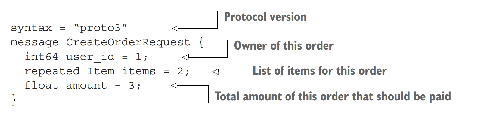
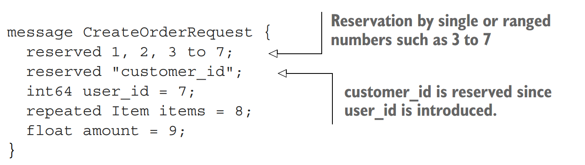
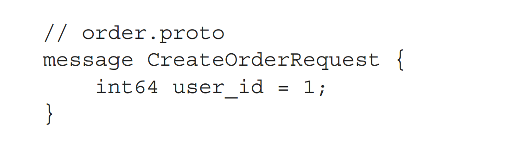
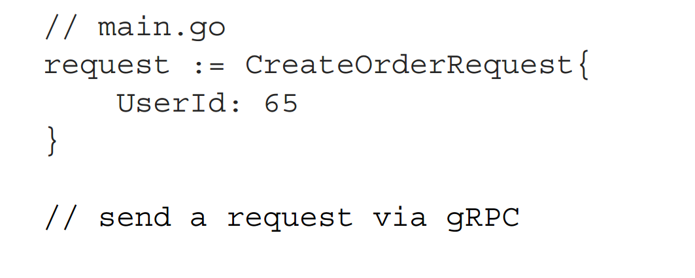
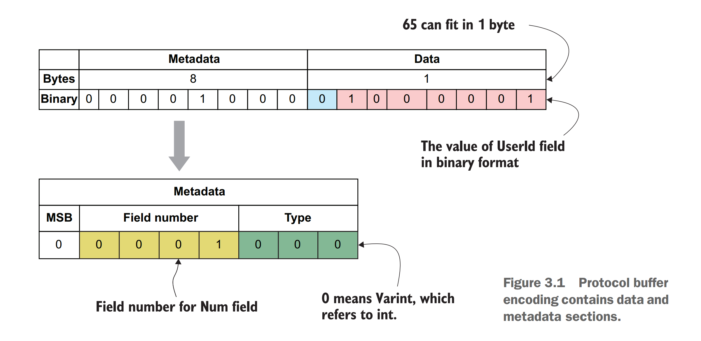
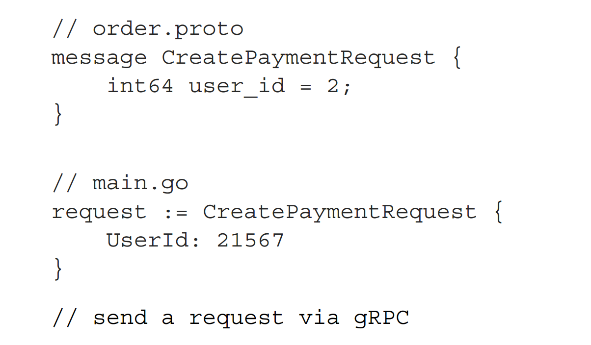
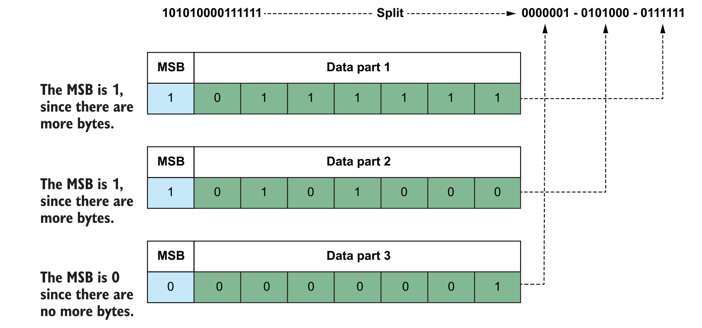
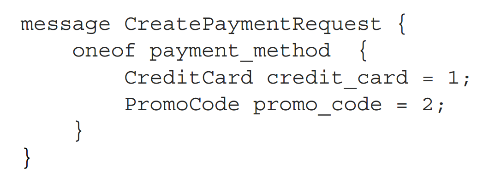

# Protobuf语法示例

```protobuf
syntax = "proto3";
message CreateOrderRequest{
	int64 userid = 1;
	repeated Item items = 2;
	float amount = 3;
}
```



`message`字段可以是：

- Singular，最多有一个。
- Repeated，可以理解为数组，可以有多个项目。

类型可以有很多，具体请查看https://protobuf.dev/programming-guides/proto3/#scalar

### Enum

值得一提的是枚举类型，示例：

```protobuf
syntax = "proto3";

package user;

// 定义一个枚举类型，表示用户状态
enum UserStatus {
    OFFLINE = 0;  // 用户离线
    ONLINE = 1;   // 用户在线
    BUSY = 2;     // 用户忙碌
}

// 定义一个消息，包含一个用户的状态
message User {
    string name = 1;           // 用户名
    UserStatus status = 2;     // 用户状态
}
```

字段命名约定**字段名应该是小写的**；如果包含多个单词，则应该用下划线分隔（例如，user_id）。

### 字段值：

每个字段在消息中都有一个唯一的标识符，用于在二进制消息格式中标识字段。

由于字段号是字段的唯一标识符，因此不应该更改这些数字以提供向后兼容性保证。

如果要删除一个字段，最好**在删除它之前使用reserved关键字保留它**，以防止将来使用相同的字段号或名称定义它。

还可以使用to关键字逐个使用字段号或按范围保留这些字段。例如，删除字段编号为3的customer_id字段并添加具有相同字段名称或编号但类型不同的新字段将导致问题。如果客户端使用旧的消息定义，而服务器使用新的消息定义，则会导致数据兼容性问题，因为它们包含相同的字段，但数据类型不同：

```go
message CreateOrderRequest {
    reserved 1, 2, 3 to 7;      // 保留字段 1 到 7
    reserved "customer_id";     // 保留 "customer_id" 字段
    int64 user_id = 7;          // 字段 7：用户ID
    repeated Item items = 8;    // 字段 8：订单项（可以是多个）
    float amount = 9;           // 字段 9：订单金额
}
```



最佳实践是为经常使用的字段保留1到15之间的一些数字，因为这些数字在该范围内编码需要**1字节**。例如，如果您引入一个名称为correlation_id的字段，并且它几乎用于所有类型的请求，那么您可以为这个新字段分配一个预先保留的数字。同样，**从16到2047的数字编码需要2字节。将频繁使用的字段编号设置在1到15之间将提高性能质量。**

# gRPC-codegen

## Install

Go plugins for the protocol compiler:

Install the protocol compiler plugins for Go using the following commands:

```go
go install google.golang.org/protobuf/cmd/protoc-gen-go@latest
go install google.golang.org/grpc/cmd/protoc-gen-go-grpc@latest
```

Update your `PATH` so that the `protoc` compiler can find the plugins:

```sh
export PATH="$PATH:$(go env GOPATH)/bin"
```

## gen

```sh
protoc \
	-I ./proto \
    --go_out=. \
    --go_opt=paths=source_relative \
    --go-grpc_out=. \
    --go-grpc_opt=paths=source_relative \
    payment.proto
```

`-I` 指定`.proto`导入包的路径。

`--go_out`和`go-grpc_out`指定输出路径

`go-grpc_opt=paths=source_relative` 选项确保生成的 Go 文件中的 import 路径是相对于 `.proto` 文件的路径结构，避免路径混乱，特别是在多模块或多目录的项目中。

生成的代码中， protoc会生成一个具有命名约定的客户端实现`New<Service_Name>client()`

我们最好这么做：

- 基于某些标准重试失败的请求
- 设置超时计时器

```go
// order.proto
message CreateOrderRequest {
 int64 user_id = 1;
}

// main.go
request := CreateOrderRequest{
 UserId: 65
}
// send a request via gRPC

```

## Protobuf编码过程







`Metadata` 8个字节，`MSB`最高有效位,当没有额外的数据的时候为0，`Field Number`即`.proto`文件定义的字段值，`Type`代表类型`int`，`0`为类型`int`。

`Data`8个字节，一位最高有效位。

- **注意**：
- `Field number`只有四个bit，因此当你将字段值设置为`0~15`时，可以拥有更好的性能。
  - 如果希望存储大于127（数据块的最大容量）的数据值，则需要更多的字节来在这些数据块中容纳该值。

### 对大于127bits的数据编码



编码过程如下：

- 21567转换为二进制： 101010000111111。
- 划分： 0000001-0101000-0111111
- 数据位7位，MSB一位，如果MSB置1，则代表后续还有数据

 


## 生成的代码解析

`order_grpc.pb.go`中，会生成一个

```go
func NewOrderClient(cc grpc.ClientConnInterface) OrderClient {
	return &orderClient{cc}
}
```

名称符合`New<ServiceName>Client`，他返回一个

```go
type orderClient struct {
	cc grpc.ClientConnInterface
}
```

你可以创建`OrderClient`，常用方法是调用`Create`方法。

```go
client := order.NewOrderClient(...)
client.Create(ctx, &CreateOrderRequest{
 UserId: 123
})
```

## 维护`.proto`文件

在相同的项目结构中使用自动生成的源代码很容易，但是如果需要在外部项目中使用这些文件作为依赖项，该怎么办呢？例如，您为Payment、Order和Shipping服务生成了存根，现在希望在可以用Go以外的其他语言编写的另一个项目中使用它们。在这种情况下，最好在单独的存储库中维护.proto文件。但是，如果使用mono repo，将.proto文件及其生成文件保存在同一位置会更容易。让我们看看如何维护.proto文件并在一个单独的存储库中生成它们。

## 版本升级相关

### 升级服务端但没有更新客户端

```go
//v1
message CreatePaymentRequest {
	 float64 price = 1;
}

message CreatePaymentResponse {
 	float64 total_price = 1;
}

service Payment {
	rpc Create(CreatePaymentRequest) returns (CreatePaymentResponse){}
}

func (p *Payment) Create(ctx, req *pb.CreatePaymentRequest) 
➥ 	(*pb.CreatePaymentResponse, error) {
	 return &CreatePaymentResponse{
 		TotalPrice: VAT + req.Price
	 }, nil
}
```

```go
//v2
message CreatePaymentRequest {
	float64 price = 1;
	float64 vat = 2; //增值税
}

message CreatePaymentResponse {
	float64 total_price = 1;
}

service Payment {
	rpc Create(CreatePaymentRequest) returns (CreatePaymentResponse){}
}

func (p *Payment) Create(ctx, req *pb.CreatePaymentRequest) 
➥ 	(*pb.CreatePaymentResponse, error) {
	 return &CreatePaymentResponse{
 		TotalPrice: VAT + req.Price
	 }, nil
}


func (p *Payment) Create(ctx, req *pb.CreatePaymentRequest) (*pb.CreatePaymentResponse, error) {
	vat := VAT
	
    if req.Vat > 0 {
		vat = req.Vat
	}
    
	return &CreatePaymentResponse{
        TotalPrice: vat + req.Price
    }, nil
}

```

### 升级客户端但服务端没有升级

那么服务端只会处理原来的默认字段，而不会报错。所有服务端未知的字段，发送过来都会默认丢弃。

## oneof



当你只需要两个字段中的其中一个而不需要两个全都接受的时候，你可以使用`oneof`字段。

注意：

- **删除 `oneof` 中的字段：**
  如果你从 `oneof` 中删除了一个字段，删除的字段会导致 **不向后兼容**。这是因为已经序列化的数据可能包含你删除的字段，如果你不再接受这个字段，解析时就会出现问题。所以，删除字段时需要谨慎。

- **添加 `oneof` 中的字段：**
  添加一个新字段到 `oneof` 中会导致 **不向前兼容**。例如，如果旧版的客户端或服务器没有这个新字段，它将无法理解这个新字段，从而导致数据丢失或错误。因此，新增字段时需要注意老版本系统的兼容性。

> 向后兼容（或称为“向后兼容性”）指的是**新版本的系统能够理解和正确处理由旧版本生成的数据或协议**。
>
> 向前兼容（或称为“向前兼容性”）是指**旧版本的系统能够理解和正确处理由新版本生成的数据或协议**。

# Context介绍

`context.Background()`返回一个空`Context`

```go
type Context interface {
    Deadline() (deadline time.Time, ok bool)
    Done() <-chan struct{}
    Err() error
    Value(key any) any
```

`context.WithTimeout`可以创建一个`context`

```go
func WithTimeout(parent Context, timeout time.Duration) (Context, CancelFunc)
```

使用示例：

```go
ctx, cancel := context.WithTimeout(context.Background(), 10*time.Second)
defer cancel()
```

