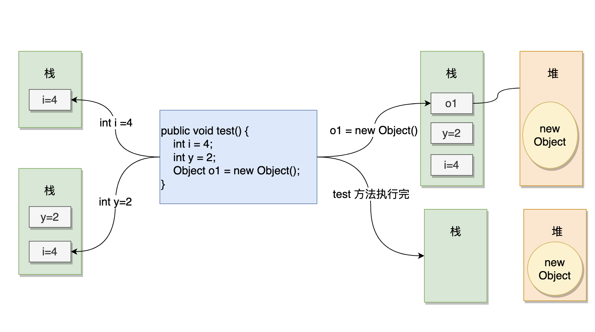

# 杂项

## 文档注释

IDEA中输入`/**`回车，自动生成文档注释。

## byte  short  int double

short有符号，取值: -128-127

int 的取值范围在 -2,147,483,648（-2 ^ 31）和 2,147,483,647（2 ^ 31 -1）（含）之间。

```java
int i; // 声明一个 int 类型变量
i = 1000000; // 将值 1000000 赋给变量 i
int j = -2000000; // 声明并初始化一个 int 类型变量 j，赋值为 -2000000
```

long 的取值范围在(-2^63) 和 (2^63 -1)（含）之间。如果 int 存储不下，就用 long。

```java
long l; // 声明一个 long 类型变量
l = 100000000000L; // 将值 100000000000L 赋给变量 l（注意要加上 L 后缀）
long m = -20000000000L; // 声明并初始化一个 long 类型变量 m，赋值为 -20000000000L
```

float 是单精度的浮点数（单精度浮点数的有效数字大约为 6 到 7 位），32 位（4 字节），遵循 IEEE 754（二进制浮点数算术标准），取值范围为 1.4E-45 到 3.4E+38。float **不适合用于精确的数值，比如说金额**。

```java
float f; // 声明一个 float 类型变量
f = 3.14159f; // 将值 3.14159f 赋给变量 f（注意要加上 f 后缀）
float g = -2.71828f; // 声明并初始化一个 float 类型变量 g，赋值为 -2.71828f
```

double 是双精度浮点数（双精度浮点数的有效数字大约为 15 到 17 位），占 64 位（8 字节），也遵循 IEEE 754 标准，取值范围大约 ±4.9E-324 到 ±1.7976931348623157E308。double 同样不适合用于精确的数值，比如说金额。

```java
double myDouble = 3.141592653589793;
```

## 强制类型转换

### int转char

```java
int a = 65;
char c = (char) a;
System.out.println(c);
```

### 各种进制转char

可以使用 `Character.forDigit()` 方法将整型 int 转换为字符 char，参数 radix 为基数，十进制为 10，十六进制为 16。

```java
public static char forDigit(int digit,int radix)
Params:
digit – the number to convert to a character. radix – the radix.
Returns:
the char representation of the specified digit in the specified radix.
```

```java
int radix = 10;
int value_int = 6;
char value_char = Character.forDigit(value_int , radix);
System.out.println(value_char );
```

### char转int

直接赋值：

```java
int a = 'a';
```

### 数字字符转数字

```java
int a = Character.getNumericValue('1');
int a = Character.digit('1', 10);
```

## 包装器

- Byte（对应 byte）
- Short（对应 short）
- Integer（对应 int）
- Long（对应 long）
- Float（对应 float）
- Double（对应 double）
- Character（对应 char）
- Boolean（对应 boolean）

## 数字字符串转数字

```java
String text = "123";
int number = Integer.parseInt(text);
System.out.println(number);
```

## 堆和栈



## 基本数据类型缓存池

- `new Integer(18)` 每次都会新建一个对象;
- `Integer.valueOf(18)` 会使⽤用缓存池中的对象，多次调用只会取同⼀一个对象的引用。

```java
Integer x = new Integer(18);
Integer y = new Integer(18);
System.out.println(x == y); //false

Integer z = Integer.valueOf(18);
Integer k = Integer.valueOf(18);
System.out.println(z == k); //true

Integer m = Integer.valueOf(300);
Integer p = Integer.valueOf(300);
System.out.println(m == p); //false
```

- Byte：-128~127，也就是所有的 byte 值
- Short：-128~127
- Long：-128~127
- Character：\u0000 - \u007F
- Boolean：true 和 false

## 位运算符


```java
int a = 60, b = 13;
System.out.println("a 的二进制：" + Integer.toBinaryString(a)); // 111100
System.out.println("b 的二进制：" + Integer.toBinaryString(b)); // 1101

int c = a & b;
System.out.println("a & b：" + c + "，二进制是：" + Integer.toBinaryString(c));

c = a | b;
System.out.println("a | b：" + c + "，二进制是：" + Integer.toBinaryString(c));

c = a ^ b;
System.out.println("a ^ b：" + c + "，二进制是：" + Integer.toBinaryString(c));

c = ~a;
System.out.println("~a：" + c + "，二进制是：" + Integer.toBinaryString(c));

c = a << 2;
System.out.println("a << 2：" + c + "，二进制是：" + Integer.toBinaryString(c));

c = a >> 2;
System.out.println("a >> 2：" + c + "，二进制是：" + Integer.toBinaryString(c));

c = a >>> 2;
System.out.println("a >>> 2：" + c + "，二进制是：" + Integer.toBinaryString(c));
```

## 数组

```java
int[] a = new int[]{1, 2, 3, 4, 5};
for (int i = 0; i < a.length; i++) {
    System.out.println(a[i]);
}
for (int element : a) {
    System.out.println(element);
}
```

## 可变参数

`void varArgsMethod(String... args)`

## Arrays工具类

以下是 Java `Arrays` 工具类中常用方法的简要说明：

1. **`equals`**
   - **参数**: `boolean equals(Object[] a, Object[] b)`
   - **返回值**: `boolean`
   - **作用**: 比较两个数组是否相等。

2. **`toString`**
   - **参数**: `String toString(int[] a)`
   - **返回值**: `String`
   - **作用**: 返回数组内容的字符串表示形式。

3. **`fill`**
   - **参数**: `void fill(int[] a, int val)`
   - **返回值**: 无
   - **作用**: 用指定值填充整个数组。

4. **`sort`**
   - **参数**: `void sort(int[] a)`
   - **返回值**: 无
   - **作用**: 对数组进行升序排序。

5. **`binarySearch`**
   - **参数**: `int binarySearch(int[] a, int key)`
   - **返回值**: `int`
   - **作用**: 使用二分搜索查找指定值的索引。

# 面向对象

## 权限修饰符

Java类的权限修饰符有四种：`public`、`protected`、`default`（无修饰符）、`private`。以下是各修饰符在不同访问范围内的权限表：

| 修饰符      | 同一个类内 | 同一个包内 | 子类 | 其他包 |
| ----------- | ---------- | ---------- | ---- | ------ |
| `public`    | √          | √          | √    | √      |
| `protected` | √          | √          | √    | ×      |
| `default`   | √          | √          | ×    | ×      |
| `private`   | √          | ×          | ×    | ×      |

- **public**: 任何地方都能访问。
- **protected**: 本类、同包类、子类可以访问，其他包不能访问。
- **default**: 仅限于同一包内访问，跨包无法访问。
- **private**: 只能在本类内访问，其他地方都不能访问。

## 成员变量和静态变量的初始值

```java
public class LocalVar {
    private int a;
    static int b;

    public static void main(String[] args) {
        LocalVar lv = new LocalVar();
        System.out.println(lv.a);
        System.out.println(b);
    }
}

```

```java
输出：
0
0
```

| 数据类型 | 默认值   | 大小   |
| -------- | -------- | ------ |
| boolean  | false    | 不确定 |
| char     | '\u0000' | 2 字节 |
| byte     | 0        | 1 字节 |
| short    | 0        | 2 字节 |
| int      | 0        | 4 字节 |
| long     | 0L       | 8 字节 |
| float    | 0.0f     | 4 字节 |
| double   | 0.0      | 8 字节 |

## 成员变量和局部变量

1. **作用域**

- **成员变量：**
  - **实例变量**：属于类的对象，每个对象有自己独立的副本。
  - **静态变量**：属于整个类，所有对象共享一份静态变量。
  
- **局部变量：**
  局部变量是在方法、构造函数或代码块中定义的变量，它们只在该代码块或方法中可见。一旦离开该作用域，局部变量就会被销毁。

2. **生命周期**

- **成员变量：**
  - **实例变量**：当一个对象被创建时，实例变量被分配内存。当对象被销毁时，实例变量也随之销毁。
  - **静态变量**：在类被加载时分配内存，直到程序结束时才被销毁。

- **局部变量：**
  局部变量的生命周期是短暂的，它们只在方法或代码块执行时存在。方法执行结束后，局部变量就会被销毁，内存被释放。

3. **默认值**

- **成员变量：**
  成员变量在没有初始化的情况下会有默认值：
  - 数字类型（如 `int`, `double`）：默认值是 `0` 或 `0.0`
  - 布尔类型：默认值是 `false`
  - 引用类型：默认值是 `null`

- **局部变量：**
  **局部变量没有默认值，必须显式地初始化**，否则编译器会报错。

4. **存储位置**

- **成员变量：**
  成员变量存储在堆内存中（对于实例变量），或者在方法区中（对于静态变量）。

- **局部变量：**
  局部变量存储在栈内存中，方法执行时压栈，方法结束后出栈。

5. **修饰符**

- **成员变量：**
  成员变量可以使用访问修饰符（如 `private`, `public`, `protected`）以及其他修饰符（如 `static`, `final`）。它们的可见性可以通过这些修饰符进行控制。

- **局部变量：**
  局部变量不能使用访问修饰符，但可以使用 `final` 修饰符来表示它是不可更改的（即只赋值一次）。

```java
public class Example {
    // 成员变量（实例变量）
    private int instanceVar;

    // 成员变量（静态变量）
    private static int staticVar;

    public void method() {
        // 局部变量
        int localVar = 10;
        
        System.out.println("局部变量：" + localVar);
        System.out.println("实例变量：" + instanceVar);
        System.out.println("静态变量：" + staticVar);
    }
}
```

## 方法

在 Java 中，类方法的声明包括多个部分：访问修饰符、返回类型、方法名、参数列表和方法体。以下是 Java 类方法的标准格式和一些注意细节。

### 1. **方法声明格式**

```java
[修饰符] 返回类型 方法名(参数列表) {
    // 方法体
}
```

### 2. **方法声明的各个部分**

- **修饰符（Modifiers）**：
  修饰符决定方法的可见性和行为，常见的修饰符包括：
  
  - `public`: 方法可以被其他类访问。
  - `private`: 方法只能在定义它的类中访问。
  - `protected`: 方法可以在同一包中的类或子类中访问。
  - `static`: 静态方法属于类，而不是类的实例，静态方法可以通过类名直接调用。
  - `final`: 表示方法不能被子类重写。
  - `abstract`: 抽象方法没有方法体，必须在子类中实现。
  - `synchronized`: 表示方法是线程安全的，同一时间只能由一个线程访问。
- **返回类型（Return Type）**：
  - 方法必须指定返回类型，可以是基本数据类型（如 `int`, `boolean`），引用类型（如 `String`, `List`），或 `void`（表示方法不返回任何值）。
- **方法名（Method Name）**：
  - 方法名应使用小写字母开头，遵循驼峰命名法（camelCase），并且要描述方法的功能。
- **参数列表（Parameter List）**：
  - 方法可以接收零个或多个参数，每个参数必须有明确的类型和名称。
  - 参数之间用逗号分隔，且参数的类型和顺序不能颠倒。

### 3. **细节注意事项**

- **返回值**：
  - 如果方法有返回值，必须使用 `return` 语句返回与声明的返回类型一致的值。
  - 如果返回类型是 `void`，则不需要 `return` 语句，除非想提前结束方法。

- **静态方法**：
  - `static` 修饰的方法属于类，而不是类的实例。可以通过 `ClassName.methodName()` 调用，而不需要创建对象。
  
- **方法重载（Overloading）**：
  - Java 支持方法重载，即同一类中可以定义多个**方法名相同但参数不同**的方法（参数类型、数量或顺序不同）。

- **异常声明**：
  - 如果方法可能会抛出异常，必须在方法声明中使用 `throws` 关键字明确列出。例如：`public void readFile() throws IOException { }`。

- **访问修饰符的作用**：
  - 默认情况下，如果没有指定修饰符，方法的可见性是包级别，即同一个包内的类可以访问。
  
- **可变参数**：
  - Java 支持可变参数，可以在参数列表的最后一项使用 `...` 表示可变参数。例如：`public void print(String... messages)`。

### 4. **示例代码**

#### 无返回值的方法
```java
public void printMessage(String message) {
    System.out.println(message);
}
```

#### 带返回值的方法
```java
public int add(int a, int b) {
    return a + b;
}
```

#### 带静态修饰符的方法
```java
public static void printStaticMessage() {
    System.out.println("This is a static method.");
}
```

#### 带异常声明的方法
```java
public void readFile(String filePath) throws IOException {
    // 方法体内的代码可能会抛出 IOException
}
```

#### 带可变参数的方法
```java
public void printMessages(String... messages) {
    for (String message : messages) {
        System.out.println(message);
    }
}
```

### 5.方法重载(Method Overloading)

**方法重载**是在同一个类中定义**多个同名**的方法，但每个方法的**参数列表不同**。Java 通过参数的数量、类型、顺序来区分这些重载的方法。重载方法允许你使用相同的方法名处理不同类型或数量的输入，这样提高了代码的可读性和灵活性。

#### **方法重载的规则**

1. **参数数量不同**：方法的参数个数可以不同。
2. **参数类型不同**：即使参数个数相同，但参数的类型不同。
3. **参数顺序不同**：参数类型相同但顺序不同也可以构成重载。

#### **不属于方法重载的情况**
- **仅返回类型不同**：Java 不允许仅通过返回类型不同来区分方法重载，编译器无法仅依靠返回类型来识别调用的是哪个方法。
- **仅访问修饰符不同**：方法的可见性（`public`, `private`等）和是否是静态方法（`static`）不能作为方法重载的依据。
- **仅抛出异常不同**：抛出的异常类型不同也不能作为方法重载的条件。

#### **方法重载的好处**
- 提高了代码的可读性和简洁性，因为开发者可以通过同一个方法名处理不同类型或数量的输入。
- 使代码更具灵活性，可以适应多种输入情况而不需要为每种情况创建不同的方法名。

#### **方法重载示例**

```java
public class OverloadExample {
    // 重载方法1：接收两个整数并返回和
    public int add(int a, int b) {
        return a + b;
    }
    
    // 重载方法2：接收三个整数并返回和
    public int add(int a, int b, int c) {
        return a + b + c;
    }
    
    // 重载方法3：接收两个浮点数并返回和
    public double add(double a, double b) {
        return a + b;
    }

    // 重载方法4：接收一个整数和一个浮点数并返回和
    public double add(int a, double b) {
        return a + b;
    }
    
    public static void main(String[] args) {
        OverloadExample obj = new OverloadExample();
        System.out.println(obj.add(1, 2));          // 调用第一个方法
        System.out.println(obj.add(1, 2, 3));       // 调用第二个方法
        System.out.println(obj.add(1.5, 2.5));      // 调用第三个方法
        System.out.println(obj.add(1, 2.5));        // 调用第四个方法
    }
}
```

#### **注意**
- **返回类型**不同并不构成重载。例如，以下代码是无效的，因为 Java 无法通过返回类型区分重载的方法：

```java
// 错误示例
public int add(int a, int b) {
    return a + b;
}

public double add(int a, int b) {
    return a + b;
}
```

#### **自动类型转换与重载**
Java 支持自动类型转换（比如从 `int` 转为 `double`），如果方法的参数类型能通过类型转换匹配，Java 编译器会自动选择合适的重载方法。例如：
```java
public double add(double a, double b) {
    return a + b;
}

public static void main(String[] args) {
    OverloadExample obj = new OverloadExample();
    System.out.println(obj.add(1, 2));  // 自动将 int 转换为 double
}
```

在这种情况下，虽然传递的是两个整数，但由于没有匹配的 `int` 参数的重载方法，Java 会将 `int` 自动转换为 `double`，并调用 `add(double, double)`。

#### **总结**
- **方法重载**是通过定义多个相同方法名但参数不同的方法来实现的。
- 它提高了代码的可读性和灵活性。
- 方法重载不能仅依靠返回类型、访问修饰符或抛出异常来实现。

在 Java 中，所有方法参数的传递都是**值传递（pass-by-value）**。这意味着当你将一个变量作为参数传递给方法时，传递的是该变量的**副本**，而不是该变量本身。

## **值传递的概念**
- **基本数据类型**（如 `int`, `char`, `boolean`, `float` 等）：传递的是变量的值的副本，方法内部对参数的修改不会影响原始变量。
- **引用类型**（如对象、数组）：传递的是对象引用的副本，虽然对象的引用是传递的副本，但该副本仍然指向原来的对象，因此方法内部可以修改对象的属性，但不能修改引用本身指向的对象。

### **基本类型的值传递**

对于基本数据类型，传递的是变量的副本，方法内部的修改不会影响原来的变量。

#### 示例：
```java
public class Test {
    public static void main(String[] args) {
        int num = 10;
        modifyPrimitive(num);  // 传递的是 num 的副本
        System.out.println("方法调用后的num值: " + num);  // 输出：10
    }

    public static void modifyPrimitive(int number) {
        number = 20;  // 修改副本，不影响原始变量
    }
}
```
在这个例子中，`num` 的副本被传递给 `modifyPrimitive` 方法，方法内部对副本的修改不影响外部的 `num` 变量。因此输出仍然是 `10`。

在 Java 中，引用类型的参数传递虽然也是**值传递**，但由于传递的是对象的**引用的副本**，可以通过这个引用修改对象的内容。这种行为有时会让人误以为是**引用传递**。为了更好地理解引用类型的值传递，我们需要详细解释引用的副本和对象的关系，以及它在方法调用中的具体行为。

### **引用类型的参数传递**

首先，需要明确以下几个概念：
- **引用**：引用是对象在内存中的地址，用于定位和操作该对象。它类似于指针，指向实际的对象。
- **值传递**：Java 总是通过传递变量的副本来传递参数，**引用类型也是如此**。传递给方法的不是对象本身，而是对象引用的副本。

#### **引用的副本传递机制**
当你将一个引用类型的变量作为参数传递给方法时，实际上传递的是该引用的**副本**，这个副本指向堆内存中的同一个对象。也就是说，方法中的引用与外部的引用虽然是两个不同的变量，但它们指向同一个对象。

- **引用的副本**意味着方法内修改引用指向的对象的属性会反映在外部对象上，因为它们都指向相同的对象。
- 但是，如果你试图让这个引用指向一个新的对象，外部引用不会受到影响，因为这只改变了方法内引用的副本，而不是外部的引用。

### **具体解释：可以修改对象内容，不能修改引用本身**

1. **可以修改对象内容**：
   由于传递的是引用的副本，而这个副本仍然指向堆中的相同对象，你可以通过这个引用修改该对象的属性。这种修改会影响到原始对象，因为它们指向同一个内存地址。

#### 示例代码：修改对象的内容

```java
class Person {
    String name;

    Person(String name) {
        this.name = name;
    }
}

public class Main {
    public static void main(String[] args) {
        Person person = new Person("Alice");
        modifyObject(person);  // 传递的是 person 引用的副本
        System.out.println("方法调用后的person.name: " + person.name);  // 输出：Bob
    }

    public static void modifyObject(Person p) {
        p.name = "Bob";  // 修改引用指向的对象的属性
    }
}
```

在这个例子中，`modifyObject` 方法接收的 `p` 是 `person` 引用的副本，但由于副本和原始引用指向同一个 `Person` 对象，修改 `p.name` 会影响到原始的 `person` 对象。调用 `modifyObject` 后，`person.name` 变成了 `"Bob"`。

2. **不能修改引用本身**：
   虽然你可以通过引用的副本修改对象的属性，但你不能让这个副本引用一个新的对象，并期望这会影响外部的引用。因为在方法内部重新给引用赋值只是改变了**副本**的引用地址，外部引用仍然保持不变。

#### 示例代码：尝试修改引用本身

```java
class Person {
    String name;

    Person(String name) {
        this.name = name;
    }
}

public class Main {
    public static void main(String[] args) {
        Person person = new Person("Alice");
        reassignObject(person);  // 尝试重新分配引用
        System.out.println("方法调用后的person.name: " + person.name);  // 输出：Alice
    }

    public static void reassignObject(Person p) {
        p = new Person("Charlie");  // 给引用副本重新分配新对象
        p.name = "Dave";  // 修改新对象的属性
    }
}
```

在这个例子中，`reassignObject` 方法内部重新给 `p` 赋值为一个新的 `Person` 对象。然而，这只是修改了 `p` 的副本，外部的 `person` 变量仍然指向最初的 `"Alice"` 对象。因此，方法调用结束后，`person.name` 仍然是 `"Alice"`，并没有变成 `"Dave"` 或 `"Charlie"`。

### **详细说明引用类型的内存模型**

为了更好地理解引用类型的传递，下面是 Java 在堆内存和栈内存中的工作机制：

1. **栈内存（Stack）**：栈内存中存储方法调用和局部变量。当你传递一个引用类型的变量时，引用本身（即对象的地址）存储在栈内存中。
2. **堆内存（Heap）**：堆内存中存储实际的对象。当你创建一个对象时，这个对象存储在堆内存中，栈中的引用指向该对象在堆中的内存地址。

在方法调用时，Java 将栈中引用的副本传递给方法。尽管引用是副本，但它指向堆内存中的同一个对象，因此修改对象的内容会影响到外部对象。

### **理解值传递与引用传递的区别**
- **值传递（Java 的行为）**：传递的是变量的副本，Java 传递的是引用的副本（对于引用类型）。方法内部的修改只影响副本，不影响外部引用变量本身，但可以修改对象的内容。
  
- **引用传递**（非 Java 的行为）：如果 Java 是引用传递，那么方法内部的引用重新指向另一个对象时，外部的引用也会随之改变。然而，Java 并不支持这种行为。

### **引用传递的误解**
由于引用类型可以修改对象内容，很多人误以为 Java 使用的是**引用传递**。实际上，Java 传递的是**引用的值**，即引用变量的副本。这就是值传递的表现形式。

### **总结**
- Java 的所有参数传递都是**值传递**，包括引用类型。
- 对于引用类型，传递的是引用的副本，但引用仍指向同一个对象，所以可以通过副本修改对象的内容。
- 不能通过修改引用本身来改变外部的引用，即方法内部重新赋值给引用不会影响外部引用。

理解这种引用的值传递机制，有助于在编写 Java 程序时正确处理对象的修改和传递。

在 Java 中，对象数组是一个包含对象引用的数组。对象数组的每个元素实际上是对堆内存中实际对象的引用。对象数组允许你存储多个对象，并通过索引访问它们，就像基本类型数组一样。不同的是，对象数组中的元素是引用类型，而不是直接存储实际的对象。

## 对象数组

### **对象数组的创建**

与普通数组一样，创建对象数组的方式也有两种：

1. **声明和初始化分开**：
   首先声明一个对象数组，然后分配内存并逐个初始化对象。

   ```java
   // 声明一个对象数组
   Person[] people;
   
   // 分配数组空间
   people = new Person[3];
   
   // 为数组中的每个元素分配内存（即创建对象）
   people[0] = new Person("Alice");
   people[1] = new Person("Bob");
   people[2] = new Person("Charlie");
   ```

2. **声明和初始化同时进行**：
   在声明数组时同时分配内存并初始化数组中的对象。

   ```java
   Person[] people = {
       new Person("Alice"),
       new Person("Bob"),
       new Person("Charlie")
   };
   ```

### **对象数组的特点**
- **默认值为 `null`**：对象数组在分配内存时，每个元素默认的值是 `null`，直到你显式地为它们分配对象。必须确保在使用数组元素前对象已经被初始化，否则会抛出 `NullPointerException`。
  
- **大小固定**：与其他数组一样，对象数组的大小在创建时是固定的，不能动态调整。如果需要动态大小的集合，通常使用 `ArrayList` 或其他集合类。

- **对象引用**：对象数组存储的是对对象的引用，而不是对象本身。修改数组元素的属性会直接影响原始对象。

### **示例代码**

#### 声明和初始化对象数组

```java
class Person {
    String name;

    Person(String name) {
        this.name = name;
    }

    void display() {
        System.out.println("Person's name: " + name);
    }
}

public class Main {
    public static void main(String[] args) {
        // 创建一个对象数组，存储3个Person对象
        Person[] people = new Person[3];
        
        // 初始化每个对象
        people[0] = new Person("Alice");
        people[1] = new Person("Bob");
        people[2] = new Person("Charlie");
        
        // 访问数组中的对象并调用方法
        for (Person person : people) {
            person.display();
        }
    }
}
```

#### 输出：
```
Person's name: Alice
Person's name: Bob
Person's name: Charlie
```

### **数组的默认值**

对象数组创建时，其每个元素默认是 `null`。如果你没有为数组的某个元素分配对象，那么尝试访问该元素会导致 `NullPointerException`。例如：

```java
Person[] people = new Person[3];
System.out.println(people[0]);  // 输出：null
```

### **对象数组的常见操作**

1. **遍历对象数组**：
   使用 `for` 或 `for-each` 循环遍历对象数组。

   ```java
   for (int i = 0; i < people.length; i++) {
       System.out.println(people[i].name);
   }
   
   // 或者使用 for-each 循环
   for (Person person : people) {
       System.out.println(person.name);
   }
   ```

2. **修改数组中的对象**：
   你可以通过数组引用直接修改数组中对象的属性。例如：

   ```java
   people[0].name = "Alex";  // 修改第一个对象的name属性
   ```

3. **访问未初始化的数组元素**：
   如果在使用前忘记初始化数组元素，尝试访问会抛出 `NullPointerException`。

   ```java
   Person[] people = new Person[3];
   people[0].display();  // 将抛出 NullPointerException，因为 people[0] 是 null
   ```

### **示例：对象数组的动态修改**

下面的示例展示了如何在数组中修改对象的属性，以及数组本身无法动态扩展的局限性。

```java
class Person {
    String name;

    Person(String name) {
        this.name = name;
    }

    void display() {
        System.out.println("Person's name: " + name);
    }
}

public class Main {
    public static void main(String[] args) {
        // 创建对象数组
        Person[] people = new Person[2];
        people[0] = new Person("Alice");
        people[1] = new Person("Bob");

        // 修改数组中第一个元素的属性
        people[0].name = "Alex";

        // 显示修改后的数组内容
        for (Person person : people) {
            person.display();
        }

        // 尝试扩展数组大小（不允许动态调整大小）
        // 如果需要扩展数组，需创建新的更大的数组
        Person[] morePeople = new Person[3];
        System.arraycopy(people, 0, morePeople, 0, people.length);
        morePeople[2] = new Person("Charlie");

        // 输出新数组内容
        for (Person person : morePeople) {
            person.display();
        }
    }
}
```

#### 输出：
```
Person's name: Alex
Person's name: Bob
Person's name: Alex
Person's name: Bob
Person's name: Charlie
```

在这个例子中，首先修改了数组中第一个对象的属性，然后通过 `System.arraycopy` 复制了原始数组到一个更大的新数组，以模拟数组的扩展。

### **常见问题**

1. **NullPointerException**：
   当访问尚未初始化的数组元素时，会抛出 `NullPointerException`。在创建对象数组后，确保每个元素都被正确初始化。

2. **数组长度不可变**：
   Java 的数组长度在创建时是固定的，无法动态调整大小。要实现动态大小的集合，可以使用 `ArrayList` 或其他集合类。

3. **数组和 `ArrayList` 的区别**：
   虽然数组大小固定，但它们比 `ArrayList` 更高效，特别是当你确定需要固定大小的集合时。`ArrayList` 提供了动态扩展的能力，但会带来额外的性能开销。

### **总结**

- 对象数组是存储对象引用的数组。
- 创建对象数组时，数组中的每个元素默认值为 `null`，需要显式初始化对象。
- 对象数组中的元素可以通过索引访问和修改。
- 数组长度固定，不能动态扩展，如果需要动态大小的集合，建议使用 `ArrayList`。

## Package和Import

在 Java 中，`package` 和 `import` 是两个非常重要的关键字，它们帮助开发者管理和组织代码。

- **`package`** 用于对类进行逻辑分组，将类放入不同的命名空间中，以避免命名冲突并组织项目结构。
- **`import`** 用于导入其他包中的类或接口，方便在当前类中直接使用这些类，而不需要使用完整的包名。

下面我们将详细介绍这两个关键字及其用法。

---

### **1. `package`：包的声明和管理**

#### **什么是 `package`？**
`package` 是 Java 提供的一种命名空间机制，用于将相关的类、接口、枚举和子包组织到一个包中。包可以看作是文件夹，它将不同的类文件放在同一个“文件夹”下，从而方便管理代码并避免类名冲突。

#### **包的作用**
- **避免类名冲突**：当项目中有多个类的名字相同时，使用不同的包可以防止命名冲突。例如，你可以在 `com.example.math` 和 `com.example.geometry` 包中分别创建同名的 `Point` 类。
- **提高代码的可维护性和组织性**：通过包的层次结构，你可以将相关的类组合在一起，从而更容易管理和理解代码结构。
- **控制访问权限**：Java 提供了包级访问控制，`public` 和 `protected` 修饰符结合包的使用可以控制类的访问权限。

#### **包的声明**
Java 类文件的第一行通常是 `package` 语句，用于指定该类属于哪个包。如果类文件中没有 `package` 语句，则默认放在无名包中（默认包）。

```java
package com.example.project;  // 声明该类属于com.example.project包

public class MyClass {
    // 类的定义
}
```

在这个例子中，`MyClass` 类被声明在 `com.example.project` 包中。包名通常使用公司域名的反转形式（如 `com.example`），以确保唯一性。

#### **包的层次结构**
包可以是嵌套的，形成层次结构，例如：

```
com
 └── example
      ├── math
      └── geometry
```

在上面的层次结构中，`com.example.math` 和 `com.example.geometry` 是两个不同的包。

#### **包与文件系统的对应关系**
包与文件系统中的目录结构直接对应。假设你的类名是 `MyClass`，并且你将其放在 `com.example.project` 包中，那么源文件应该位于项目目录的 `com/example/project` 文件夹中。

```bash
src/
└── com/
    └── example/
        └── project/
            └── MyClass.java
```

编译后的 `.class` 文件也会放在相应的文件夹中。

---

### **2. `import`：类和包的导入**

#### **什么是 `import`？**
`import` 关键字用于在一个类中引用其他包中的类或接口，从而避免在代码中使用类的全限定名。导入某个类后，你可以直接使用该类的简单名称，而不需要每次都带上包名。

#### **import 的用法**
- **单个类的导入**：通过 `import` 指定要使用的具体类。
  
  ```java
  import java.util.ArrayList;
  
  public class Test {
      public static void main(String[] args) {
          ArrayList<String> list = new ArrayList<>();
      }
  }
  ```

  在这个例子中，导入了 `java.util.ArrayList` 类，因此在代码中可以直接使用 `ArrayList`。

- **整个包的导入**：使用 `*` 导入整个包中的所有类。

  ```java
  import java.util.*;
  
  public class Test {
      public static void main(String[] args) {
          ArrayList<String> list = new ArrayList<>();
          HashMap<String, Integer> map = new HashMap<>();
      }
  }
  ```

  使用 `import java.util.*` 导入整个 `java.util` 包，这样可以使用该包中的任何类，如 `ArrayList` 和 `HashMap`。

#### **注意事项**
- **`import` 不会导入子包**：导入一个包时，不会导入其子包中的类。例如，`import java.util.*` 导入了 `java.util` 包中的所有类，但不会导入 `java.util.concurrent` 中的类。如果需要使用子包中的类，必须单独导入它们。
  
  ```java
  import java.util.concurrent.*;
  
  public class Test {
      // 可以使用concurrent包中的类
      ExecutorService executor = Executors.newFixedThreadPool(10);
  }
  ```

- **静态导入**：Java 5 引入了**静态导入（`import static`）**，用于导入类的静态成员（方法或字段）。静态导入允许你直接访问静态方法或字段，而无需通过类名调用。

  ```java
  import static java.lang.Math.*;
  
  public class Test {
      public static void main(String[] args) {
          double result = sqrt(16);  // 不需要 Math.sqrt()
          System.out.println(result);
      }
  }
  ```

  在这个例子中，通过 `import static java.lang.Math.*` 导入了 `Math` 类的所有静态方法，因此可以直接调用 `sqrt` 等方法。

---

### **package 和 import 的关系**

- **`package` 是类的组织方式**，它将类划分为不同的命名空间，避免类名冲突，增强代码的组织性。通过 `package` 关键字声明一个类所属的包。
  
- **`import` 是用来引用其他包中的类**，使得你在使用这些类时无需每次都使用类的全限定名。`import` 使代码更简洁，但不会导入整个包的子包，也不会影响编译性能（Java 编译器知道具体使用哪些类）。

---

### **示例：使用 `package` 和 `import`**

假设有两个类，分别位于不同的包中。

**文件：`src/com/example/project/Person.java`**
```java
package com.example.project;

public class Person {
    private String name;

    public Person(String name) {
        this.name = name;
    }

    public String getName() {
        return name;
    }
}
```

**文件：`src/com/example/test/Main.java`**
```java
package com.example.test;

import com.example.project.Person;  // 导入 Person 类

public class Main {
    public static void main(String[] args) {
        Person person = new Person("Alice");  // 使用导入的类
        System.out.println(person.getName());
    }
}
```

在这个例子中：
1. `Person` 类位于 `com.example.project` 包中。
2. 在 `Main` 类中，通过 `import com.example.project.Person` 导入了 `Person` 类，这样可以直接在 `Main` 类中使用 `Person`。
3. `Main` 类位于 `com.example.test` 包中，并且它可以从不同的包中导入所需的类。

---

### **总结**
- **`package`**：用于组织类，将相关类放在同一个包中，避免命名冲突，增强代码的组织性。包名通常遵循域名反转的命名规则。
- **`import`**：用于导入其他包中的类，使得在代码中可以直接使用类的简单名称，而无需使用类的全限定名。可以导入单个类或整个包（但不包括子包），也可以通过 `import static` 导入静态成员。

通过 `package` 和 `import`，Java 开发者可以有效地组织和复用代码，使项目结构更加清晰合理。

## this指针

在 Java 中，`this` 关键字非常重要，它用于引用当前对象。通过 `this`，你可以在类的内部访问当前对象的属性（成员变量）、方法，甚至可以调用其他构造器。下面详细介绍 `this` 的几种常见用法：

---

### **1. `this` 调用属性（成员变量）**

`this` 可以用来区分当前对象的成员变量和局部变量，尤其是在方法或构造器的参数名与成员变量名相同的情况下。`this` 解决了命名冲突问题，明确表示引用的是当前对象的成员变量。

#### **示例：访问成员变量**

```java
class Person {
    private String name;
    
    // 构造方法
    public Person(String name) {
        this.name = name;  // 使用 this 访问成员变量 name
    }

    public void display() {
        System.out.println("Name: " + this.name);  // 使用 this 访问成员变量 name
    }
}

public class Main {
    public static void main(String[] args) {
        Person person = new Person("Alice");
        person.display();  // 输出：Name: Alice
    }
}
```

#### **解释：**
- `this.name = name;` 中的 `this.name` 表示当前对象的成员变量，而 `name` 表示构造器的参数。如果不使用 `this`，Java 会默认认为你指的是参数变量而不是成员变量。
- 在 `display()` 方法中，`this.name` 也是访问当前对象的成员变量。

---

### **2. `this` 调用方法**

`this` 还可以用于调用当前对象的其他方法。虽然在类内部调用方法时，通常可以省略 `this`，但使用 `this` 可以使代码更清晰，明确表示调用的是当前对象的方法。

#### **示例：调用方法**

```java
class Person {
    private String name;
    
    public Person(String name) {
        this.name = name;
    }

    public void greet() {
        System.out.println("Hello, " + this.name + "!");
    }

    public void introduce() {
        this.greet();  // 使用 this 调用当前对象的 greet() 方法
        System.out.println("I am " + this.name + ".");
    }
}

public class Main {
    public static void main(String[] args) {
        Person person = new Person("Alice");
        person.introduce();  
    }
}
```

#### **输出：**
```
Hello, Alice!
I am Alice.
```

#### **解释：**
- 在 `introduce()` 方法中，使用 `this.greet()` 来调用 `greet()` 方法。虽然 `greet()` 可以直接调用（省略 `this`），但使用 `this` 显示调用使代码更清晰。
- `this.greet()` 和 `greet()` 是等效的，二者都是调用当前对象的方法。

---

### **3. `this` 调用构造器**

在一个类的多个构造器中，你可以使用 `this()` 关键字来调用当前类中的其他构造器。这种用法通常被称为**构造器重载**的一部分，它允许你在一个构造器中复用另一个构造器的逻辑，从而避免代码重复。

#### **注意：**
- `this()` 必须是构造器中的第一条语句。
- 不能在普通方法中使用 `this()`，它只能在构造器内部使用。

#### **示例：调用构造器**

```java
class Person {
    private String name;
    private int age;

    // 第一个构造器，只接收 name 参数
    public Person(String name) {
        this(name, 0);  // 调用第二个构造器
    }

    // 第二个构造器，接收 name 和 age 参数
    public Person(String name, int age) {
        this.name = name;
        this.age = age;
    }

    public void display() {
        System.out.println("Name: " + this.name + ", Age: " + this.age);
    }
}

public class Main {
    public static void main(String[] args) {
        Person person1 = new Person("Alice");  // 使用第一个构造器
        person1.display();  // 输出：Name: Alice, Age: 0

        Person person2 = new Person("Bob", 25);  // 使用第二个构造器
        person2.display();  // 输出：Name: Bob, Age: 25
    }
}
```

#### **解释：**
- `this(name, 0)` 调用了另一个接收 `name` 和 `age` 参数的构造器。这样，在调用只有 `name` 参数的构造器时，可以重用 `name` 和 `age` 参数的构造逻辑，避免重复代码。
- `this()` 必须作为构造器中的第一行代码，否则会导致编译错误。

---

### **总结**

1. **`this` 调用属性**：`this` 用于在类的成员变量和方法或构造器的局部变量同名时，明确指代当前对象的成员变量，避免冲突。
   
2. **`this` 调用方法**：在类的内部可以使用 `this` 来调用当前对象的其他方法。虽然可以省略 `this`，但使用它可以使代码更具可读性。

3. **`this` 调用构造器**：通过 `this()` 调用当前类中的其他构造器，允许构造器间的复用。必须作为构造器中的第一条语句使用。

通过 `this` 关键字，Java 程序可以更加灵活地在类中访问和管理当前对象的属性、方法和构造器，实现更好的代码复用和组织。

面向对象编程（OOP）的继承性是其核心特性之一，允许创建新的类（子类）从现有类（父类）继承属性和行为。这种机制提供了代码的重用性、可扩展性和多态性。以下是对继承性的详细介绍。

## 继承

### **1. 继承的基本概念**

- **父类（Super Class 或 Base Class）**：被继承的类，定义了一组共享的属性和方法。
- **子类（Sub Class 或 Derived Class）**：继承父类的类，能够继承父类的属性和方法，同时也可以定义自己的属性和方法。

### **2. 继承的类型**

- **单继承**：一个子类只能有一个父类。Java 中只支持单继承。 
  ```java
  class Animal {  // 父类
      void eat() {
          System.out.println("Eating...");
      }
  }
  
  class Dog extends Animal {  // 子类
      void bark() {
          System.out.println("Barking...");
      }
  }
  ```

- **多重继承**：子类可以继承多个父类的特性，但 Java 不支持直接的多重继承（一个类直接继承多个类），以避免菱形继承问题。然而，子类可以通过实现多个接口来达到多重继承的效果。
  
  ```java
  interface CanRun {
      void run();
  }
  
  interface CanBark {
      void bark();
  }
  
  class Dog implements CanRun, CanBark {  // 通过接口实现多重继承
      public void run() {
          System.out.println("Dog is running...");
      }
  
      public void bark() {
          System.out.println("Dog is barking...");
      }
  }
  ```

### **3. 继承的特性**

- **属性和方法的继承**：子类自动继承父类的所有公共和保护（`protected`）属性和方法。私有（`private`）属性和方法不能被子类直接访问，但子类可以通过父类的公共或保护方法间接访问。

- **方法重写**（Overriding）：子类可以重写（override）父类的方法以提供特定实现。重写的方法必须具有相同的名称、返回类型和参数列表。

  ```java
  class Animal {
      void sound() {
          System.out.println("Animal sound");
      }
  }

  class Dog extends Animal {
      void sound() {  // 重写父类的方法
          System.out.println("Barking...");
      }
  }
  ```

- **构造器**：子类不继承父类的构造器，但可以调用父类的构造器。Java 会在创建子类对象时自动调用父类的无参构造器，若父类没有无参构造器，子类必须使用 `super` 关键字显式调用父类的构造器。

  ```java
  class Animal {
      Animal() {
          System.out.println("Animal constructor");
      }
  }
  
  class Dog extends Animal {
      Dog() {
          super();  // 调用父类的构造器
          System.out.println("Dog constructor");
      }
  }
  ```

### **4. 继承的优点**

- **代码重用**：子类可以继承父类的代码，减少冗余，提升代码的可维护性。
- **易于扩展**：通过继承，子类可以扩展父类的功能，而无需修改现有代码。
- **多态性**：通过父类引用指向子类对象，实现多态性。这样可以在运行时决定调用哪个方法，提高了代码的灵活性。

  ```java
  Animal animal = new Dog();  // 父类引用指向子类对象
  animal.sound();  // 输出：Barking...
  ```

### **5. 继承的注意事项**

- **单继承限制**：Java 只支持单继承，但可以通过接口实现多重继承。
- **重写与重载**：重写是子类对父类方法的实现，而重载是同一类中方法名相同但参数不同的情况。
- **使用 `super` 关键字**：可以在子类中使用 `super` 关键字访问父类的属性和方法，或调用父类构造器。
- **不支持多重继承的原因**：Java 不支持多重继承的主要原因是为了避免菱形继承问题（即出现多个父类时，父类的方法的调用会产生混乱）。

在 Java 中，`super` 关键字用于访问父类的属性、方法和构造器。它在继承关系中扮演着重要的角色，允许子类引用其父类的成员。下面是对 `super` 关键字的详细介绍。

## super关键字

### **1. `super` 访问父类属性**

在子类中，如果存在与父类同名的属性，`super` 可以用来访问父类的属性。通过 `super`，你可以明确地指示编译器访问父类的属性，而不是子类的同名属性。

#### **示例：访问父类属性**

```java
class Animal {
    String name = "Animal";  // 父类属性
}

class Dog extends Animal {
    String name = "Dog";  // 子类属性

    void displayNames() {
        System.out.println("Dog's name: " + this.name);  // 访问子类属性
        System.out.println("Animal's name: " + super.name);  // 访问父类属性
    }
}

public class Main {
    public static void main(String[] args) {
        Dog dog = new Dog();
        dog.displayNames();
    }
}
```

#### **输出：**
```
Dog's name: Dog
Animal's name: Animal
```

### **2. `super` 访问父类方法**

在子类中，可以使用 `super` 调用父类的方法。即使子类重写了父类的方法，仍然可以通过 `super` 调用被重写的父类方法。

#### **示例：访问父类方法**

```java
class Animal {
    void sound() {
        System.out.println("Animal sound");
    }
}

class Dog extends Animal {
    void sound() {  // 重写父类方法
        System.out.println("Barking...");
    }

    void callSuperSound() {
        super.sound();  // 调用父类的 sound() 方法
    }
}

public class Main {
    public static void main(String[] args) {
        Dog dog = new Dog();
        dog.sound();  // 调用子类的 sound() 方法
        dog.callSuperSound();  // 调用父类的 sound() 方法
    }
}
```

#### **输出：**
```
Barking...
Animal sound
```

### **3. `super` 调用父类构造器**

在子类的构造器中，可以使用 `super()` 来调用父类的构造器。这个调用必须是构造器中的第一条语句。通过这种方式，子类可以初始化从父类继承的属性。

#### **示例：调用父类构造器**

```java
class Animal {
    String name;

    // 父类构造器
    Animal(String name) {
        this.name = name;
        System.out.println("Animal constructor called: " + this.name);
    }
}

class Dog extends Animal {
    // 子类构造器
    Dog(String name) {
        super(name);  // 调用父类构造器
        System.out.println("Dog constructor called: " + this.name);
    }
}

public class Main {
    public static void main(String[] args) {
        Dog dog = new Dog("Buddy");
    }
}
```

#### **输出：**
```
Animal constructor called: Buddy
Dog constructor called: Buddy
```

### **4. `super` 的注意事项**

- **必须在构造器的第一行**：使用 `super()` 调用父类构造器时，必须将其放在子类构造器中的第一条语句之前。如果不这样做，编译器会抛出错误。
  
- **父类构造器的访问权限**：`super()` 只能调用可访问的父类构造器。如果父类的构造器是私有的，子类将无法调用它。

- **与 `this` 的区别**：`super` 关键字用于引用父类的成员，而 `this` 关键字用于引用当前类的成员。它们可以在构造器中一起使用，但 `super()` 调用必须在构造器的第一行。

### **总结**

`super` 关键字在 Java 的继承机制中扮演着重要的角色，它允许子类访问和使用父类的属性、方法和构造器。通过合理使用 `super`，可以实现更清晰和可维护的代码，同时也能有效地管理继承关系中的成员访问。

## 方法重写

方法重写（Overriding）是面向对象编程中的一个重要特性，允许子类重新定义父类中已经存在的方法。这种机制提供了灵活性，使得子类可以根据需要实现特定的行为，而无需修改父类的代码。以下是对方法重写的详细介绍。

### **1. 方法重写的基本概念**

- **定义**：当子类提供一个与父类方法同名、参数列表相同且返回类型一致的方法时，称为对父类方法的重写。
- **目的**：方法重写的主要目的是为了实现多态性，使得程序在运行时可以根据对象的实际类型（而不是引用类型）来调用相应的方法。

### **2. 方法重写的规则**

- **方法名称相同**：子类方法的名称必须与父类中被重写的方法名称相同。
  
- **参数列表相同**：子类方法的参数列表必须与父类方法的参数列表相同，包括参数的数量、类型和顺序。

- **返回类型相同**：子类方法的返回类型必须与父类方法的返回类型相同，或是其子类（返回类型的协变）。

- **访问权限**：子类方法的访问权限不能低于父类方法的访问权限。例如，如果父类方法是 `public`，则子类方法不能是 `private`，可以是 `public` 或 `protected`。

- **不能重写静态方法**：静态方法属于类而不是对象，因此不能被重写，尽管可以被隐藏（hidden）。

### **3. 示例**

以下是一个简单的示例，演示了如何进行方法重写：

```java
class Animal {
    void sound() {
        System.out.println("Animal sound");
    }
}

class Dog extends Animal {
    @Override  // @Override 注解是可选的，建议使用以提高可读性
    void sound() {  // 重写父类的 sound() 方法
        System.out.println("Barking...");
    }
}

public class Main {
    public static void main(String[] args) {
        Animal animal = new Animal();
        animal.sound();  // 输出：Animal sound

        Animal dog = new Dog();  // 父类引用指向子类对象
        dog.sound();  // 输出：Barking...
    }
}
```

### **4. 多态性与方法重写**

通过方法重写，Java 实现了多态性。多态性允许程序在运行时根据对象的实际类型调用相应的方法。下面是一个关于多态性的示例：

```java
class Cat extends Animal {
    @Override
    void sound() {
        System.out.println("Meowing...");
    }
}

public class Main {
    public static void main(String[] args) {
        Animal myDog = new Dog();
        Animal myCat = new Cat();
        
        myDog.sound();  // 输出：Barking...
        myCat.sound();  // 输出：Meowing...
    }
}
```

在这个例子中，虽然 `myDog` 和 `myCat` 的类型是 `Animal`，但它们的实际类型分别是 `Dog` 和 `Cat`。根据实际类型调用的 `sound()` 方法各自输出不同的内容。

### **5. 注意事项**

- **使用 `@Override` 注解**：虽然 `@Override` 注解不是强制性的，但建议在重写方法时使用它。这可以帮助编译器在编译期间检查是否正确重写了父类的方法，提高代码的可读性。

- **调用父类方法**：在子类中，可以通过 `super` 关键字调用父类的重写方法，尤其在需要扩展父类方法的功能时。

  ```java
  class Dog extends Animal {
      @Override
      void sound() {
          super.sound();  // 调用父类方法
          System.out.println("Barking...");
      }
  }
  ```

## 多态

### **1. 多态性的基本概念**

- **定义**：多态性指的是同一操作作用于不同的对象时，可以产生不同的效果。换句话说，通过相同的方法调用不同类的实例，表现出不同的行为。

- **形式**：多态性主要有两种形式：
  - **编译时多态性**（静态多态性）：通过方法重载（Overloading）和运算符重载实现。Java 不支持运算符重载，但支持方法重载。
  - **运行时多态性**（动态多态性）：通过方法重写（Overriding）和继承实现。

### **2. 编译时多态性**

编译时多态性发生在方法重载时。方法重载是指在同一类中，可以定义多个同名的方法，但它们的参数列表必须不同（数量、类型或顺序不同）。编译器根据参数的类型和数量来决定调用哪个方法。

#### **示例：方法重载**

```java
class Calculator {
    // 重载方法，计算两个整数的和
    int add(int a, int b) {
        return a + b;
    }

    // 重载方法，计算三个整数的和
    int add(int a, int b, int c) {
        return a + b + c;
    }

    // 重载方法，计算两个浮点数的和
    double add(double a, double b) {
        return a + b;
    }
}

public class Main {
    public static void main(String[] args) {
        Calculator calc = new Calculator();
        System.out.println(calc.add(5, 10));          // 输出：15
        System.out.println(calc.add(5, 10, 15));      // 输出：30
        System.out.println(calc.add(5.5, 10.5));      // 输出：16.0
    }
}
```

### **3. 运行时多态性**

运行时多态性是通过方法重写实现的。在这种情况下，父类引用指向子类对象，程序在运行时根据对象的实际类型来决定调用哪个方法。它是实现多态性的最常用方式。

#### **示例：方法重写和运行时多态性**

```java
class Animal {
    void sound() {
        System.out.println("Animal sound");
    }
}

class Dog extends Animal {
    @Override
    void sound() {
        System.out.println("Barking...");
    }
}

class Cat extends Animal {
    @Override
    void sound() {
        System.out.println("Meowing...");
    }
}

public class Main {
    public static void main(String[] args) {
        Animal myAnimal;   // 声明一个 Animal 类型的引用
        
        myAnimal = new Dog();  // myAnimal 引用 Dog 对象
        myAnimal.sound();      // 输出：Barking...

        myAnimal = new Cat();  // myAnimal 引用 Cat 对象
        myAnimal.sound();      // 输出：Meowing...
    }
}
```

在这个例子中，虽然 `myAnimal` 是 `Animal` 类型的引用，但它实际上引用的是 `Dog` 和 `Cat` 类型的对象。根据实际对象的类型，调用了相应的 `sound()` 方法。

### **4. 注意事项**

- **方法重载和重写**：方法重载是在同一类中定义多个同名方法，而方法重写是在子类中重写父类的方法。两者都支持多态性，但重载是编译时多态性，重写是运行时多态性。

- **性能开销**：虽然多态性带来了灵活性，但也会导致一定的性能开销，因为 JVM 需要在运行时决定实际调用的方法。

## instance of

`instanceof` 是 Java 中的一个运算符，用于测试对象是否是某个特定类或接口的实例。它可以帮助开发者在运行时判断对象的类型，从而做出相应的处理。以下是对 `instanceof` 运算符的详细介绍。

### **1. 基本语法**

```java
object instanceof ClassName
```

- **object**：要进行测试的对象。
- **ClassName**：要检测的类或接口的名称。
- **返回值**：如果 `object` 是 `ClassName` 类型的实例（或其子类的实例），则返回 `true`；否则返回 `false`。

### **2. 使用示例**

以下是使用 `instanceof` 运算符的示例：

```java
class Animal {
}

class Dog extends Animal {
}

class Cat extends Animal {
}

public class Main {
    public static void main(String[] args) {
        Animal myDog = new Dog();
        Animal myCat = new Cat();

        System.out.println(myDog instanceof Dog);       // 输出：true
        System.out.println(myDog instanceof Animal);    // 输出：true
        System.out.println(myDog instanceof Cat);       // 输出：false

        System.out.println(myCat instanceof Cat);       // 输出：true
        System.out.println(myCat instanceof Animal);    // 输出：true
        System.out.println(myCat instanceof Dog);       // 输出：false
    }
}
```

### **3. 应用场景**

1. **类型判断**：在继承层次结构中，可以使用 `instanceof` 确定对象的具体类型，从而执行特定的操作。

2. **避免 ClassCastException**：在进行强制类型转换之前，使用 `instanceof` 检查对象是否可以安全地转换为目标类型，从而避免运行时异常。

   ```java
   Animal myAnimal = new Dog();
   if (myAnimal instanceof Dog) {
       Dog myDog = (Dog) myAnimal;  // 安全转换
       // 进一步操作
   }
   ```

### **4. 注意事项**

- **与 null 比较**：如果将 `null` 与 `instanceof` 运算符进行比较，结果总是 `false`。例如：

   ```java
   Animal myAnimal = null;
   System.out.println(myAnimal instanceof Dog); // 输出：false
   ```

- **性能影响**：虽然 `instanceof` 是一种有效的类型检查方法，但频繁使用可能会影响性能，因此在设计类层次结构时应考虑到这一点。

- **接口的使用**：`instanceof` 不仅可以用于类，还可以用于接口。如果一个对象实现了某个接口，可以使用 `instanceof` 检查这个对象是否是该接口的实现类。

   ```java
   interface CanFly {
   }
   
   class Bird implements CanFly {
   }
   
   public class Main {
       public static void main(String[] args) {
           Bird myBird = new Bird();
           System.out.println(myBird instanceof CanFly); // 输出：true
       }
   }
   ```

### **总结**

`instanceof` 运算符是 Java 中一个非常有用的工具，可以用来判断对象的实际类型，特别是在使用多态和继承时。它可以帮助程序员编写更安全和更灵活的代码，避免类型转换时的错误，并在运行时做出适当的决策。合理使用 `instanceof` 有助于提高程序的可读性和可维护性。
