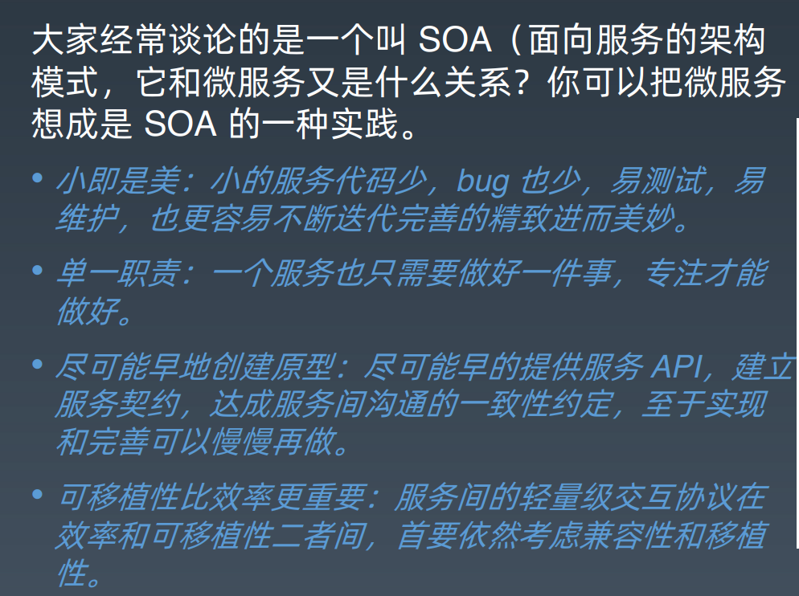
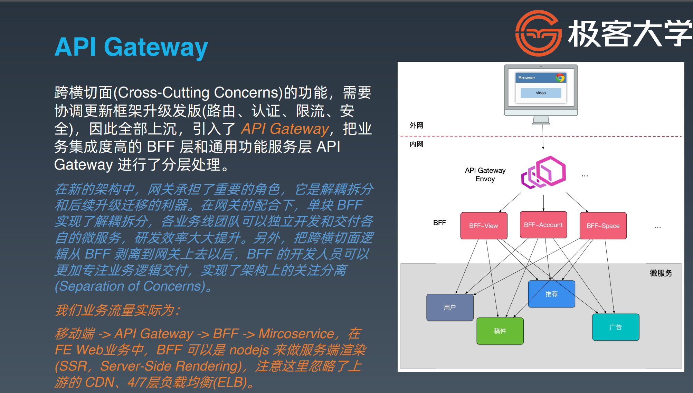
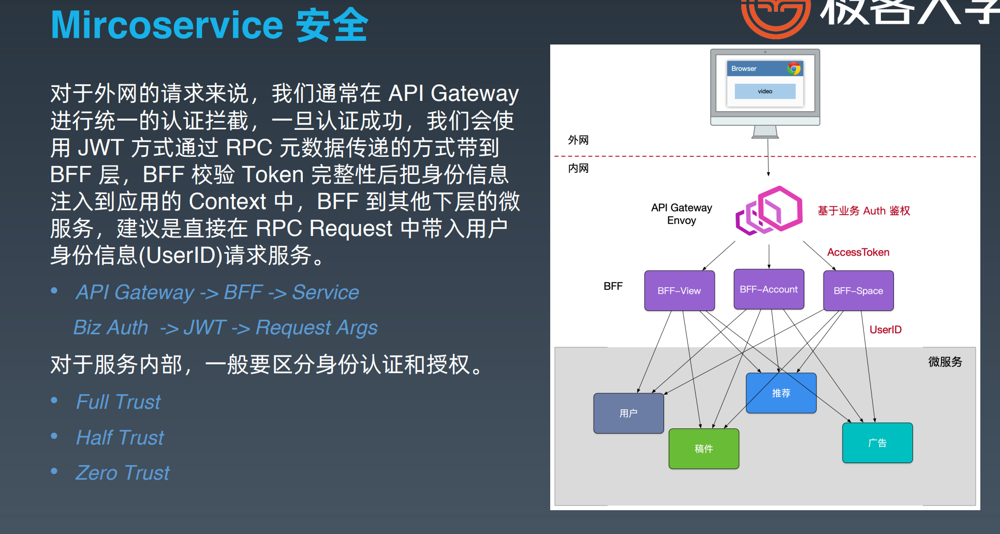
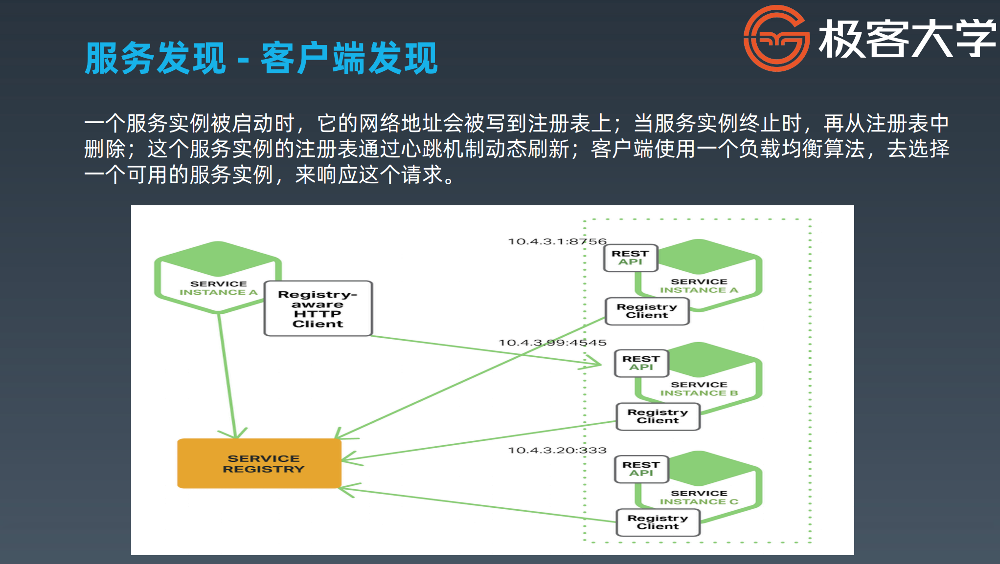
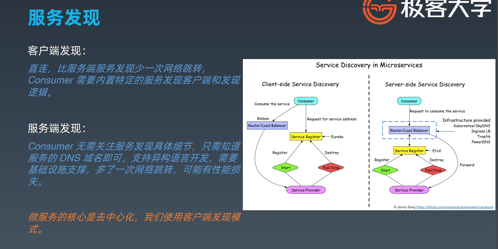
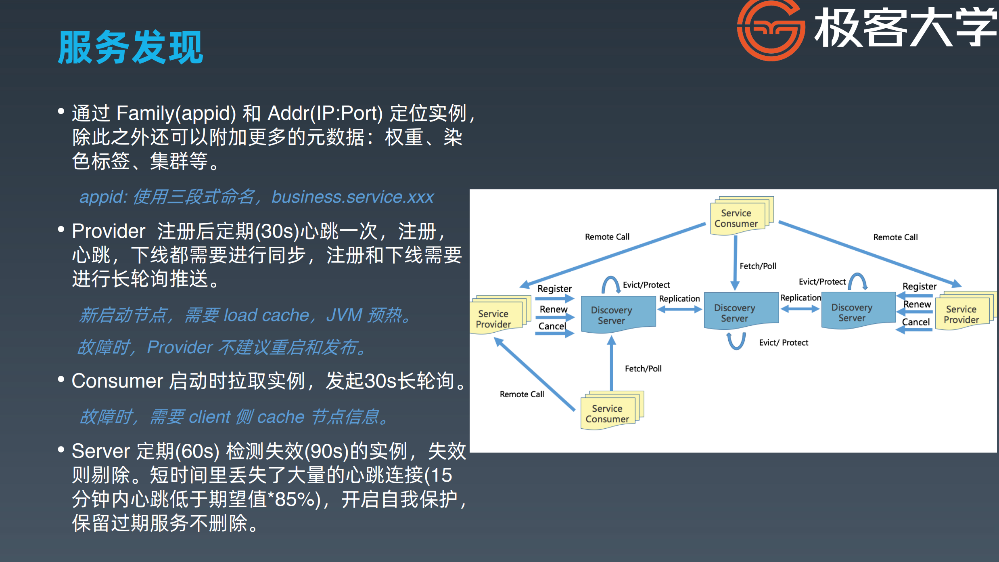

 SOA 面向服务的架构模式

- 原子服务
- 独立进程
- 隔离部署
- 去中心化服务治理

## gRPC

grpc-HealthCheck主动健康检查

**平滑发布**流程：

- 收到kill信号
- 向服务发现register发送一个注销请求
- 设置health check标记为失败，进入优雅退出过程
- 使用grpc或者http的shutdown接口,入参为`context`，可以设定为两个心跳周期
- 如果无法退出，强制kill -9

注册:

- Provider自己注册
- 外挂注册，docker启动脚本EntryPoint自动注册,通过调用provider内部的health check接口,好了就注册，没好就等待

### 服务发现

eureka

#### 客户端发现

gRPC 客户端发现模式（Client-side Service Discovery）指的是客户端通过某种方式动态发现和连接后端服务，而不是直接依赖固定的服务器地址。这种方式主要用于分布式系统中，尤其是在微服务架构中，服务的实例可能是动态变化的，增加或减少节点，因此客户端需要一种机制来找到当前有效的服务实例。

#### **客户端负载均衡**

客户端可以根据服务发现系统返回的多个服务实例进行负载均衡。常见的负载均衡策略有：

- **轮询（Round Robin）**：按顺序访问每个服务实例。
- **随机选择（Random）**：随机选择一个服务实例。
- **权重负载均衡**：根据服务实例的负载或响应时间来选择实例。

#### 服务端发现

https://cloud.tencent.com/developer/article/1082047

LVS->Nginx

