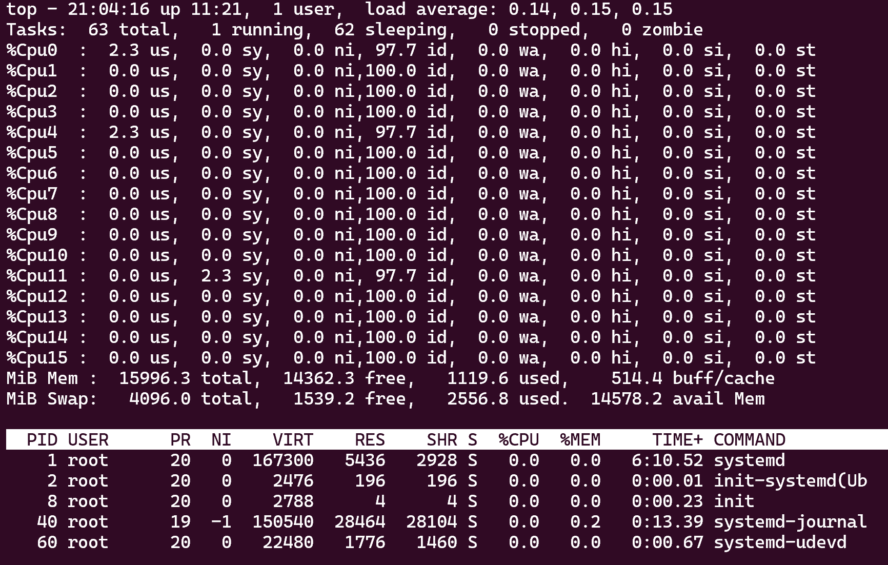
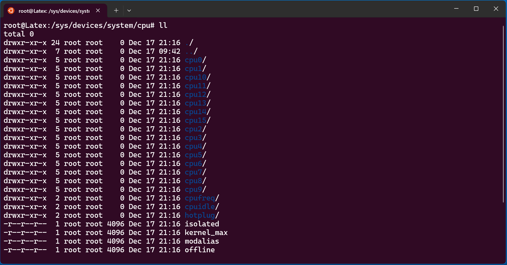

## top

在大多数Linux系统上，`top` 命令是一个实时任务管理器，可以显示系统的各种性能指标，包括CPU使用率。

**使用`1`键：**

- 运行 `top` 命令后，按下数字键 `1`。这会将CPU的使用情况分开显示到每个单独的核心上，这样你就可以通过观察来判断系统中有多少个逻辑CPU核心。



## cat /proc/cpuinfo

显示当前有多少个物理CPU

`cat /proc/cpuinfo | grep "physical id" | sort | uniq` 

显示当前有多少个物理核

`cat /proc/cpuinfo | grep "cpu cores" | uniq`


### `sort` 命令

`sort` 命令用于将文本文件中的行进行排序。默认情况下，它按照字母序（字典序）排序，可以根据需要指定不同的排序方式。

#### 基本用法

```bash
sort filename
```


#### 常用选项

- `-n`：按数值排序，而不是字典顺序。
- `-r`：按逆序（降序）排序。
- `-k`：根据指定的列进行排序。例如，`sort -k 2 filename` 根据第二列进行排序。
- `-u`：在排序的同时去重，功能类似于 `uniq`。

#### 示例

```bash
sort -n numbers.txt  # 按数值排序
sort -r words.txt    # 按逆序排序
sort -k 2 data.txt   # 根据第二列进行排序
```


### `uniq` 命令

`uniq` 命令用于去除文本文件中相邻的重复行。因此，在使用 `uniq` 之前，通常需要先使用 `sort` 命令对数据进行排序。

#### 基本用法

```bash
uniq filename
```


#### 常用选项

- `-c`：在每行前加上出现次数。
- `-d`：只显示重复的行。
- `-u`：只显示不重复的行。

#### 示例

```
sort filename | uniq              # 去除重复行 sort filename | uniq -c           # 显示每个唯一行的出现次数
uniq -d filename                  # 显示重复的行 sort filename | uniq -u           # 显示不重复的行
```

## 查看缓存

`cd /sys/devices/system/cpu`



`cat cpu0/cache/index0/level`

```bash
root@Latex:/sys/devices/system/cpu/cpu0/cache/index0# ll

total 0
drwxr-xr-x 2 root root    0 Dec 17 21:17 ./
drwxr-xr-x 6 root root    0 Dec 17 21:17 ../
-r--r--r-- 1 root root 4096 Dec 17 21:17 coherency_line_size
-r--r--r-- 1 root root 4096 Dec 17 21:17 id
-r--r--r-- 1 root root 4096 Dec 17 21:17 level
-r--r--r-- 1 root root 4096 Dec 17 21:17 number_of_sets
-r--r--r-- 1 root root 4096 Dec 17 21:17 physical_line_partition
-r--r--r-- 1 root root 4096 Dec 17 21:17 shared_cpu_list
-r--r--r-- 1 root root 4096 Dec 17 21:17 shared_cpu_map
-r--r--r-- 1 root root 4096 Dec 17 21:17 size
-r--r--r-- 1 root root 4096 Dec 17 21:17 type
-rw-r--r-- 1 root root 4096 Dec 17 21:17 uevent
-r--r--r-- 1 root root 4096 Dec 17 21:17 ways_of_associativity

root@Latex:/sys/devices/system/cpu/cpu0/cache/index0# cat id
0
root@Latex:/sys/devices/system/cpu/cpu0/cache/index0# cat size
48K
root@Latex:/sys/devices/system/cpu/cpu0/cache/index0# cat type
Data
root@Latex:/sys/devices/system/cpu/cpu0/cache/index0# cat shared_cpu_list
0-1

root@Latex:/sys/devices/system/cpu/cpu0/cache/index0# cd ../index1
root@Latex:/sys/devices/system/cpu/cpu0/cache/index1# cat type
Instruction
```

`index0`和`index1`都是一级缓存，大小均为`48K`，`Data`类型的L1用作数据缓存，`Instruction`类型的L1用作指令缓存。

下面来看`L2`缓存：

```bash
root@Latex:/sys/devices/system/cpu/cpu0/cache/index2# cat id
0
root@Latex:/sys/devices/system/cpu/cpu0/cache/index2# cat size
1280K
root@Latex:/sys/devices/system/cpu/cpu0/cache/index2# cat type
Unified
root@Latex:/sys/devices/system/cpu/cpu0/cache/index2# cat shared_cpu_list
0-1
```

`Unified`表示不区分Data和Instruction。

`L3`:

```go
root@Latex:/sys/devices/system/cpu/cpu0/cache/index3# cat shared_cpu_list
0-15
root@Latex:/sys/devices/system/cpu/cpu0/cache/index3# cat size
20480K
```

`Cache Line` :

在将数据从内存加载到缓存时，CPU一次会将整个cache line加载，而不是单个字节或字。这样做是因为程序通常具有空间局部性，意味着如果一个位置的数据被访问，那么很可能其附近的数据也会被访问。

当处理器查找数据时，如果数据在缓存中可用，那叫做缓存命中。如果数据不在缓存中，会发生缓存未命中，并需要从主存中加载对应的cache line到缓存。

```go
root@Latex:/sys/devices/system/cpu# cat cpu0/cache/index0/coherency_line_size
64
root@Latex:/sys/devices/system/cpu# cat cpu0/cache/index1/coherency_line_size
64
root@Latex:/sys/devices/system/cpu# cat cpu0/cache/index2/coherency_line_size
64
root@Latex:/sys/devices/system/cpu# cat cpu0/cache/index3/coherency_line_size
64
```

本级缓存向下一级取数据的时候基本单位并不是字节，而是`Cache Line`。

假设有一个**64Byte**的对象，如果内存对齐过，那么一次IO就可以请求到，如果没有对齐，可能需要多次IO。

## 页表大小

```go
root@Latex:/sys/devices/system/cpu# getconf PAGE_SIZE
4096
```

## TLB缓存

TLB（Translation Lookaside Buffer）缓存是计算机处理器中的一个特殊的硬件缓存，用于加速虚拟地址到物理地址的转换过程。它在计算机内存管理中扮演着重要角色，尤其是在支持虚拟内存的系统中。

### 背景

现代计算机系统普遍使用虚拟内存机制，允许应用程序使用比实际物理内存更多的内存空间。虚拟内存涉及将虚拟地址映射到物理地址，这个映射信息存储在系统的页表中。然而，访问页表的过程比较耗时，因为每次内存访问都需要查询页表。

### TLB 的功能

1. **缓存页表项**：TLB缓存了一小部分页表项（PTE, Page Table Entries），这些页表项包含了虚拟地址到物理地址的映射关系。当CPU需要访问某个虚拟地址时，它首先会在TLB中查找，以便快速获得对应的物理地址。
2. **减少内存访问延迟**：如果所需的地址映射在TLB中被找到（称为TLB命中），处理器可以直接使用物理地址访问内存，从而省去了查询页表的时间。如果未命中（称为TLB未命中），则处理器必须访问更慢的内存层级来查找页表，并将结果加载到TLB。
3. **提高系统性能**：由于大多数程序存在局部性原理，即长时间访问同一部分内存地址，因此利用TLB可以显著减少对页表的访问，提高内存访问速度和整体系统性能。

